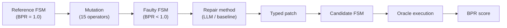
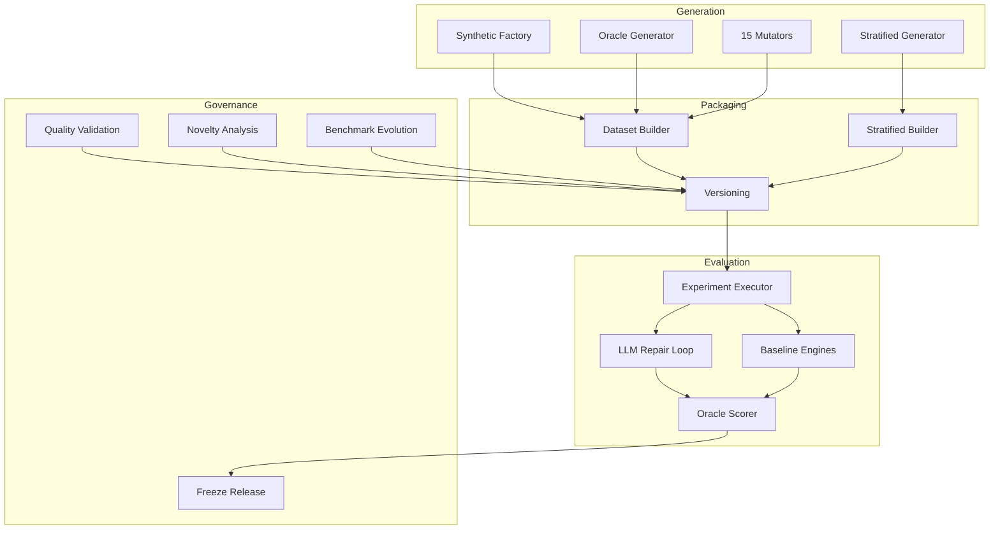
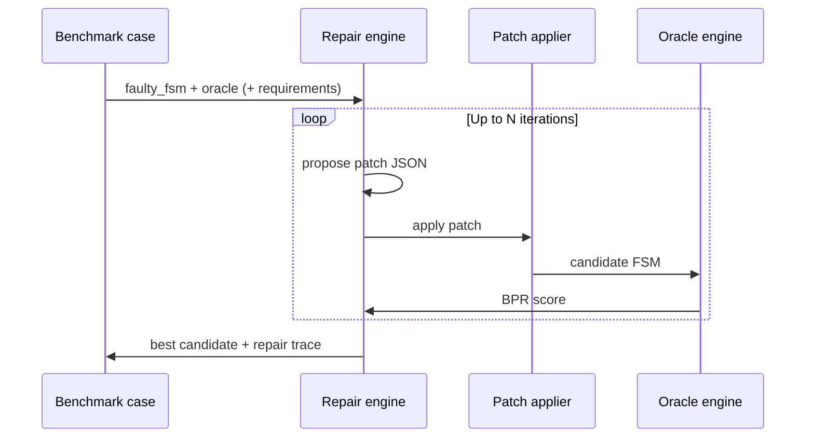

# FSMRepairBench

[](https://github.com/ORG/FSMRepairBench/actions)
[](https://github.com/ORG/FSMRepairBench/actions/workflows/docs.yml)
[](https://www.python.org/downloads/)
[](LICENSE)
[](pyproject.toml)
[](#dataset-structure)

**A reproducible benchmark for evaluating automated repair of behavioural finite-state machines.**

FSMRepairBench provides seeded FSM instances, controlled fault injection, behavioural
oracle suites, and a full experiment toolchain — from dataset generation through LLM
repair loops to checksum-backed frozen releases.

---

## Table of contents

- [Motivation](#motivation)
- [Benchmark overview](#benchmark-overview)
- [Architecture](#architecture)
- [Quick start](#quick-start)
- [Installation](#installation)
- [Benchmark taxonomy](#benchmark-taxonomy)
- [Dataset structure](#dataset-structure)
- [Repair workflow](#repair-workflow)
- [Documentation](#documentation)
- [Roadmap](#roadmap)
- [Citation](#citation)
- [Contributing](#contributing)

---

## Motivation

Real-world controllers, protocol handlers, and embedded systems are often specified as
**state machines**. When those models are wrong, engineers must repair behaviour — not
merely edit syntax. Meanwhile, LLMs and program-repair tools are overwhelmingly evaluated
on **line-level code** (Defects4J, SWE-Bench, HumanEval) or **smart-contract bytecode**
(SmartBugs).

**FSMRepairBench fills a gap**: a controlled, stratified benchmark where:

- Ground truth is **behavioural** — oracle scenarios, not diff against a hidden reference.
- Faults are **documented** — fifteen seeded mutation operators with reproducible metadata.
- Diversity is **measurable** — a ten-dimensional taxonomy supports slice-aware reporting.
- Artefacts are **long-lived** — stable case IDs, schema versioning, and frozen releases.

We built FSMRepairBench as an open research artifact intended to survive multiple paper
cycles: comparable scores, reproducible datasets, and transparent threats to validity.

> See the [FSMRepairBench Manifesto](docs/FSMREPAIRBENCH_MANIFESTO.md) for scientific
> positioning relative to Defects4J, SWE-Bench, HumanEval, and SmartBugs.

---

## Benchmark overview

Each benchmark **case** is a self-contained repair instance:

| Component | Role |
|-----------|------|
| **Reference FSM** | Correct behavioural model (not shown to repair methods at scoring time) |
| **Faulty FSM** | Buggy instance the repair method must fix |
| **Oracle suite** | Ordered scenarios: apply events, assert expected states |
| **Bug metadata** | Mutation operator, seed, and fault description |
| **Case metadata** | Difficulty, coverage, BPR summary, taxonomy features |

**Primary metric — Behavioural Pass Rate (BPR)**

\[
\text{BPR} = \frac{\text{passed oracle steps}}{\text{total oracle steps}}
\]

A **complete repair** achieves BPR = 1.0. Partial improvements are tracked via
`delta_bpr = final_bpr − initial_bpr`.



**What FSMRepairBench is not**

- Not a repository-scale software engineering benchmark (cf. SWE-Bench).
- Not a real-bug Java/Python APR corpus (cf. Defects4J / BugsInPy).
- Not single-function synthesis from docstrings (cf. HumanEval).

It **is** a behavioural model-repair benchmark with explicit state spaces, oracles, and
stratified synthetic diversity.

---

## Architecture



The toolkit is a Python package (`fsmrepairbench`) with a Typer CLI (~35 commands),
Pydantic JSON schemas, pluggable LLM backends (Ollama, vLLM, OpenAI-compatible APIs),
and governance tooling for quality, novelty, migration, and frozen releases.

Full details: [docs/architecture.md](docs/architecture.md)

---

## Quick start

### Validate a sample case

```bash
fsmrepairbench validate-fsm tests/fixtures/valid_fsm.json
fsmrepairbench validate-oracle tests/fixtures/valid_oracle.json
```

### Score an FSM against an oracle

```bash
fsmrepairbench score tests/fixtures/valid_fsm.json tests/fixtures/valid_oracle.json
```

### Build a small dataset

```bash
fsmrepairbench build-dataset --size 10 --seed 42 --output data/my_benchmark
fsmrepairbench validate-dataset data/my_benchmark
fsmrepairbench analyze-novelty data/my_benchmark
```

### Run an experiment

```bash
fsmrepairbench run-experiment configs/experiment.yaml
fsmrepairbench leaderboard results/
fsmrepairbench freeze-release results/ --release-dir releases/run_001
```

### Build a stratified dataset from a plan

```bash
fsmrepairbench build-stratified-dataset plans/fsmrepairbench_v0_10k_plan.yaml data/stratified
```

---

## Installation

**Requirements:** Python 3.11+ (3.12 recommended). Use a virtual environment to avoid mixing
interpreter-specific packages.

```bash
git clone https://github.com/ORG/FSMRepairBench.git
cd FSMRepairBench
python3.12 -m venv .venv
source .venv/bin/activate
python -m pip install -U pip
python -m pip install -e ".[dev,analytics]"
```

| Install target | Command | Includes |
|----------------|---------|----------|
| Core CLI | `pip install -e .` | validate, score, mutate, dataset build |
| Analytics plots | `pip install -e ".[analytics]"` | matplotlib, kiwisolver |
| Development | `pip install -e ".[dev]"` | pytest, ruff, mypy |

Full setup guide: [docs/development.md](docs/development.md)

Verify the installation:

```bash
fsmrepairbench --help
pytest -q
```

---

## Benchmark taxonomy

Cases are classified along **ten stratification dimensions** for generation, filtering,
and slice-aware evaluation:

| Dimension | Example values |
|-----------|----------------|
| `machine_type` | `plain_fsm`, `mealy`, `moore`, `efsm`, `timed_fsm`, `timed_efsm` |
| `determinism` | `deterministic`, `nondeterministic` |
| `completeness` | `complete`, `partial` |
| `arity_class` | `low`, `medium`, `high`, `very_high` |
| `size_class` | `tiny`, `small`, `medium`, `large`, `very_large` |
| `guard_complexity` | `none`, `simple`, `compound`, `nested` |
| `time_features` | `none`, `timeout`, `timed_guard`, … |
| `graph_structure` | `acyclic`, `cyclic`, `dense`, `layered`, … |
| `oracle_depth` | `shallow`, `medium`, `deep`, `exhaustive_like` |
| `bug_type` | aligns with [15 mutation operators](docs/mutation_spec.md) |

Filter cases programmatically:

```bash
fsmrepairbench filter-cases DATASET_DIR \
  --determinism deterministic \
  --machine-type efsm \
  --out subset.csv
```

Taxonomy reference: [docs/taxonomy.md](docs/taxonomy.md) · Literature grounding:
[data/literature/literature_taxonomy.yaml](data/literature/literature_taxonomy.yaml)

---

## Dataset structure

```
DATASET_DIR/
├── metadata.json              # dataset seed, version, statistics
├── index.csv                  # case inventory
├── feature_matrix.csv         # stratified builds: taxonomy features per case
├── release_manifest.json      # release traceability
├── cases/
│   └── case_000001/
│       ├── reference_fsm.json
│       ├── faulty_fsm.json
│       ├── bug_metadata.json
│       ├── oracle_suite.json
│       ├── case_metadata.json
│       └── requirements.json  # optional (schema v2.0)
├── quality_report.json        # from validate-dataset
└── novelty_report.json        # from analyze-novelty
```

**Schema versions**

| Version | Dataset ID | Notable addition |
|---------|------------|------------------|
| v0.1 | `fsmrepairbench_v0` | Core four case files |
| v1.0 | `fsmrepairbench_v1` | `case_metadata.json` |
| v2.0 | `fsmrepairbench_v2` | Optional `requirements.json` |

Detect version: `fsmrepairbench benchmark-version DATASET_DIR`

Full schema reference: [docs/dataset_format.md](docs/dataset_format.md) ·
Auto-generated: [docs/schemas.md](docs/schemas.md)

---

## Repair workflow

Repair methods receive the **faulty FSM**, **oracle suite**, and optionally **natural-language
requirements**. They propose a **typed patch** (add/remove/replace transitions, guards,
actions, initial state). The patch is applied; the candidate FSM is scored by oracle
execution.



**Patch operations:** `add_transition`, `remove_transition`, `replace_transition_source`,
`replace_transition_target`, `replace_transition_event`, `replace_initial_state`,
`replace_guard`, `replace_action`

**Experiment metrics:** `initial_bpr`, `final_bpr`, `delta_bpr`, `complete_repair`,
`effective_repair`, `regression`, patch failure counts, iteration count.

```bash
# Baseline repair
fsmrepairbench baseline-repair faulty.json oracle.json --out patch.json

# LLM repair (Ollama example)
fsmrepairbench llm-repair faulty.json oracle.json --model llama3.1:8b --out patch.json

# Apply and score
fsmrepairbench apply-patch faulty.json patch.json --out repaired.json
fsmrepairbench score repaired.json oracle.json
```

Oracle semantics: [docs/oracle_spec.md](docs/oracle_spec.md) · Metrics:
[docs/metrics.md](docs/metrics.md)

---

## Documentation

| Document | Description |
|----------|-------------|
| [docs/architecture.md](docs/architecture.md) | System architecture and data flow |
| [docs/benchmark_spec.md](docs/benchmark_spec.md) | Goals, scope, limitations |
| [docs/dataset_format.md](docs/dataset_format.md) | JSON schemas and validation |
| [docs/oracle_spec.md](docs/oracle_spec.md) | Oracle execution and BPR |
| [docs/mutation_spec.md](docs/mutation_spec.md) | Mutation operators and fault models |
| [docs/metrics.md](docs/metrics.md) | All benchmark metrics |
| [docs/reproducibility.md](docs/reproducibility.md) | Seeds, versioning, freezing |
| [docs/roadmap.md](docs/roadmap.md) | Planned evolution |
| [docs/development.md](docs/development.md) | Developer setup and troubleshooting |
| [docs/api.md](docs/api.md) | Auto-generated API reference |
| [docs/cli.md](docs/cli.md) | Auto-generated CLI reference |
| [BENCHMARK_SPEC.md](BENCHMARK_SPEC.md) | Normative benchmark contract |
| [DATASET_POLICY.md](DATASET_POLICY.md) | Dataset governance |
| [CONTRIBUTING.md](CONTRIBUTING.md) | Contribution guidelines |

Regenerate API/CLI/schema docs after code changes:

```bash
python scripts/update_docs.py
```

---

## Roadmap

| Horizon | Goals |
|---------|-------|
| **Now (v1 → v2)** | Community frozen v2.0 release, public leaderboard, held-out evaluation split |
| **Medium term** | Timed oracle execution, industrial case studies, multi-oracle consensus, MDE interchange |
| **Long term** | Community steering, perennial artifact track, certified repair classes |

Completed: core validation, 15 mutators, stratified builder, versioning/migration,
difficulty calibration, gap detection, requirement generation, repair trajectories,
failure pattern mining, quality/novelty analysis, artifact reproduction.

Full roadmap: [docs/roadmap.md](docs/roadmap.md)

---

## Citation

If you use FSMRepairBench in your research, please cite:

```bibtex
@software{fsmrepairbench2026,
  title        = {FSMRepairBench: A Benchmark for Behavioural Finite-State Machine Repair},
  author       = {FSMRepairBench Contributors},
  year         = {2026},
  url          = {https://github.com/ORG/FSMRepairBench},
  version      = {0.1.0},
  note         = {Benchmark toolkit and dataset generation framework}
}
```

> **Placeholder** — replace `ORG/FSMRepairBench` with the canonical repository URL and
> add a peer-reviewed paper citation when published.

---

## Contributing

We welcome contributions that improve benchmark quality, tooling, documentation, and
stratified coverage. Please read:

1. [CONTRIBUTING.md](CONTRIBUTING.md) — workflow and review expectations
2. [DATASET_POLICY.md](DATASET_POLICY.md) — what may change in published datasets
3. [VERSIONING_POLICY.md](VERSIONING_POLICY.md) — schema and evolution rules

Before opening a pull request:

```bash
pytest -q
ruff check src tests
python scripts/update_docs.py    # if CLI or models changed
fsmrepairbench validate-dataset DATASET_DIR   # if dataset changed
```

Install test dependencies with `pip install -e ".[dev,analytics]"`. See
[docs/development.md](docs/development.md).

**Do not** silently edit frozen benchmark cases or reuse case IDs for different semantics.

---

## License

MIT License — see [LICENSE](LICENSE).

---

<p align="center">
  <sub>FSMRepairBench — behavioural ground truth · seeded faults · stratified diversity · reproducible science</sub>
</p>
