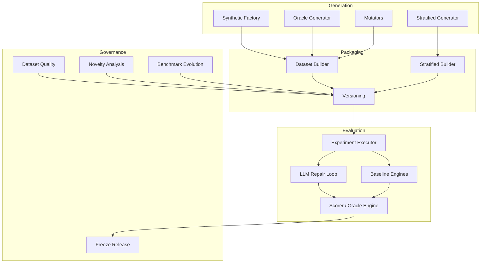
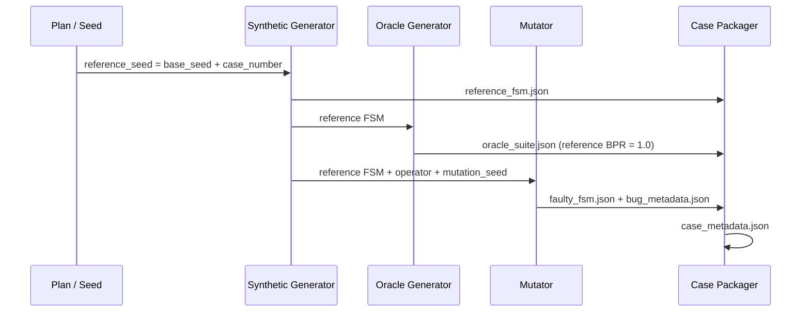
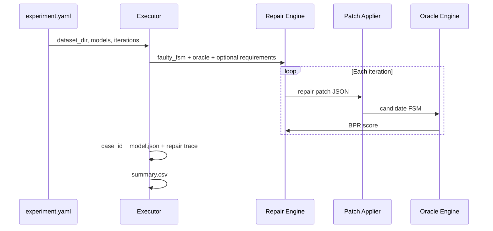

# FSMRepairBench Architecture

This document describes the system architecture of FSMRepairBench as an open-source,
long-lived research benchmark for behavioural finite-state machine (FSM) repair.

## Overview

FSMRepairBench is organised as a Python package (`fsmrepairbench`) with a Typer-based
CLI, a declarative on-disk dataset contract, and pluggable repair backends (LLM and
baseline engines). The architecture separates **generation**, **packaging**,
**evaluation**, and **governance** so that benchmark instances remain stable while
tooling evolves.

## Design principles

1. **Behavioural ground truth** — correctness is defined by oracle execution, not by
   textual diff against a reference model.
2. **Deterministic generation** — seeds control FSM synthesis, mutation, and case
   assignment; published cases are reproducible.
3. **Stable identifiers** — case IDs, FSM IDs, and bug IDs are immutable once a release
   is frozen.
4. **Separation of concerns** — JSON artefacts encode benchmark instances; Python modules
   implement validation, scoring, and analytics without mutating frozen cases.
5. **Stratified diversity** — taxonomy features and literature grounding support
   slice-aware evaluation rather than aggregate-only leaderboards.

## Module map

### Core model and validation

| Module | Responsibility |
|--------|----------------|
| `models.py` | Pydantic schemas for FSM, oracle, bug metadata, score and repair results |
| `validators.py` | JSON loading and semantic FSM validation (determinism, referential integrity) |
| `oracle.py` | Step-by-step oracle scenario execution |
| `scorer.py` | Behavioural Pass Rate (BPR) aggregation and repair scoring |
| `patch.py` | Typed repair patch metamodel (eight operations) and application |

### Generation pipeline

| Module | Responsibility |
|--------|----------------|
| `generators/synthetic_factory.py` | Parameterised synthetic FSM generation |
| `generators/stratified_generator.py` | FSM generation aligned to taxonomy cells |
| `oracle_generator.py` | Automatic oracle suite generation with coverage metrics |
| `mutators.py` | Fifteen seeded mutation operators |
| `requirement_generation.py` | Natural-language requirements from FSM structure |
| `ambiguity_injection.py` | Controlled ambiguity injection for NL experiments |

### Dataset construction

| Module | Responsibility |
|--------|----------------|
| `dataset_builder.py` | Parallel mass dataset build (`build-dataset`) |
| `stratified_builder.py` | Plan-driven stratified build (`build-stratified-dataset`) |
| `generator.py` | Single-case benchmark packaging from reference FSMs |
| `taxonomy.py` | Feature inference (machine type, graph structure, bug type, etc.) |
| `case_filter.py` | Predicate-based case filtering and subset overlap |

### Experiments and repair

| Module | Responsibility |
|--------|----------------|
| `experiments.py` | Experiment configuration, case discovery, result aggregation |
| `experiment/executor.py` | Parallel execution with checkpoint/resume |
| `experiment/worker.py` | Per-case repair worker |
| `llm/repair.py` | Iterative LLM repair loop |
| `llm/clients/*` | Pluggable backends (Ollama, vLLM, OpenAI-compatible APIs) |
| `repair_engines/baselines.py` | Deterministic baseline repair engines |
| `repair_trajectory.py` | Repair trace persistence per iteration |

### Analytics and governance

| Module | Responsibility |
|--------|----------------|
| `difficulty.py` | Structural difficulty estimation |
| `difficulty_calibration.py` | Dataset-wide difficulty bucket calibration |
| `coverage_optimizer.py` | Feature-space coverage analysis |
| `gap_detection.py` | Underrepresented taxonomy cell detection |
| `dataset_quality.py` | Quality validation (`validate-dataset`) |
| `novelty_analysis.py` | Novelty and synthetic collapse detection |
| `analytics.py` | Diversity reports and plots |
| `failure_pattern_mining.py` | Recurring failure pattern extraction |
| `leaderboard.py` | Model ranking from experiment results |

### Versioning and reproducibility

| Module | Responsibility |
|--------|----------------|
| `versioning.py` | Schema versions, migration, release manifests |
| `benchmark_evolution.py` | Evolution release comparison and tracing |
| `freeze.py` | Auditable result freezing with SHA-256 hashes |
| `artifact.py` | Paper artifact bundles and reproduction |
| `hf_export.py` | Hugging Face dataset export |

### User interface

| Module | Responsibility |
|--------|----------------|
| `cli.py` | Typer CLI (~40 commands) |

Authoritative JSON schemas live in `models.py`. Normative governance policies live in
the repository root (`BENCHMARK_SPEC.md`, `DATASET_POLICY.md`, `VERSIONING_POLICY.md`).

## End-to-end data flow

### 1. Case generation

Each benchmark case under `cases/<case_id>/` contains:

- `reference_fsm.json` — correct behavioural model
- `faulty_fsm.json` — buggy instance to repair
- `bug_metadata.json` — mutation operator, seed, description
- `oracle_suite.json` — behavioural test scenarios
- `case_metadata.json` — difficulty, coverage, BPR summary

Schema v2.0 optionally adds `requirements.json`.

### 2. Dataset assembly

Mass builds produce dataset-level artefacts:

| File | Purpose |
|------|---------|
| `metadata.json` | Dataset ID, benchmark version, seed, size |
| `index.csv` | Per-case inventory |
| `feature_matrix.csv` | Stratified taxonomy features (stratified builds) |
| `release_manifest.json` | Release traceability |
| `progress.csv` | Resumable build progress |

### 3. Experiment execution

Repair methods propose patches over a typed patch DSL (`patch.py`). After each
application, the candidate FSM is scored with `score_oracle_suite`.

### 4. Post-experiment analytics

Results directories feed:

- `leaderboard` — model ranking
- `freeze-release` — checksum-backed frozen release
- `mine-failure-patterns` — trajectory mining
- `benchmark-report`, `analyze-novelty`, `validate-dataset` — dataset diagnostics

## CLI architecture

The CLI (`fsmrepairbench`) is a thin orchestration layer over library modules. Commands
are grouped by concern:

| Group | Representative commands |
|-------|-------------------------|
| Validation | `validate-fsm`, `validate-oracle`, `validate-dataset` |
| Scoring | `score`, `mutate`, `apply-patch` |
| Generation | `generate-fsm`, `generate-oracles`, `build-dataset` |
| Experiments | `run-experiment`, `baseline-repair`, `llm-repair` |
| Governance | `migrate-benchmark`, `freeze-release`, `analyze-novelty` |

Library code is importable without the CLI for programmatic use and CI integration.

## Extension points

Future modules can extend the benchmark without breaking frozen cases:

1. **New mutation operators** — register in `mutators.py`; assign via stratified plans
2. **New repair backends** — implement `ModelBackend` in `llm/clients/`
3. **New taxonomy dimensions** — extend `taxonomy.py` and `feature_matrix.csv` columns
4. **New schema versions** — add `VersionSpec` entries in `versioning.py` with migration

Breaking changes require a new evolution release and documented migration path (see
[reproducibility.md](reproducibility.md) and [roadmap.md](roadmap.md)).

## Related documents

- [benchmark_spec.md](benchmark_spec.md) — scientific goals and scope
- [dataset_format.md](dataset_format.md) — on-disk JSON contract
- [oracle_spec.md](oracle_spec.md) — oracle execution semantics
- [metrics.md](metrics.md) — evaluation metrics
