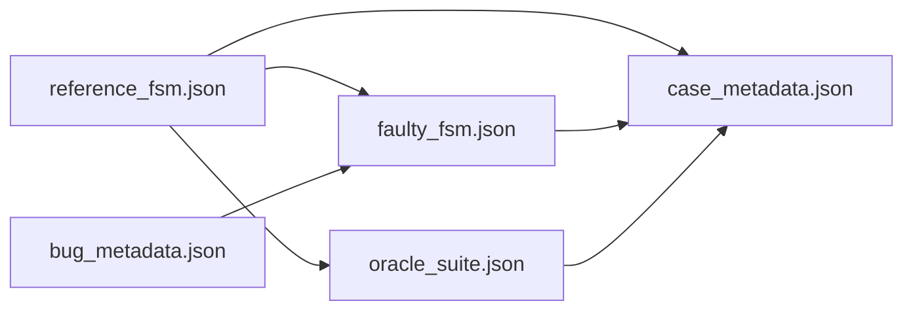

# FSMRepairBench Specification

This document defines the scientific specification of FSMRepairBench: its goals,
assumptions, scope, and known limitations. It complements the normative contract in
[`BENCHMARK_SPEC.md`](../BENCHMARK_SPEC.md) and governance policies in
[`DATASET_POLICY.md`](../DATASET_POLICY.md).

## Benchmark goals

FSMRepairBench evaluates **automated repair of behavioural finite-state machines**.
Given a faulty FSM and a behavioural oracle suite, a repair method must produce a
candidate FSM that satisfies the published scenarios.

Primary research questions the benchmark supports:

1. Can language models or specialised repair tools restore correct behaviour on
   structurally diverse FSMs?
2. How does repair performance vary across machine families, fault types, and
   structural complexity?
3. Which failure modes recur across models (partial repair, regression, patch
   application errors)?
4. Does method performance generalise beyond aggregate scores when evaluated on
   stratified taxonomy slices?

The primary evaluation signal is the **Behavioural Pass Rate (BPR)** — the fraction of
oracle steps passed by a candidate FSM (see [oracle_spec.md](oracle_spec.md) and
[metrics.md](metrics.md)).

Secondary signals include difficulty calibration, oracle coverage, repair trajectory
analysis, and leaderboard aggregates stratified by taxonomy features.

## Benchmark assumptions

The following assumptions define the experimental setting. Violating them may invalidate
comparisons.

### A1. Oracle as behavioural specification

Published oracle scenarios define the **observable** correctness criterion for a case.
A repair is successful (complete repair) when the candidate FSM achieves BPR = 1.0 on
the published suite. Passing all scenarios does **not** guarantee equivalence to the
reference FSM.

### A2. Controlled fault injection

Faults are introduced by **seeded mutation operators** with documented metadata. They
approximate defect classes (missing transitions, wrong targets, guard faults) but are
not sampled from industrial bug repositories.

### A3. Deterministic generation

Given `(dataset_seed, case_number, mutation_operator, mutation_seed)`, case generation
is deterministic. Published datasets pin these values in `metadata.json` and
`bug_metadata.json`.

### A4. Typed repair patches

LLM and baseline repair methods operate over a **typed patch DSL** (add/remove/replace
transitions, guards, actions, initial state). This constrains the repair search space
and enables reproducible patch application.

### A5. Reference-oracle coupling at generation time

Oracle suites are generated from the same reference FSM used to define ground truth.
This ensures reference FSMs achieve BPR = 1.0 before mutation, but introduces
generator-oracle coupling (see limitations).

### A6. Stratified reporting

Aggregate leaderboard scores alone are insufficient. Papers using FSMRepairBench should
report performance on relevant taxonomy slices (machine type, bug type, size class,
etc.) as defined in [taxonomy.md](taxonomy.md).

## Benchmark scope

### In scope

| Dimension | Coverage |
|-----------|----------|
| Machine families | Plain FSM, Mealy, Moore, EFSM, timed FSM, timed EFSM (practical subset) |
| Structural features | Determinism, completeness, guards, timing, graph topology |
| Fault models | 15 mutation operators (structural, guard, timing, nondeterminism) |
| Oracle depths | Shallow, medium, deep, exhaustive-like scenario generation |
| Repair backends | LLM (Ollama, vLLM, OpenAI-compatible), deterministic baselines |
| Dataset scales | Single cases to stratified 10k plans (see `plans/`) |
| NL requirements | Optional requirement text and ambiguity injection (v2.0+) |

### Evaluation tasks

1. **Complete repair** — raise faulty BPR to 1.0
2. **Effective repair** — improve BPR without necessarily reaching 1.0
3. **Repair under ambiguity** — repair with ambiguous NL requirements (optional track)

### Out of scope (current release)

- Full timed automata semantics (clocks, zones, urgent transitions)
- Probabilistic or stochastic state machines
- Interface automata and register automata in full generality
- Industrial proprietary models (unless contributed as curated cases)
- Proof-carrying or certified repair (future roadmap item)
- Repository-scale software repair (cf. SWE-Bench)

## Benchmark limitations

Researchers must acknowledge the following limitations when interpreting results.

### Construct validity

| Limitation | Impact |
|------------|--------|
| Oracle incompleteness | BPR = 1.0 does not prove behavioural equivalence to the reference FSM |
| Mutation realism | Seeded faults may not match industrial defect distributions |
| Taxonomy heuristics | Graph and guard tags are approximate classifiers |
| Patch DSL bias | Methods may overfit to allowed patch operations |

### Internal validity

| Limitation | Impact |
|------------|--------|
| Oracle-generator coupling | Oracles derived from reference may share generator artefacts |
| Step-level BPR | Partial scenario execution affects the metric (fail-fast semantics) |
| LLM non-determinism | Scores vary unless temperature, prompts, and seeds are fixed |
| Guard evaluation | Guards are matched as opaque strings, not evaluated over variables |

### External validity

| Limitation | Impact |
|------------|--------|
| Domain transfer | Synthetic/stratified FSMs may not predict SCADE, Simulink, or protocol spec repair |
| Scale | Size classes may underrepresent very large industrial state spaces |
| NL gap | Generated requirements may not reflect real requirements engineering |

### Conclusion validity

| Limitation | Impact |
|------------|--------|
| Leaderboard overfitting | Tuning to public cases without held-out frozen releases |
| Slice shopping | Reporting only favourable taxonomy cells |

Mitigations documented in the project:

- Frozen release tracks with SHA-256 checksums (`freeze-release`)
- Mandatory stratified reporting in leaderboard design
- Repair trajectory and failure-pattern mining
- Quality and novelty analysis (`validate-dataset`, `analyze-novelty`)

## Benchmark artefact model

Each published case is a self-contained artefact:

Stable identifiers (case ID, FSM ID, bug ID) must not be reused for different
semantics once a release is published.

## Compatibility and versioning

FSMRepairBench defines **schema versions** (`v0.1`–`v2.0`) and **evolution releases**
(`v0`, `v1`, `v2`). Case IDs are preserved across compatible migrations. See
[reproducibility.md](reproducibility.md) and [`VERSIONING_POLICY.md`](../VERSIONING_POLICY.md).

## Related documents

- [dataset_format.md](dataset_format.md) — JSON schemas and validation
- [oracle_spec.md](oracle_spec.md) — execution semantics
- [mutation_spec.md](mutation_spec.md) — fault models
- [metrics.md](metrics.md) — evaluation metrics
- [FSMREPAIRBENCH_MANIFESTO.md](FSMREPAIRBENCH_MANIFESTO.md) — vision and positioning
