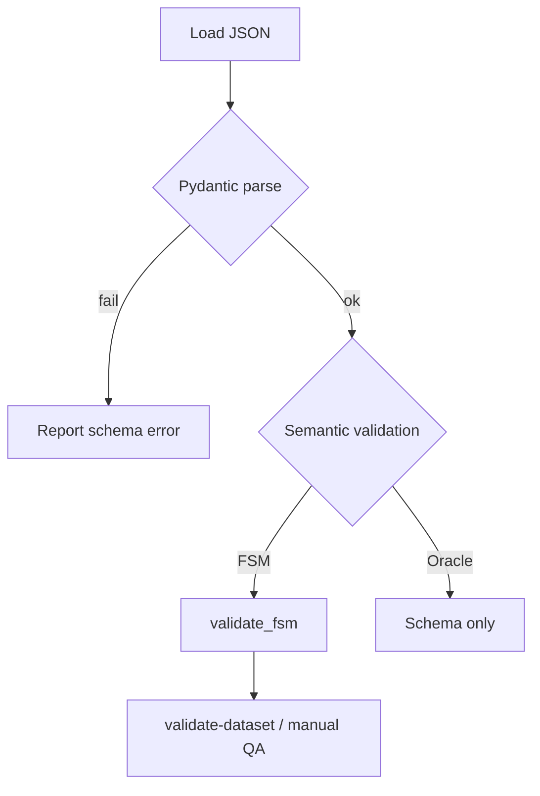

# Dataset Format

This document specifies the on-disk format of FSMRepairBench datasets: JSON schemas,
examples, and validation rules. Authoritative Pydantic models live in
`src/fsmrepairbench/models.py`; version-specific file requirements live in
`src/fsmrepairbench/versioning.py`.

## Dataset layout

```
DATASET_DIR/
├── metadata.json
├── index.csv
├── release_manifest.json          # optional until release
├── feature_matrix.csv             # stratified builds
├── cases/
│   └── case_000001/
│       ├── reference_fsm.json
│       ├── faulty_fsm.json
│       ├── bug_metadata.json
│       ├── oracle_suite.json
│       ├── case_metadata.json
│       └── requirements.json      # v2.0 optional
├── quality_report.json            # derived: validate-dataset
└── novelty_report.json            # derived: analyze-novelty
```

Case directories must be named exactly `case_{index:06d}` (e.g. `case_000042`).

## Version matrix

| Schema | Dataset ID | Required case files | Optional case files |
|--------|------------|---------------------|---------------------|
| v0.1 | `fsmrepairbench_v0` | reference, faulty, bug_metadata, oracle | — |
| v1.0 | `fsmrepairbench_v1` | + case_metadata | — |
| v1.1 | `fsmrepairbench_v1` | same as v1.0 | — |
| v2.0 | `fsmrepairbench_v2` | same as v1.0 | requirements.json |

Detect version with:

```bash
fsmrepairbench benchmark-version DATASET_DIR
```

---

## FSM (`reference_fsm.json`, `faulty_fsm.json`)

### Schema

| Field | Type | Required | Description |
|-------|------|----------|-------------|
| `id` | string | yes | Stable FSM identifier |
| `name` | string | yes | Human-readable name |
| `description` | string | no | Default `""` |
| `states` | array | yes | List of state objects |
| `initial_state` | string | yes | ID of initial state |
| `events` | array[string] | yes | Event alphabet |
| `transitions` | array | no | Default `[]` |
| `variables` | object | no | EFSM variables (`name → type`) |

**State object**

| Field | Type | Required |
|-------|------|----------|
| `id` | string | yes |
| `state_output` | string | no (Moore-style) |

**Transition object**

| Field | Type | Required |
|-------|------|----------|
| `id` | string | yes |
| `source` | string | yes |
| `event` | string | yes |
| `target` | string | yes |
| `guard` | string | no |
| `action` | string | no |
| `output` | string | no (Mealy-style) |
| `timeout` | number | no |
| `delay` | number | no |
| `requirements` | array[string] | no |

### Example

```json
{
  "id": "parking_gate_001",
  "name": "Parking Gate",
  "description": "Controls access to a parking lot based on ticket validation.",
  "states": [
    {"id": "closed"},
    {"id": "open"}
  ],
  "initial_state": "closed",
  "events": ["car_arrives", "ticket_valid", "timeout"],
  "transitions": [
    {
      "id": "t1",
      "source": "closed",
      "event": "car_arrives",
      "target": "closed",
      "guard": "ticket_invalid",
      "action": "display_error",
      "requirements": ["R1"]
    },
    {
      "id": "t2",
      "source": "closed",
      "event": "car_arrives",
      "target": "open",
      "guard": "ticket_valid",
      "action": "open_gate"
    },
    {
      "id": "t3",
      "source": "open",
      "event": "timeout",
      "target": "closed",
      "action": "close_gate"
    }
  ]
}
```

### Validation rules

Run: `fsmrepairbench validate-fsm PATH`

| Rule | Error condition |
|------|-----------------|
| Unique state IDs | Duplicate `states[].id` |
| Valid initial state | `initial_state` ∉ state IDs |
| Unique transition IDs | Duplicate `transitions[].id` |
| Referential integrity | `source`, `target` ∈ state IDs; `event` ∈ `events` |
| Determinism (default) | Duplicate `(source, event, guard)` triple |

Override determinism check with `allow_nondeterminism=True` in programmatic validation.

Benchmark cases additionally require:

- Reference FSM reaches BPR = 1.0 on the case oracle suite
- Faulty FSM has BPR strictly below reference (typically `faulty_bpr < reference_bpr`)
- All states reachable from `initial_state` (builder-enforced for synthetic cases)

---

## Oracle suite (`oracle_suite.json`)

### Schema

| Field | Type | Required |
|-------|------|----------|
| `id` | string | yes |
| `fsm_id` | string | no |
| `scenarios` | array | yes |

**Scenario**

| Field | Type | Required |
|-------|------|----------|
| `id` | string | yes |
| `description` | string | no |
| `steps` | array | yes |

**Step**

| Field | Type | Required |
|-------|------|----------|
| `event` | string | yes |
| `expected_state` | string | yes |
| `guard` | string | no |

### Example

```json
{
  "id": "parking_gate_oracles",
  "fsm_id": "parking_gate_001",
  "scenarios": [
    {
      "id": "invalid_ticket_stays_closed",
      "description": "An invalid ticket keeps the gate closed.",
      "steps": [
        {
          "event": "car_arrives",
          "guard": "ticket_invalid",
          "expected_state": "closed"
        }
      ]
    },
    {
      "id": "valid_ticket_opens_gate",
      "steps": [
        {
          "event": "car_arrives",
          "guard": "ticket_valid",
          "expected_state": "open"
        }
      ]
    },
    {
      "id": "open_then_timeout_closes",
      "steps": [
        {"event": "car_arrives", "guard": "ticket_valid", "expected_state": "open"},
        {"event": "timeout", "expected_state": "closed"}
      ]
    }
  ]
}
```

### Validation rules

Run: `fsmrepairbench validate-oracle PATH`

- Pydantic schema validation only (no semantic FSM cross-check in validator)
- When `fsm_id` is present, experiment runners verify it matches the scored FSM ID

See [oracle_spec.md](oracle_spec.md) for execution semantics.

---

## Bug metadata (`bug_metadata.json`)

### Schema

| Field | Type | Required | Description |
|-------|------|----------|-------------|
| `bug_id` | string | yes | `{ref_id}__{operator}__{seed}` |
| `reference_fsm_id` | string | yes | Reference FSM ID |
| `faulty_fsm_id` | string | yes | `{ref_id}__faulty__{operator}__{seed}` |
| `mutation_operator` | string | yes | One of 15 registered operators |
| `changed_transition_id` | string \| null | yes | Affected transition, or null |
| `description` | string | yes | Human-readable fault description |
| `seed` | integer | yes | Mutation seed |

### Example

```json
{
  "bug_id": "synthetic_001__missing_transition__42001",
  "reference_fsm_id": "synthetic_001",
  "faulty_fsm_id": "synthetic_001__faulty__missing_transition__42001",
  "mutation_operator": "missing_transition",
  "changed_transition_id": "t_3",
  "description": "Removed transition 't_3'",
  "seed": 42001
}
```

### Validation rules

- Must parse as `BugMetadata` (Pydantic)
- `mutation_operator` ∈ `MUTATION_OPERATORS` in `mutators.py`
- `faulty_fsm_id` in `faulty_fsm.json` should match metadata
- Re-applying mutation with `apply_mutation(reference, metadata)` reproduces faulty FSM

---

## Case metadata (`case_metadata.json`)

Written by the dataset builder; not defined in `models.py`.

### Schema (v1.0+)

| Field | Type | Description |
|-------|------|-------------|
| `case_id` | string | e.g. `case_000001` |
| `benchmark_version` | string | Schema version |
| `reference_fsm_id` | string | |
| `faulty_fsm_id` | string | |
| `complexity` | string | `small`, `medium`, `large`, `very_large` |
| `state_count` | integer | Reachable states |
| `transition_count` | integer | Reachable transitions |
| `event_count` | integer | Event alphabet size |
| `mutation_operator` | string | Applied operator |
| `difficulty_score` | float | 0–100 |
| `difficulty_category` | string | `easy`, `medium`, `hard`, `expert` |
| `difficulty` | object | Full difficulty metadata |
| `oracle_coverage` | object | `state_coverage`, `transition_coverage`, `event_coverage` |
| `reference_bpr` | float | Expected 1.0 |
| `faulty_bpr` | float | BPR before repair |
| `bpr_delta` | float | `reference_bpr - faulty_bpr` |
| `valid_reference` | boolean | FSM validation passed |
| `valid_faulty` | boolean | FSM validation passed |

v2.0 adds `schema_version: 2` and may embed `requirements[]`.

### Example

```json
{
  "case_id": "case_000001",
  "benchmark_version": "v1.0",
  "reference_fsm_id": "synthetic_fsm_43",
  "faulty_fsm_id": "synthetic_fsm_43__faulty__missing_transition__43001",
  "complexity": "small",
  "state_count": 4,
  "transition_count": 6,
  "event_count": 3,
  "mutation_operator": "missing_transition",
  "difficulty_score": 18.5,
  "difficulty_category": "easy",
  "oracle_coverage": {
    "state_coverage": 1.0,
    "transition_coverage": 0.8333,
    "event_coverage": 1.0
  },
  "reference_bpr": 1.0,
  "faulty_bpr": 0.75,
  "bpr_delta": 0.25,
  "valid_reference": true,
  "valid_faulty": true
}
```

---

## Requirements (`requirements.json`, v2.0 optional)

Optional file linking natural-language requirements to transitions.

Typical structure:

```json
{
  "requirements": [
    {
      "id": "R1",
      "text": "When a car arrives with an invalid ticket, the gate remains closed.",
      "linked_transitions": ["t1"]
    }
  ]
}
```

Used by requirement-generation and ambiguity-injection experiments.

---

## Dataset metadata (`metadata.json`)

### Required fields by version

| Field | v0.1 | v1.0 | v1.1 | v2.0 |
|-------|------|------|------|------|
| `dataset_id` | ✓ | ✓ | ✓ | ✓ |
| `seed` | ✓ | ✓ | ✓ | ✓ |
| `cases_dir` | ✓ | ✓ | ✓ | ✓ |
| `benchmark_version` | | ✓ | ✓ | ✓ |
| `target_size` | | ✓ | ✓ | ✓ |
| `completed_cases` | | ✓ | ✓ | ✓ |
| `statistics` | | | ✓ | ✓ |
| `schema_version` | | | | ✓ |

### Example (v1.0)

```json
{
  "dataset_id": "fsmrepairbench_v1",
  "benchmark_version": "v1.0",
  "seed": 42,
  "target_size": 100,
  "completed_cases": 100,
  "cases_dir": "cases",
  "generated_at": "2026-06-08T12:00:00+00:00",
  "statistics": {
    "average_difficulty_score": 32.4,
    "complexity_counts": {"small": 25, "medium": 25, "large": 25, "very_large": 25},
    "mutation_operator_counts": {"missing_transition": 7, "wrong_target": 7}
  }
}
```

---

## Index files

### `index.csv`

One row per case with build status, complexity, mutation operator, difficulty, oracle
coverage, and BPR fields. Produced by `build-dataset`.

### `feature_matrix.csv` (stratified builds)

One row per case with taxonomy dimensions (`machine_type`, `determinism`, `bug_type`,
etc.) and structural counts. Used by coverage analysis, gap detection, and filtering.

---

## Experiment result JSON (`case_*__*.json`)

Per-case, per-model result files in experiment output directories:

| Field | Type | Description |
|-------|------|-------------|
| `case_id` | string | |
| `model` | string | Model identifier |
| `mutation_operator` | string | |
| `initial_bpr` | float | Faulty FSM BPR |
| `final_bpr` | float | Best candidate BPR |
| `delta_bpr` | float | `final - initial` |
| `complete_repair` | boolean | `final_bpr == 1.0` |
| `effective_repair` | boolean | `final_bpr > initial_bpr` |
| `regression` | boolean | `final_bpr < initial_bpr` |
| `iterations_completed` | integer | |
| `repair_result` | object | Nested `RepairResult` |

Repair traces are stored separately as `trace__{case_id}__{model}.json`.

---

## Repair patch JSON

Patches are arrays of typed operations (see `patch.py`):

```json
{
  "operations": [
    {
      "op": "add_transition",
      "id": "t_new",
      "source": "closed",
      "event": "timeout",
      "target": "closed"
    }
  ]
}
```

Supported operations: `add_transition`, `remove_transition`,
`replace_transition_source`, `replace_transition_target`, `replace_transition_event`,
`replace_initial_state`, `replace_guard`, `replace_action`.

---

## Validation workflow



Recommended quality gates before publication:

```bash
fsmrepairbench validate-dataset DATASET_DIR
fsmrepairbench analyze-novelty DATASET_DIR
fsmrepairbench benchmark-version DATASET_DIR
```

## Related documents

- [oracle_spec.md](oracle_spec.md)
- [mutation_spec.md](mutation_spec.md)
- [`BENCHMARK_SPEC.md`](../BENCHMARK_SPEC.md)
- [`DATASET_POLICY.md`](../DATASET_POLICY.md)
