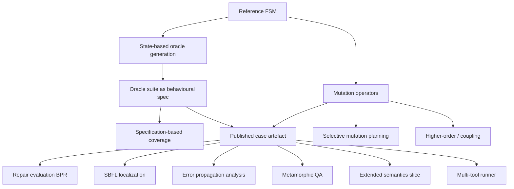

# FSMRepairBench 2025: Literature Mapping

This document maps ten research traditions to concrete FSMRepairBench capabilities,
metadata, and intended paper contributions. It is descriptive, not promotional:
where the benchmark implements only a practical subset of a tradition, that scope is
stated explicitly.

FSMRepairBench is a **behavioural repair benchmark** for finite-state machines. Most
traditions below appear as **generation, measurement, or analysis tooling** around
published cases—not as claims that the benchmark fully instantiates every formal
theory in the literature.

---

## Summary matrix

| # | Tradition | Primary modules | Primary metadata |
|---|-----------|-----------------|------------------|
| 1 | Specification-based testing | `coverage.py`, `spec_coverage.py` | Coverage JSON, `oracle_coverage` in `case_metadata.json` |
| 2 | State-based test generation | `oracle_generator.py`, `dataset_builder.py` | `oracle_suite.json`, `oracle_depth`, coverage fields |
| 3 | Mutation testing | `mutators.py`, `mutation_advanced.py` | `bug_metadata.json`, `bug_type` in taxonomy |
| 4 | Selective mutation | `selective_mutation.py` | Mutation plan JSON (`plan-mutations`) |
| 5 | Coupling effect | `coupling_tracker.py`, `higher_order_mutation.py` | Extended `bug_metadata.json`, coupling reports |
| 6 | Spectrum-based fault localization | `fault_localization.py` | Localization JSON (`localize-fault`) |
| 7 | Model-based diagnosis | `error_propagation.py`, `fault_localization.py`, `bug_metadata.json` | Propagation reports, ranked elements, fault sites |
| 8 | Metamorphic testing | `metamorphic.py` | `metamorphic_manifest.json`, follow-up case dirs |
| 9 | Nondeterministic and probabilistic systems | `semantics.py`, extended oracle/scorer | FSM/oracle semantics fields, `CaseFeatures` flags |
| 10 | SmartBugs-style reproducible frameworks | `tool_runner.py`, `reproducibility` tooling | Tool YAML configs, per-run JSON, `leaderboard.csv` |

---

## 1. Specification-based testing

### What the idea is

Specification-based testing derives test adequacy criteria from a formal or
semi-formal specification rather than from implementation structure alone. For
state-oriented models, classic criteria include state coverage, transition coverage,
and richer sequence or transition-pair coverage.

### How FSMRepairBench implements it

The benchmark treats published oracle suites as the **observable behavioural
specification** for repair evaluation (see Assumption A1 in
[benchmark_spec.md](benchmark_spec.md)). Separately, `compute_coverage_report`
(`coverage.py`) measures how thoroughly an oracle suite exercises structural
elements of an FSM: reachable states, transitions, transition pairs, bounded
transition sequences, guards (EFSM), and timed fields. The legacy `spec-coverage`
CLI delegates to the same implementation.

Coverage is computed by tracing oracle scenarios against the model and comparing
exercised elements to reachable denominators.

### What benchmark metadata captures it

| Artefact | Fields / content |
|----------|------------------|
| `case_metadata.json` | `oracle_coverage.state_coverage`, `transition_coverage`, `event_coverage` |
| Coverage report JSON | Per-criterion `covered`, `total`, `coverage`, `covered_items`; `sequence_depth` |
| `oracle_suite.json` | Scenario steps that define the exercised behaviour |
| Taxonomy (`CaseFeatures`) | `oracle_depth` (`shallow` … `exhaustive_like`) |

### What future paper section it supports

- **Benchmark design** — justify oracle depth presets and stratification by coverage
  ambition.
- **Threats to validity** — relate oracle incompleteness to uncovered specification
  elements.
- **Secondary analysis** — correlate repair difficulty with specification coverage
  gaps rather than BPR alone.

### What limitation remains

Passing all oracle steps (BPR = 1.0) does **not** imply equivalence to the reference
FSM or satisfaction of full formal coverage of the specification space. Guard strings
are matched literally, not evaluated over EFSM variables, so guard coverage counts
syntactic exercise rather than semantic partition coverage.

---

## 2. State-based test generation

### What the idea is

State-based test generation builds test sequences from a state-transition model,
typically aiming to reach states, traverse transitions, or satisfy tour-based or
transition-oriented adequacy goals.

### How FSMRepairBench implements it

`generate_oracle_suite` (`oracle_generator.py`) synthesises behavioural oracle
scenarios from a reference FSM:

- breadth-first path discovery from the initial state to each reachable transition;
- per-transition scenarios with prefix paths plus the target transition step;
- depth presets (`shallow`, `medium`, `deep`, `exhaustive_like`) bounding maximum
  scenario length.

The dataset builder and stratified builder call this generator when constructing
published cases. Generated suites are validated so the reference FSM achieves
BPR = 1.0 before release.

### What benchmark metadata captures it

| Artefact | Fields / content |
|----------|------------------|
| `oracle_suite.json` | Ordered scenarios and steps (`event`, `guard`, `expected_state`) |
| `case_metadata.json` | `oracle_coverage`, `reference_bpr`, `faulty_bpr` |
| Taxonomy | `oracle_depth`, reachable counts (`num_states`, `num_transitions`, …) |
| CLI output | `OracleCoverageMetrics` during `generate-oracles` |

### What future paper section it supports

- **Dataset construction** — describe automatic oracle synthesis and depth
  stratification.
- **Experimental controls** — slice results by `oracle_depth` or transition coverage.
- **Related work** — position the generator as a lightweight, bounded walk strategy
  rather than a full W-method or UIO-sequence engine.

### What limitation remains

Generation is **heuristic and bounded**, not complete with respect to classical
state-based test generation theory (e.g., characterising sets, reset assumptions,
or distinguishing sequences). Oracles are derived from the same reference FSM used
as builder ground truth, which introduces generator–oracle coupling
([oracle_spec.md](oracle_spec.md)).

---

## 3. Mutation testing

### What the idea is

Mutation testing injects small syntactic changes (mutants) into a program or model
and uses an test suite to **kill** mutants—i.e., detect behavioural differences.
Mutation operators approximate defect classes; mutation score measures suite strength.

### How FSMRepairBench implements it

Faulty benchmark cases are produced by **seeded first-order mutation operators**
(`mutators.py`): fifteen operators covering structural transitions, initialisation,
guards, timing, actions, and introduced nondeterminism. Each case applies one
documented operator with deterministic seeds; `apply_mutation` reproduces the
faulty FSM from reference plus `bug_metadata.json`.

Advanced operators and complexity tags live in `mutation_advanced.py`. The primary
repair task uses oracle execution (BPR), not classical mutant killing on a
separate test pool, but the same fault-injection machinery supports mutation
analysis workflows.

### What benchmark metadata captures it

| Artefact | Fields / content |
|----------|------------------|
| `bug_metadata.json` | `bug_id`, `mutation_operator`, `changed_transition_id`, `seed`, descriptions |
| `faulty_fsm.json` | Mutated model artefact |
| Taxonomy (`CaseFeatures`) | `bug_type` (aligned with operators) |
| `case_metadata.json` | `mutation_operator`, `faulty_bpr`, `bpr_delta` |

### What future paper section it supports

- **Fault model** — catalogue operators and map them to repair failure modes.
- **Stratified evaluation** — report BPR by `bug_type` / operator family.
- **Mutation-testing experiments** — reuse operators for kill-rate studies with
  oracle suites or selected scenarios.

### What limitation remains

Mutants are **synthetic and seeded**, not sampled from industrial bug repositories.
Equivalent or near-equivalent mutants are not formally decided; the benchmark does
not ship exhaustive mutant sets per reference FSM in the default dataset build (one
fault per case). Mutation score in the classical sense is supported analytically
(e.g., oracle selection) but is not the primary leaderboard metric.

---

## 4. Selective mutation

### What the idea is

Selective mutation reduces the cost of mutation testing by applying a subset of
operators or mutant instances according to a budget, coverage goal, operator
balance, or estimated fault relevance—rather than enumerating all mutants.

### How FSMRepairBench implements it

`plan_mutations` (`selective_mutation.py`) plans first-order mutation instances
without materialising every possible mutant. Strategies include:

| Strategy | Intent |
|----------|--------|
| `all` | Enumerate applicable operator–site pairs |
| `balanced_by_operator` | Equalise representation across operators |
| `random_sample` | Seeded subsample to a budget |
| `cost_aware` | Prefer lower-cost operators/sites |
| `coverage_aware` | Prioritise transitions/state coverage impact |
| `difficulty_aware` | Use difficulty estimates to diversify planned faults |

CLI: `fsmrepairbench plan-mutations FSM --strategy … --budget … --out …`

### What benchmark metadata captures it

| Artefact | Fields / content |
|----------|------------------|
| Mutation plan JSON | Selected operator, site, strategy, budget, rationale fields |
| Derived mutants | Standard `bug_metadata.json` when plans are executed |
| `selective_mutation.py` exports | Operator cost tables, transition/state indexing |

Default published datasets use deterministic per-case operator cycling rather than
full selective planning; plans support **large-scale or custom generation studies**.

### What future paper section it supports

- **Scalability** — explain how stratified 10k-scale builds avoid exhaustive
  mutation blow-up.
- **Methodology** — compare selective strategies for fault diversity vs. generation
  cost.
- **Ablation** — study sensitivity of repair rankings to mutation sampling policy.

### What limitation remains

Selective strategies use **structural heuristics** (reachability, out-degree,
operator cost, difficulty proxies)—not empirically validated fault distributions
from production systems. Plans do not automatically guarantee pairwise mutant
distinguishability or minimum adequate mutation sampling in the statistical sense.

---

## 5. Coupling effect

### What the idea is

The coupling effect hypothesis observes that test suites adequate for detecting
simple (first-order) faults often detect many complex (higher-order or compound)
faults. Empirical mutation research tracks how often compound mutants are killed
when their constituent first-order faults are detected.

### How FSMRepairBench implements it

Two complementary mechanisms:

1. **Higher-order mutation** (`higher_order_mutation.py`) — chain operators
   sequentially; extended `BugMetadata` records `mutation_order`, `component_faults`,
   `is_higher_order`, and optional `coupled_to_simple_faults`.
2. **Coupling analysis** (`coupling_tracker.py`, `coupling-analysis` CLI) —
   compares oracle detection on first-order vs. higher-order cases and estimates
   `coupling_effect_estimate` among cases where constituent first-order faults are
   detected.

Per-case `track_coupling_effect` relates mutation complexity tags to oracle
failure coverage and simple-scenario proxies.

### What benchmark metadata captures it

| Artefact | Fields / content |
|----------|------------------|
| Extended `bug_metadata.json` | `mutation_order`, `component_faults`, `is_higher_order`, `coupled_to_simple_faults` |
| Coupling report JSON | First-order vs. higher-order detection rates, `coupling_effect_estimate` |
| `CouplingReport` rows | `mutation_complexity`, `complex_fault_coverage`, `simple_fault_proxy_coverage` |

### What future paper section it supports

- **Fault model extension** — motivate higher-order cases beyond single-operator bugs.
- **Oracle adequacy** — discuss whether published suites expose compound faults.
- **Empirical study** — report coupling estimates on benchmark slices (not as universal
  proof of the coupling hypothesis).

### What limitation remains

Higher-order cases are **constructed by operator chaining**, not mined from field
failures. The coupling estimate depends on the published oracle suite and a
simple-scenario proxy (≤1 step); it is an **benchmark-internal statistic**, not a
replication of classic coupling experiments on arbitrary programs. Higher-order
coverage in default dataset releases may be limited compared to first-order cases.

---

## 6. Spectrum-based fault localization (SBFL)

### What the idea is

Spectrum-based fault localization ranks program elements by suspiciousness coefficients
computed from pass/fail spectra: how often each element appears in failing vs. passing
test executions. Common formulas include Ochiai, Tarantula, and Jaccard.

### How FSMRepairBench implements it

`localize_fault` (`fault_localization.py`) executes oracle scenarios on a (typically
faulty) FSM, records per-scenario spectra over states, transitions, guards, actions,
and timeouts, and ranks elements with Ochiai (default), Tarantula, or Jaccard.
Requires at least one failing scenario on the supplied FSM.

CLI: `fsmrepairbench localize-fault FSM ORACLE --method ochiai --out …`

### What benchmark metadata captures it

| Artefact | Fields / content |
|----------|------------------|
| Localization JSON | `rankings` (element type/id, score, failed/passed cover counts), `scenario_spectra` |
| Ground-truth hints | `bug_metadata.changed_transition_id` for evaluation of top-k hits |
| Oracle execution | Pass/fail per scenario driving spectra |

SBFL outputs are **derived artefacts**; they are not bundled in every published case
directory by default.

### What future paper section it supports

- **Diagnostic baselines** — evaluate localization quality against known fault sites.
- **Repair pipelines** — combine SBFL rankings with LLM or search-based patch proposals.
- **Oracle sensitivity** — study how oracle suite composition changes suspiciousness
  rankings.

### What limitation remains

SBFL here operates on **coarse FSM elements and oracle scenarios**, not on source code
lines or guard semantics evaluated over data states. Rankings are only meaningful when
the suite contains failing scenarios; masked faults (faulty FSM still passes all
scenarios) yield no localization signal. This is standard SBFL adapted to models, not
a claim of state-of-the-art localization on industrial models.

---

## 7. Model-based diagnosis

### What the idea is

Model-based diagnosis infer fault locations or explanations from a system model and
observations of incorrect behaviour, often linking symptoms to structural components.
In model-based testing contexts, diagnosis connects failed traces to model elements
responsible for specification violations.

### How FSMRepairBench implements it

FSMRepairBench does **not** ship a standalone diagnostic reasoning engine. It provides
**analysis primitives and ground truth** that support diagnostic experiments:

| Capability | Role |
|------------|------|
| `bug_metadata.json` | Documents intended fault operator and primary changed transition |
| `error_propagation.py` | Classifies activation, infection, propagation to observable states, oracle detection, and masking per scenario |
| `fault_localization.py` | Ranks suspicious FSM elements from oracle pass/fail spectra |
| Oracle execution traces | `trace_scenario_transitions`, step-level failure reasons |
| Taxonomy / `bug_type` | Stratify faults for diagnostic method comparison |

CLI: `analyze-error-propagation CASE_DIR --out propagation_report.json`

### What benchmark metadata captures it

| Artefact | Fields / content |
|----------|------------------|
| `bug_metadata.json` | Operator, `changed_transition_id`, higher-order component faults |
| Propagation report JSON | Per-scenario flags (`activated_fault`, `masked_fault`, …), mutant class summary |
| Localization JSON | Ranked suspicious elements |
| `case_metadata.json` | `faulty_bpr`, `bpr_delta`, difficulty fields |

### What future paper section it supports

- **Diagnostic evaluation** — measure precision/recall of ranked elements vs.
  `changed_transition_id` (where applicable).
- **Failure analysis** — explain repair tool failures via propagation/masking classes.
- **Discussion** — separate **observable behavioural failure** (oracle) from **known
  injected fault** (metadata).

### What limitation remains

Ground truth identifies **injected mutation sites**, not necessarily the minimal
diagnosis or all causally relevant elements in a semantic model. Propagation analysis
uses the same opaque guard matching as oracle execution. The benchmark evaluates
repair by BPR, not by diagnostic accuracy; diagnostic tooling is ancillary.

---

## 8. Metamorphic testing

### What the idea is

Metamorphic testing checks software through **relations** between multiple inputs:
instead of a single oracle for every output, testers derive follow-up cases and
expected relations (e.g., invariance under renaming) from source cases.

### How FSMRepairBench implements it

`metamorphic.py` defines seven relations that transform a source benchmark case into
follow-up cases and compare scoring outcomes:

| Relation | Expected relation (BPR) |
|----------|-------------------------|
| `state_renaming_invariance` | equality |
| `transition_order_invariance` | equality |
| `unreachable_state_invariance` | equality |
| `equivalent_guard_rewriting` | equality |
| `timeout_scaling_relation` | equality |
| `event_alias_relation` | equality |
| `deterministic_refinement_relation` | follow-up ≥ source |

CLI: `generate-metamorphic-cases`, `check-metamorphic`

### What benchmark metadata captures it

| Artefact | Fields / content |
|----------|------------------|
| `metamorphic_manifest.json` | Relation ids, source case, output layout |
| Per-relation dir | Transformed FSMs, oracles, `metamorphic_metadata.json` |
| `metamorphic_metadata.json` | Relation id, transform summary, reference/faulty BPR at generation |

Metamorphic artefacts are **QA and consistency tools**; they are not required in the
minimal published case layout.

### What future paper section it supports

- **Benchmark validation** — demonstrate scoring and oracle consistency under
  behaviour-preserving transforms.
- **Tooling paper / artifact appendix** — document metamorphic QA workflow.
- **Threats to validity** — detect scorer or generator regressions before release.

### What limitation remains

Relations cover **structural transforms and coarse guard rewrites**, not full semantic
equivalence of EFSM guards or timed automata. Violations indicate benchmark tooling
bugs, not faults in repair methods under test. Metamorphic testing here validates the
benchmark infrastructure, not participant submissions directly.

---

## 9. Nondeterministic and probabilistic systems

### What the idea is

Testing and repair for nondeterministic, probabilistic, refusal/quiescence, cyclic,
or timed discrete models requires semantics beyond deterministic Mealy/Moore
simulation—e.g., accepting sets of successor states, probability thresholds, or
refusal steps.

### How FSMRepairBench implements it

An **experimental semantics slice** extends schemas and oracle execution
(`semantics.py`, `oracle.py`, `scorer.py`):

- FSM/transition fields: `probability`, `is_nondeterministic`, refusal/quiescence
  markers, discrete time metadata.
- `infer_structural_features` and taxonomy flags: `has_nondeterminism`,
  `has_probabilities`, `has_cycles`, `has_refusals`, `has_discrete_time`, SCC/cycle
  counts.
- Oracle modes: `deterministic`, `nondeterministic_accepting`,
  `probabilistic_threshold`, `refusal_aware`, `timed_discrete`.
- CLI: `validate-semantics`

The main benchmark specification still describes the **default track** as
deterministic plain/EFSM/timed FSM repair; advanced semantics are optional slices.

### What benchmark metadata captures it

| Artefact | Fields / content |
|----------|------------------|
| FSM JSON | Semantics extension fields, optional `semantics_mode`, `cyclic_metadata` |
| `oracle_suite.json` | `semantics_mode`, `accepting_states`, `probability_threshold`, refusal/quiescence expectations |
| Taxonomy (`CaseFeatures`) | `has_nondeterminism`, `has_probabilities`, `semantics_features`, cycle/SCC fields |
| `literature_taxonomy.yaml` | NFA/probabilistic families with `generation_support: partial` |

### What future paper section it supports

- **Scope and roadmap** — separate deterministic core results from semantics extensions.
- **Stratified analysis** — filter cases with `filter-cases` / feature matrix by
  semantics flags.
- **Related work** — cite testing literature for nondeterministic and probabilistic
  automata without claiming full timed or stochastic automata theory.

### What limitation remains

This is a **partial, discrete-time-oriented encoding**, not full timed automata
(clocks, zones, urgency) or rigorous stochastic model checking. Probability handling
uses threshold-based oracle steps, not statistical hypothesis testing over many runs.
Default dataset generation emphasises deterministic cases; semantics-rich cases may
be sparse unless explicitly planned.

---

## 10. SmartBugs-style reproducible benchmark frameworks

### What the idea is

Frameworks such as SmartBugs standardise multi-tool benchmark campaigns: declarative
tool descriptions, uniform inputs, per-run JSON logs, timeouts, resume, and
aggregated comparison tables—so independent groups can reproduce leaderboard results.

### How FSMRepairBench implements it

`tool_runner.py` adapts this pattern to FSM repair:

- YAML tool configs (`tool_id`, `tool_type`, `command`, `timeout_seconds`, formats).
- Uniform case inputs (`faulty_fsm.json`, `oracle_suite.json`).
- Per `(case, tool)` JSON results with status, failure class, BPR metrics, nested
  `repair_result`.
- Campaign outputs: `summary.csv`, `leaderboard.csv`, `tool_run_manifest.json`.
- Resume skips completed pairs; parallel `--workers` supported.

Related reproducibility tooling: dataset seeds, `release_manifest.json`,
`freeze-release`, `reproduce`, experiment YAML (`run-experiment`), checksum-backed
releases ([reproducibility.md](reproducibility.md)).

CLI: `fsmrepairbench run-tools DATASET_DIR tools/ --out …`

### What benchmark metadata captures it

| Artefact | Fields / content |
|----------|------------------|
| Tool YAML | Tool identity, backend command, timeout, iterations, temperature |
| Per-run JSON | `status`, `failure_class`, `initial_bpr`, `final_bpr`, `delta_bpr` |
| `leaderboard.csv` | Aggregated tool comparison |
| `metadata.json` / release manifest | Dataset version, seeds, checksums |
| `case_metadata.json` | Case difficulty and taxonomy for stratified leaderboard slices |

### What future paper section it supports

- **Experimental methodology** — describe reproducible multi-tool protocol.
- **Results tables** — primary BPR leaderboard plus failure-class breakdown.
- **Artifact evaluation** — point reviewers to pinned dataset hash, tool configs, and
  `reproduce` manifests.

### What limitation remains

Tool configs cover **bundled baselines and LLM backends** shipped with the project;
external tools require adapter JSON and manual validation. LLM runs may remain
non-deterministic unless temperature, prompts, and model versions are pinned.
SmartBugs targets smart-contract analysis tools; FSMRepairBench adapts the **workflow
pattern**, not tool compatibility or vulnerability taxonomy.

---

## Cross-tradition dependencies

---

## Recommended paper sections (consolidated)

| Section | Traditions to cite |
|---------|-------------------|
| Introduction / motivation | Model-based testing context; repair benchmark gap |
| Benchmark design | Spec-based testing, state-based generation, mutation fault model |
| Dataset construction | Selective mutation, taxonomy, reproducibility framework |
| Metrics | BPR, coverage, mutation/coupling statistics, SBFL (if used) |
| Experimental setup | SmartBugs-style runner, seeds, frozen releases |
| Threats to validity | Oracle incompleteness, synthetic mutants, semantics partial scope |
| Artifact / QA appendix | Metamorphic relations, validate-dataset, propagation reports |

---

## Document scope

This mapping reflects the FSMRepairBench toolkit as of the 2025 benchmark line
(schema versions v0.1–v2.0, evolution releases v0–v2). Module names and CLI commands
refer to the `fsmrepairbench` Python package. For normative behaviour, prefer
[benchmark_spec.md](benchmark_spec.md), [dataset_format.md](dataset_format.md), and
the linked per-topic specifications over this summary.
