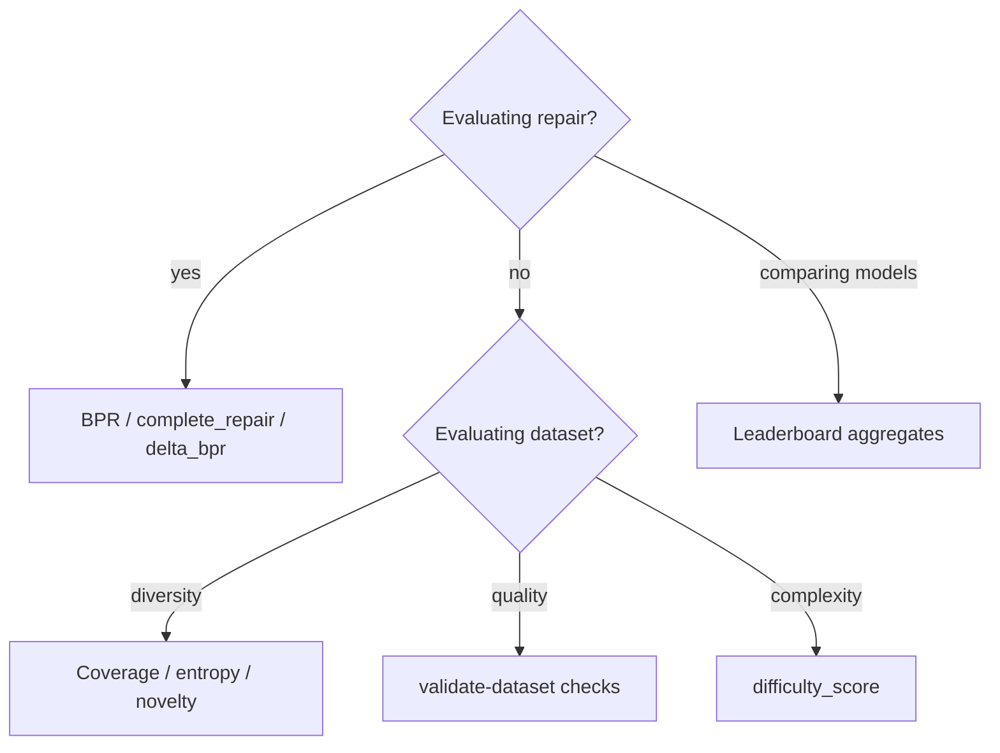

# Metrics

This document defines evaluation metrics used in FSMRepairBench, including formulas and
worked examples. Metrics are grouped by purpose: behavioural scoring, structural
difficulty, dataset diversity, experiment outcomes, and leaderboard aggregates.

## Behavioural metrics

### Behavioural Pass Rate (BPR)

**Primary repair correctness metric.**

For oracle suite with scenarios \(S\):

\[
\text{BPR} = \frac{\sum_{s \in S} \text{passed\_steps}(s)}{\sum_{s \in S} \text{total\_steps}(s)}
\]

| Property | Value |
|----------|-------|
| Range | [0.0, 1.0] |
| Complete repair | BPR = 1.0 |
| Implementation | `scorer.score_oracle_suite` |

**Example**: 8 passed steps out of 10 total → BPR = 0.8

See [oracle_spec.md](oracle_spec.md) for step-level semantics.

### Scenario pass rate

\[
\text{scenario\_pass\_rate} = \frac{\text{passed\_scenarios}}{\text{total\_scenarios}}
\]

Informational only; not used for primary ranking.

### Case-level BPR fields

Recorded in `case_metadata.json`:

| Field | Definition |
|-------|------------|
| `reference_bpr` | BPR(reference FSM, oracle) — expected 1.0 |
| `faulty_bpr` | BPR(faulty FSM, oracle) |
| `bpr_delta` | `reference_bpr - faulty_bpr` |

**Example**: reference = 1.0, faulty = 0.6 → `bpr_delta` = 0.4

---

## Experiment metrics

Per-case, per-model results (`case_*__*.json`, `summary.csv`):

| Metric | Formula / definition |
|--------|---------------------|
| `initial_bpr` | BPR before repair (= faulty BPR) |
| `final_bpr` | BPR after best repair iteration |
| `delta_bpr` | `final_bpr - initial_bpr` |
| `complete_repair` | `final_bpr == 1.0` |
| `effective_repair` | `final_bpr > initial_bpr` |
| `regression` | `final_bpr < initial_bpr` |
| `iterations_completed` | Repair loop iterations executed |
| `patch_parse_failures` | Invalid patch JSON count |
| `patch_validation_failures` | Schema/semantic patch rejections |
| `patch_application_failures` | Patch apply errors |

**Example**

| Field | Value |
|-------|-------|
| initial_bpr | 0.50 |
| final_bpr | 1.00 |
| delta_bpr | +0.50 |
| complete_repair | true |
| effective_repair | true |
| regression | false |

---

## Leaderboard metrics

Aggregated per model over \(N\) case results:

| Metric | Formula |
|--------|---------|
| `repair_success_rate` | \(\frac{1}{N} \sum \mathbb{1}[\text{effective\_repair}]\) |
| `complete_repair_rate` | \(\frac{1}{N} \sum \mathbb{1}[\text{complete\_repair}]\) |
| `avg_bpr_improvement` | \(\frac{1}{N} \sum \text{delta\_bpr}\) |
| `avg_iterations` | Mean `iterations_completed` |
| `avg_runtime_seconds` | Mean wall-clock runtime |

**Ranking order** (lexicographic, descending except runtime):

1. `complete_repair_rate`
2. `repair_success_rate`
3. `avg_bpr_improvement`
4. `avg_runtime_seconds` (ascending — lower is better)

**Example**: Model A completes 80/100 cases → `complete_repair_rate` = 0.80

Generate with:

```bash
fsmrepairbench leaderboard RESULTS_DIR
```

---

## Structural difficulty metrics

Computed from reachable subgraph of reference FSM (`difficulty.py`).

### Raw metrics

| Metric | Symbol | Description |
|--------|--------|-------------|
| State count | \(n_s\) | Reachable states |
| Transition count | \(n_t\) | Reachable transitions |
| Branching factor | \(b\) | Average outgoing transitions per reachable state |
| Average path length | \(\bar{\ell}\) | Mean shortest path length (BFS-based) |
| Cycle count | \(c\) | Number of cycles detected |
| SCC count | \(k\) | Strongly connected components |

### Normalisation

Each metric is normalised against reference maxima:

| Metric | Reference maximum |
|--------|-------------------|
| \(n_s\) | 50 |
| \(n_t\) | 250 |
| \(b\) | 5.0 |
| \(\bar{\ell}\) | 25.0 |
| \(c\) | 20 |
| \(k\) | 50 |

\[
\hat{m} = \min\left(1, \frac{m}{m_{\max}}\right)
\]

### Difficulty score

Weighted sum over normalised metrics:

\[
\text{difficulty\_score} = 100 \times \sum_{i} w_i \cdot \hat{m}_i
\]

| Metric | Weight \(w_i\) |
|--------|----------------|
| state_count | 0.15 |
| transition_count | 0.20 |
| branching_factor | 0.20 |
| average_path_length | 0.15 |
| cycles | 0.15 |
| strongly_connected_components | 0.15 |

**Example**: normalised vector sums to 0.32 → difficulty score = 32.0 → category **medium**

### Difficulty categories

| Category | Score range |
|----------|-------------|
| easy | (0, 25] |
| medium | (25, 50] |
| hard | (50, 75] |
| expert | (75, 100] |

### Calibrated buckets

`calibrate-difficulty` assigns dataset-relative buckets using:

- **quantile** — quartile boundaries from empirical score distribution
- **fixed** — global easy/medium/hard/expert thresholds above

Output: `difficulty_calibration.csv`

---

## Oracle coverage metrics

From oracle generation (`oracle_generator.py`):

\[
\text{state\_coverage} = \frac{|\text{covered reachable states}|}{|\text{reachable states}|}
\]

\[
\text{transition\_coverage} = \frac{|\text{covered transitions}|}{|\text{reachable transitions}|}
\]

\[
\text{event\_coverage} = \frac{|\text{covered events}|}{|\text{events}|}
\]

Stored in `case_metadata.json` → `oracle_coverage`.

**Example**: 5/6 reachable transitions covered → transition_coverage ≈ 0.833

---

## Taxonomy and coverage metrics

### Feature entropy

Shannon entropy over taxonomy feature values in `feature_matrix.csv`:

\[
H(F) = -\sum_{v} p(v) \log_2 p(v)
\]

Higher entropy indicates more balanced feature distribution.

### Missing combinations

Count of taxonomy cells with zero cases in the Cartesian feature space defined by
`COVERAGE_FEATURES` (10 dimensions).

### Gap metrics (`detect-gaps`)

| Metric | Description |
|--------|-------------|
| `missing_cells` | Cells with zero cases |
| `underrepresented_cells` | Cells below expected count threshold |
| `suggested_additional_cases` | Estimated cases to fill gaps |

---

## Quality metrics (`validate-dataset`)

| Check | Severity | Signal |
|-------|----------|--------|
| duplicate_fsms | warning | Exact reference FSM hash collision |
| near_duplicate_fsms | warning | Transition Jaccard ≥ 0.90 |
| duplicate_oracle_suites | warning | Exact oracle hash collision |
| invalid_metadata | error | Schema/consistency violations |
| invalid_feature_vectors | error | Feature matrix row mismatch |
| class_imbalance | warning | Feature dominance > 50% |
| coverage_imbalance | warning | Low feature entropy |
| suspicious_generation_patterns | info/warning | Repeated seeds, zero BPR delta |

`overall_status`: pass / warn / fail

---

## Novelty metrics (`analyze-novelty`)

Pairwise similarity for reference FSMs:

| Dimension | Method |
|-----------|--------|
| graph_similarity | Jaccard on canonically labelled undirected edges |
| transition_similarity | Jaccard on `(source, event, target)` triples |
| structural_similarity | Fingerprint L1 similarity (counts, branching, SCCs) |
| oracle_similarity | Jaccard on scenario step signatures |
| combined_similarity | Weighted average (0.25 / 0.30 / 0.20 / 0.25) |

Summary metrics:

| Metric | Definition |
|--------|------------|
| `novelty_score` | `1 - mean_combined_similarity` |
| `collapse_risk` | low / medium / high based on cluster fraction |
| `largest_cluster_size` | Biggest high-similarity cluster |
| `unique_fraction` | Cases not in any multi-case cluster |

---

## Analytics metrics (`benchmark-report`)

Dataset-wide distributions exported to CSV/JSON/plots:

- State and transition count histograms
- Mutation operator frequency
- Difficulty category distribution
- Oracle coverage distributions

---

## Failure pattern metrics

From `mine-failure-patterns`:

| Metric | Description |
|--------|-------------|
| `occurrence_count` | Total pattern occurrences across traces |
| `trace_count` | Repair traces analysed |
| Pattern labels | e.g. patch parse failure, regression, partial repair |

---

## Metric selection guide



## Reporting recommendations

Papers using FSMRepairBench should report at minimum:

1. `complete_repair_rate` and `avg_bpr_improvement` with confidence intervals
2. Stratified breakdown by `bug_type` and `size_class`
3. Dataset version, seed, and benchmark schema version
4. Initial vs final BPR (not final alone)

## Related documents

- [oracle_spec.md](oracle_spec.md) — BPR execution semantics
- [benchmark_spec.md](benchmark_spec.md) — scope and limitations
- [dataset_format.md](dataset_format.md) — where metrics are stored on disk
