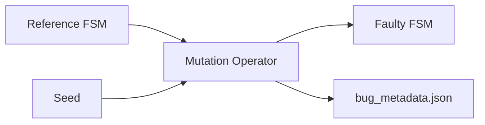

# Mutation Specification

This document specifies FSMRepairBench mutation operators: intended fault models,
semantics, and the bug metadata schema. Implementation:
`src/fsmrepairbench/mutators.py`.

## Purpose

Benchmark faults are **injected systematically** rather than mined from production
systems. Each case applies exactly one mutation operator with a documented seed, enabling:

- Reproducible faulty instances
- Stratified analysis by fault type (`bug_type` in taxonomy)
- Controlled ablation across defect classes



## Bug metadata schema

Every mutation produces a `BugMetadata` record stored in `bug_metadata.json`.

| Field | Type | Description |
|-------|------|-------------|
| `bug_id` | string | `{reference_fsm_id}__{operator}__{seed}` |
| `reference_fsm_id` | string | Unmutated FSM ID |
| `faulty_fsm_id` | string | `{reference_fsm_id}__faulty__{operator}__{seed}` |
| `mutation_operator` | string | Operator name |
| `changed_transition_id` | string \| null | Primary affected transition, if applicable |
| `description` | string | Human-readable summary |
| `seed` | integer | Deterministic mutation seed |

### Example

```json
{
  "bug_id": "toggle_001__wrong_target__1042",
  "reference_fsm_id": "toggle_001",
  "faulty_fsm_id": "toggle_001__faulty__wrong_target__1042",
  "mutation_operator": "wrong_target",
  "changed_transition_id": "t_off_on",
  "description": "Changed target of transition 't_off_on' from 'on' to 'off'",
  "seed": 1042
}
```

### Reproducibility

Given the reference FSM and metadata, `apply_mutation(reference, metadata)` reproduces
the faulty FSM. Dataset builder mutation seed:

```
mutation_seed = base_seed + case_number * 1000 + attempt
```

Up to 32 attempts per operator if preconditions fail.

## Operator catalogue

Fifteen operators are registered in `MUTATION_OPERATORS`:

### Structural transition faults

| Operator | Action | Fault model | Preconditions |
|----------|--------|-------------|---------------|
| `missing_transition` | Removes one randomly selected transition | Absent behaviour / incomplete specification | ≥ 1 transition |
| `wrong_target` | Changes `target` to a different state | Incorrect state reachability | ≥ 1 transition, ≥ 2 states |
| `wrong_source` | Changes `source` to a different state | Incorrect triggering context | ≥ 1 transition, ≥ 2 states |
| `wrong_event` | Changes `event` to another alphabet symbol | Wrong stimulus response | ≥ 2 events, ≥ 1 transition |
| `duplicate_transition` | Duplicates a transition with new ID | Ambiguous specification | ≥ 1 transition |

### Initialisation and reachability faults

| Operator | Action | Fault model | Preconditions |
|----------|--------|-------------|---------------|
| `wrong_initial_state` | Sets `initial_state` to a different state | Wrong startup configuration | ≥ 2 states |
| `dead_state_intro` | Adds a state with no incoming transitions | Dead/unreachable fragment | any |
| `unreachable_state_intro` | Adds isolated state `unreachable_{seed}` | Spurious state space | any |

### Guard faults

| Operator | Action | Fault model | Preconditions |
|----------|--------|-------------|---------------|
| `guard_flip` | Adds `unexpected_guard` or negates existing guard as `not_{guard}` | Incorrect enabling condition | ≥ 1 transition |
| `guard_weaken` | Sets guard to `"true"` | Over-permissive transition | ≥ 1 transition |
| `guard_strengthen` | Sets guard to `(guard) and strict_check` | Under-permissive transition | ≥ 1 transition |

### Action and timing faults

| Operator | Action | Fault model | Preconditions |
|----------|--------|-------------|---------------|
| `action_corruption` | Adds `wrong_action` or prefixes existing action | Side-effect fault (observable only if actions used downstream) | ≥ 1 transition |
| `timeout_corruption` | Multiplies `timeout` by 2 (default 1.0 if absent) | Temporal constraint fault | ≥ 1 transition |
| `delay_corruption` | Adds 1.0 to `delay` (default 0.5 if absent) | Timing delay fault | ≥ 1 transition |

### Nondeterminism faults

| Operator | Action | Fault model | Preconditions |
|----------|--------|-------------|---------------|
| `nondeterminism_intro` | Duplicates `(source, event, guard)` with different target | Under-specified concurrent behaviour | ≥ 1 transition, ≥ 2 states |

## Operator semantics (detailed)

### `missing_transition`

Randomly selects a transition index and removes it from the faulty FSM.

- **Oracle impact**: scenarios traversing the removed edge fail with
  `no_matching_transition`
- **Typical repair**: `add_transition` patch restoring the edge
- **Metadata**: `changed_transition_id` = removed transition ID

### `wrong_target`

Randomly selects a transition and replaces `target` with a different state ID.

- **Oracle impact**: scenarios expecting the original target state fail with
  `unexpected_state`
- **Typical repair**: `replace_transition_target`

### `wrong_source`

Randomly selects a transition and replaces `source`.

- **Oracle impact**: scenarios starting from the original source may fail to find a
  matching transition
- **Typical repair**: `replace_transition_source`

### `wrong_event`

Randomly selects a transition and replaces `event` with a different symbol from the
alphabet.

- **Oracle impact**: event sequences in oracles no longer match
- **Typical repair**: `replace_transition_event`

### `wrong_initial_state`

Changes `initial_state` to a different state.

- **Oracle impact**: all scenarios may start in wrong configuration
- **Metadata**: `changed_transition_id = null`
- **Typical repair**: `replace_initial_state`

### `duplicate_transition`

Appends a copy of a randomly selected transition with ID `{id}__dup__{seed}`.

- **Oracle impact**: may introduce nondeterministic matching (first match wins)
- **Fault model**: specification ambiguity

### `dead_state_intro`

Adds state `dead_{seed}` (with numeric suffix if collision) without connecting edges.

- **Oracle impact**: usually none unless oracles reference the dead state
- **Fault model**: structural noise / model hygiene defect

### `unreachable_state_intro`

Adds isolated state `unreachable_{seed}`.

- Similar to `dead_state_intro` but naming signals intentional unreachable fragment.

### `guard_flip`

If guard is absent, sets `unexpected_guard`. Otherwise sets `not_{original_guard}`.

- **Oracle impact**: guard-specific steps match different transitions or fail
- **Typical repair**: `replace_guard`

### `guard_weaken`

Sets guard to literal `"true"`.

- **Fault model**: overly permissive enabling condition
- May cause wrong transitions to fire on guarded oracle steps

### `guard_strengthen`

Replaces guard with `(original) and strict_check`.

- **Fault model**: overly restrictive enabling condition
- May cause `no_matching_transition` on previously valid steps

### `action_corruption`

Corrupts or introduces `action` field.

- **Oracle impact**: none under current oracle engine (actions are not observed)
- Included for structural realism and future extensions

### `timeout_corruption` / `delay_corruption`

Scales timing fields on a randomly selected transition.

- **Oracle impact**: none under current step-based oracle (timeouts not simulated)
- Supports timed FSM family tagging and future timed oracle extensions

### `nondeterminism_intro`

Duplicates a transition with same `(source, event, guard)` but different `target`.

- **Fault model**: incomplete conflict resolution
- **Oracle impact**: first matching transition in file order determines behaviour

## Selection in dataset builds

Mass builds (`build-dataset`) cycle operators by case number:

```
operator = MUTATION_OPERATORS[(case_number - 1) % len(MUTATION_OPERATORS)]
```

Stratified builds assign operators via plan cells (`bug_type` dimension).

## Taxonomy mapping

Mutation operators map to taxonomy `bug_type` labels (e.g. `missing_transition`,
`wrong_target`, `guard_fault`, `timing_fault`) for stratified reporting. See
[taxonomy.md](taxonomy.md).

## Validation

1. `faulty_fsm.json` must pass `validate_fsm` (except intentional nondeterminism cases)
2. `faulty_bpr` should be strictly less than `reference_bpr` (quality gate)
3. `mutation_operator` in metadata must match applied operator
4. `bug_id` must be unique within a dataset

Run case-level checks:

```bash
fsmrepairbench mutate REF.json --operator missing_transition --seed 42 \
  --out faulty.json --meta bug.json
fsmrepairbench score faulty.json oracle.json
```

## Related documents

- [dataset_format.md](dataset_format.md) — bug metadata JSON
- [oracle_spec.md](oracle_spec.md) — how faults surface in oracle execution
- [metrics.md](metrics.md) — `initial_bpr`, `bpr_delta`
- [reproducibility.md](reproducibility.md) — mutation seeds
