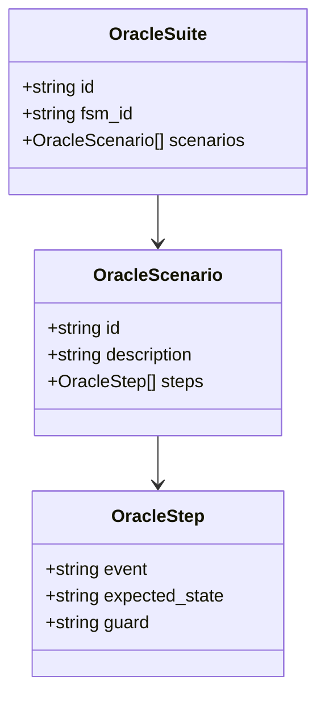
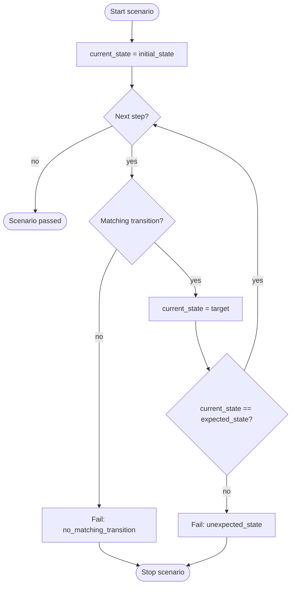

# Oracle Specification

This document specifies behavioural oracle execution in FSMRepairBench: how scenarios
are run against candidate FSMs, pass/fail semantics, and the Behavioural Pass Rate (BPR).

Implementation: `src/fsmrepairbench/oracle.py`, `src/fsmrepairbench/scorer.py`.

## Purpose

An oracle suite defines **observable behavioural requirements** for a benchmark case.
Repair methods are evaluated by executing oracle scenarios against candidate FSMs — not
by comparing JSON structure to the reference model.

Each case ships:

- `reference_fsm.json` — achieves BPR = 1.0 on the published suite (builder-enforced)
- `faulty_fsm.json` — intentionally fails one or more scenarios
- `oracle_suite.json` — ordered scenarios of input events and expected states

## Oracle model



| Level | Pass criterion |
|-------|----------------|
| Step | Matching transition found; resulting state equals `expected_state` |
| Scenario | All steps pass without early termination |
| Suite (BPR = 1.0) | All steps in all scenarios pass |

## Execution algorithm

Oracle execution is **deterministic**, ** synchronous**, and uses **fail-fast** semantics
within each scenario.

### Initial state

Execution begins at `fsm.initial_state`.

### Transition selection

For each step, the engine searches for a transition where:

1. `transition.source == current_state`
2. `transition.event == step.event`
3. `transition.guard == step.guard` (exact match, including both `null`)

The first matching transition in declaration order is taken. Guards are **not**
evaluated over EFSM variables; they are opaque string keys.



### Step outcomes

| Condition | `passed` | `failure_reason` |
|-----------|----------|------------------|
| No matching transition | false | `no_matching_transition` |
| Transition found, wrong state | false | `unexpected_state` |
| Transition found, correct state | true | null |

When a step fails, **remaining steps in the scenario are not executed** (fail-fast).
However, `total_steps` for the scenario remains the full declared step count.

### Non-deterministic FSMs

If multiple transitions match `(source, event, guard)`, the first in JSON declaration
order fires. Nondeterministic reference FSMs should be avoided unless explicitly studied;
the default validator rejects duplicate triples.

## Pass/fail semantics

### Step level

A step passes when a matching transition exists and the post-transition state equals
`expected_state`.

### Scenario level

`ScenarioResult.passed` is true only if every executed step passes and no fail-fast
termination occurred.

### Suite level

Two aggregate views are reported:

| Metric | Definition |
|--------|------------|
| Step pass rate (BPR) | `passed_steps / total_steps` |
| Scenario pass rate | `passed_scenarios / total_scenarios` |

**BPR is the primary benchmark metric.** Scenario pass rate is informational.

### Repair pass/fail

From `score_repair`:

- `RepairResult.score` = BPR of the candidate FSM
- `RepairResult.passed` = `(BPR == 1.0)` — **complete repair**

Experiment summaries additionally define:

- `effective_repair` = `final_bpr > initial_bpr`
- `regression` = `final_bpr < initial_bpr`

## Behavioural Pass Rate (BPR)

### Definition

Let \(S\) be the set of scenarios in the oracle suite. For scenario \(s\), let
\(n_s\) be the number of declared steps and \(p_s\) the number of steps marked passed
after execution (including fail-fast truncation).

\[
\text{BPR} = \frac{\sum_{s \in S} p_s}{\sum_{s \in S} n_s}
\]

If the suite has zero steps, BPR = 0.0.

### Implementation

```python
bpr = passed_steps / total_steps if total_steps else 0.0
```

BPR ∈ [0.0, 1.0].

### Worked example

Consider the parking gate oracle (3 scenarios, 4 total steps):

| Scenario | Steps | Faulty FSM outcome | Passed steps |
|----------|-------|-------------------|--------------|
| invalid_ticket_stays_closed | 1 | pass | 1 |
| valid_ticket_opens_gate | 1 | fail at step 1 | 0 |
| open_then_timeout_closes | 2 | not fully run if prior fail in suite scoring | varies |

For a faulty FSM missing the valid-ticket transition:

- Scenario 1: 1/1 passed
- Scenario 2: 0/1 passed (fail-fast)
- Scenario 3: 0/2 passed (first step fails)

\[
\text{BPR} = \frac{1 + 0 + 0}{1 + 1 + 2} = \frac{1}{4} = 0.25
\]

Case metadata records `reference_bpr = 1.0`, `faulty_bpr = 0.25`, `bpr_delta = 0.75`.

### Important properties

1. **Step-weighted** — longer scenarios contribute more to BPR than short ones.
2. **Fail-fast** — failed scenarios may not execute all steps, but undeclared steps
   still count in the denominator.
3. **Guard-sensitive** — steps with different guards are distinct inputs.
4. **Not equivalence** — BPR = 1.0 does not prove isomorphism or bisimulation to the
   reference FSM.

## Oracle generation

Automatic oracle suites (`generate-oracles`) explore the reference FSM via bounded
random walks. Depth presets control maximum scenario length:

| Depth | Max steps per scenario |
|-------|------------------------|
| shallow | 5 |
| medium | 12 |
| deep | 25 |
| exhaustive_like | 40 |

Coverage metrics recorded in `case_metadata.json`:

| Metric | Formula |
|--------|---------|
| `state_coverage` | \|covered states\| / \|reachable states\| |
| `transition_coverage` | \|covered transitions\| / \|reachable transitions\| |
| `event_coverage` | \|covered events\| / \|events\| |

Generated suites are validated to achieve BPR = 1.0 on the reference FSM before the
case is published.

## CLI usage

Score an FSM against an oracle:

```bash
fsmrepairbench score FSM.json ORACLE.json
```

Exit code 0 if BPR = 1.0; exit code 1 otherwise.

Validate oracle JSON schema:

```bash
fsmrepairbench validate-oracle ORACLE.json
```

## Threats to validity

Researchers should acknowledge:

- **Oracle incompleteness** — passing all published steps may miss divergent behaviours
- **Generator coupling** — oracles are derived from the same reference used for ground truth
- **Opaque guards** — guard strings are matched literally, not semantically evaluated
- **Step weighting** — BPR favours cases with many oracle steps

See [benchmark_spec.md](benchmark_spec.md) § Benchmark limitations.

## Related documents

- [dataset_format.md](dataset_format.md) — oracle JSON schema
- [metrics.md](metrics.md) — BPR in experiment aggregates
- [mutation_spec.md](mutation_spec.md) — how faults affect oracle outcomes
