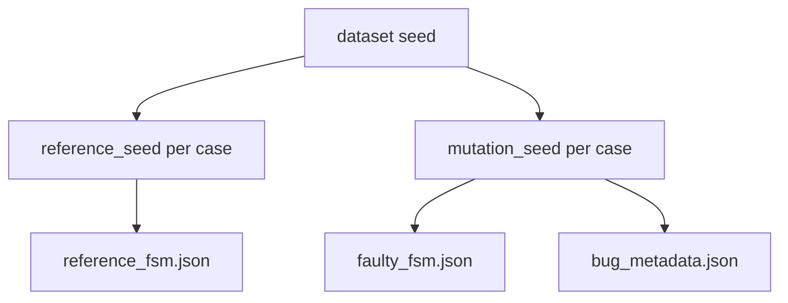
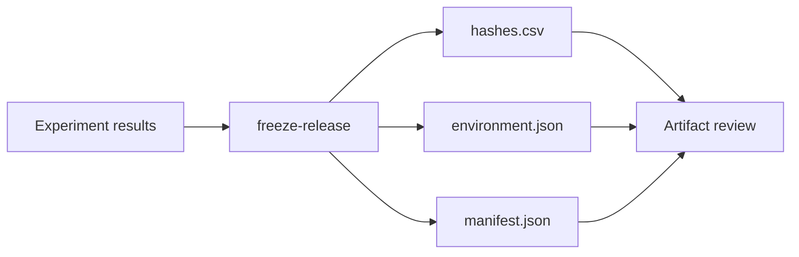

# Reproducibility

This document explains how FSMRepairBench ensures reproducible generation, versioning,
benchmark freezing, and experiment reproduction. It is intended for artifact reviewers,
benchmark maintainers, and researchers reporting comparative results.

## Reproducibility principles

1. **Pinned seeds** — every stochastic choice records its seed
2. **Stable case IDs** — identifiers survive schema migration
3. **Checksum-backed releases** — frozen results include SHA-256 hashes
4. **Declarative experiments** — YAML configs drive repair runs
5. **Artifact bundles** — paper packages pin dataset, prompts, and models

## Seeds

### Dataset seed

The top-level dataset seed is stored in `metadata.json`:

```json
{
  "seed": 42,
  "benchmark_version": "v1.0"
}
```

All case generation derives from this value plus deterministic offsets.

### Per-case seeds

| Purpose | Formula |
|---------|---------|
| Reference FSM synthesis | `reference_seed = base_seed + case_number` |
| Mutation operator selection | `MUTATION_OPERATORS[(case_number - 1) % 15]` |
| Mutation application | `mutation_seed = base_seed + case_number * 1000 + attempt` |

The applied mutation seed is persisted in `bug_metadata.json`:

```json
{
  "seed": 43001,
  "mutation_operator": "missing_transition"
}
```

### Complexity cycling

Synthetic complexity levels cycle by case number:

```
complexity = COMPLEXITY_LEVELS[(case_number - 1) % len(COMPLEXITY_LEVELS)]
```

### Stratified plans

Stratified builds (`build-stratified-dataset`) read `seed` from the plan YAML:

```yaml
name: benchmark-10k
version: "1.0"
seed: 42
cells:
  - machine_type: plain_fsm
    bug_type: missing_transition
    count: 100
```

### LLM experiments

LLM outputs may be non-deterministic unless:

- Model temperature is fixed (prefer 0.0)
- Prompt templates are pinned (`llm/prompts.py`, artifact `prompts/`)
- Backend version is recorded in `environment.json`

Record model name, backend, and prompt hash in experiment configs.



## Versioning

FSMRepairBench separates **schema versions** from **evolution releases**.

### Schema versions

| Version | Dataset ID | Notable change |
|---------|------------|----------------|
| v0.1 | `fsmrepairbench_v0` | Core four case files |
| v1.0 | `fsmrepairbench_v1` | + `case_metadata.json` |
| v1.1 | `fsmrepairbench_v1` | + dataset `statistics` |
| v2.0 | `fsmrepairbench_v2` | + optional `requirements.json` |

Detect with:

```bash
fsmrepairbench benchmark-version DATASET_DIR
```

### Evolution releases

| Release | Schema versions | Purpose |
|---------|-----------------|---------|
| v0 | v0.1 | Prototype |
| v1 | v1.0, v1.1 | Stable public benchmark |
| v2 | v2.0 | Requirements-aware cases |

Evolution comparison:

```bash
fsmrepairbench benchmark-evolution compare OLD_DATASET NEW_DATASET
fsmrepairbench benchmark-evolution trace case_000042 DATASET_DIR
```

### Case ID immutability

Case IDs (`case_000001`, …) are assigned at build time and **must not change** across
compatible migrations. Removed cases are documented in evolution reports; IDs are never
reused for different semantics.

### Migration

Upgrade datasets between schema versions:

```bash
fsmrepairbench migrate-benchmark DATASET_DIR --target-version v2.0
```

Produces:

- Updated JSON files (additive fields only on upgrade paths)
- `migration_report.json` — added/modified/removed cases
- Updated `release_manifest.json`

Dry-run analysis:

```bash
fsmrepairbench analyze_migration DATASET_DIR --target-version v2.0 --dry-run
```

Rules (see [`VERSIONING_POLICY.md`](../VERSIONING_POLICY.md)):

- Upgrade-only migrations preserve case IDs
- Breaking semantic changes require new evolution release
- Deprecated schemas remain readable until documented sunset

## Benchmark freezing

### Dataset release manifest

Published datasets include `release_manifest.json`:

- Benchmark version and dataset ID
- Case count and file inventory
- Generation timestamp and toolchain version

Generate/update:

```bash
fsmrepairbench release-manifest DATASET_DIR
```

### Experiment result freezing

After experiments, freeze results for artifact evaluation:

```bash
fsmrepairbench freeze-release RESULTS_DIR --output RELEASE_DIR
```

Produces an auditable release directory:

| File | Content |
|------|---------|
| `summary.csv` | Aggregated experiment metrics |
| `cases_index.csv` | Per-case result index |
| `results/` | Copy of result JSON files |
| `hashes.csv` | SHA-256 of every frozen file |
| `environment.json` | Python version, platform, git commit, package version |
| `manifest.json` | Release metadata |
| `README.md` | Human-readable release summary |



Reviewers verify integrity:

```bash
sha256sum -c hashes.csv
```

### Quality gates before freezing

Recommended pipeline:

```bash
fsmrepairbench validate-dataset DATASET_DIR
fsmrepairbench analyze-novelty DATASET_DIR
fsmrepairbench run-experiment CONFIG.yaml
fsmrepairbench freeze-release RESULTS_DIR
```

## Experiment reproduction

### Experiment configuration

Experiments are driven by YAML configs:

```yaml
dataset_dir: data/benchmark_v1
models:
  - name: llama3.1:8b
    backend: ollama
iterations: 5
workers: 4
output_dir: results/run_001
```

Run:

```bash
fsmrepairbench run-experiment CONFIG.yaml
```

Outputs:

- `summary.csv` — one row per (case, model)
- `case_{id}__{model}.json` — detailed result
- `trace__case_{id}__{model}.json` — repair trajectory

### Artifact bundles

Paper artifact packages include `artifact.yaml`:

```yaml
dataset:
  benchmark_version: v1.0
  size: 100
  seed: 42
  output_dir: artifact_data/dataset
  build_if_missing: true
seeds:
  dataset: 42
models:
  default_backend: ollama
  models:
    - llama3.1:8b
experiment:
  config: configs/experiment.yaml
```

Reproduce end-to-end:

```bash
fsmrepairbench reproduce ARTIFACT_DIR
```

This may:

1. Build the pinned dataset if missing
2. Run the experiment config
3. Generate leaderboard
4. Optionally freeze results
5. Write `reproduction_report.json`

### Repair trace reproduction

Repair trajectories record each iteration:

- Prompt hash
- Raw model output
- Parsed patch
- BPR before/after patch application
- Failure reasons

Replaying a trace validates patch application determinism independent of the LLM.

### Environment pinning

Record in papers:

- FSMRepairBench package version (`fsmrepairbench.__version__`)
- Python version
- Git commit hash (from `environment.json`)
- Model backend and model ID
- Dataset `benchmark_version`, `seed`, and frozen hash

## Checklist for reproducible papers

- [ ] Dataset schema version and seed reported
- [ ] Case count and stratified plan referenced (if applicable)
- [ ] Experiment YAML included in artifact
- [ ] Model backend, temperature, and prompt version documented
- [ ] `freeze-release` hashes cited or archived
- [ ] Stratified metrics reported alongside aggregates
- [ ] Threats to validity acknowledged ([benchmark_spec.md](benchmark_spec.md))

## Related documents

- [`VERSIONING_POLICY.md`](../VERSIONING_POLICY.md)
- [`DATASET_POLICY.md`](../DATASET_POLICY.md)
- [dataset_format.md](dataset_format.md)
- [architecture.md](architecture.md)
