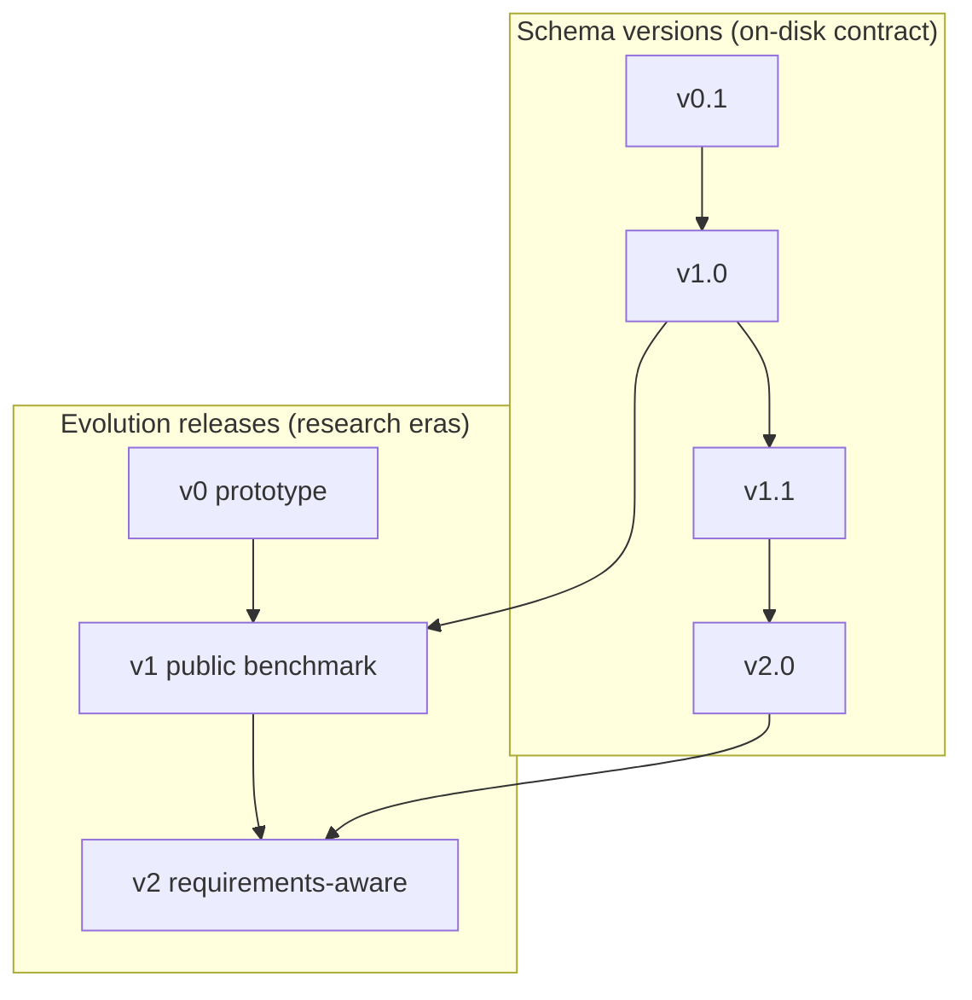
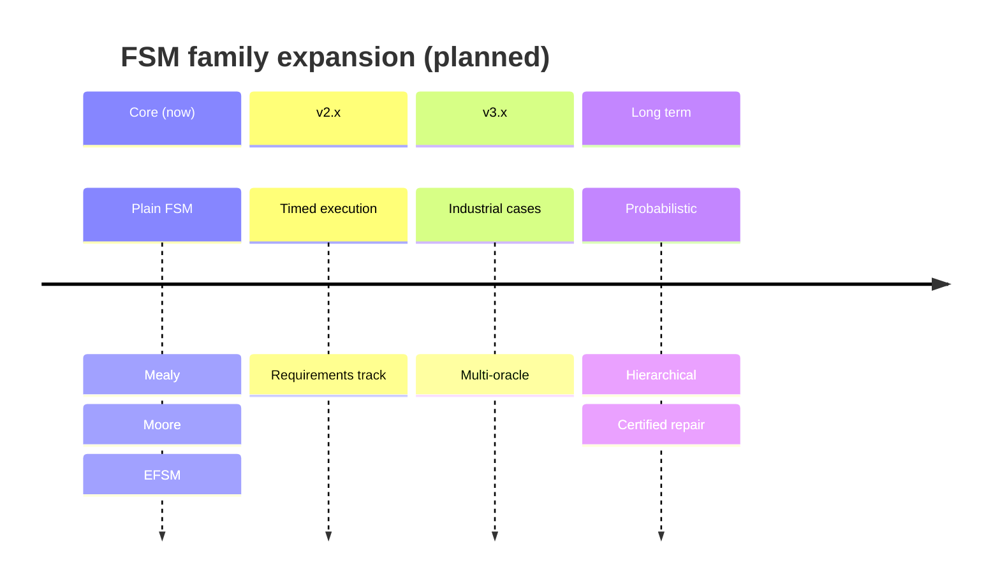

# Roadmap

This document outlines the planned evolution of FSMRepairBench as a long-term open-source
research artifact. Items are aspirational until shipped with tests, documentation, and
migration paths. Completed milestones are marked accordingly.

## Vision

FSMRepairBench aims to become a **standing reference** for behavioural FSM repair
research — analogous in spirit to established benchmarks in program repair and verification,
but centred on explicit state machines, oracle-based evaluation, and stratified diversity.

See [FSMREPAIRBENCH_MANIFESTO.md](FSMREPAIRBENCH_MANIFESTO.md) for scientific positioning.

## Evolution strategy

FSMRepairBench uses a two-layer versioning model:

### Change categories

| Category | Examples | Case ID impact |
|----------|----------|----------------|
| Patch release | Tooling, analytics, docs | None |
| Schema minor | Additive metadata, migration reports | IDs preserved |
| Evolution major | New case families, case removal | Documented in evolution report |

### Governance

Maintainers enforce ([`DATASET_POLICY.md`](../DATASET_POLICY.md)):

- No silent edits to frozen cases
- No reuse of case IDs
- Migration paths for deprecated schemas
- Test suite passage before merge

Community proposals flow through documented review; schema-breaking changes require
explicit migration design.

## Completed milestones

- [x] Core FSM and oracle validation
- [x] Fifteen seeded mutation operators with bug metadata
- [x] Mass and stratified dataset builders
- [x] Schema versioning, migration, and release manifests
- [x] Benchmark evolution comparison and case tracing
- [x] Structural difficulty estimation and calibration
- [x] Feature-space coverage analysis and gap detection
- [x] Requirement generation and ambiguity injection (v2.0 track)
- [x] Scalable experiment execution with checkpoint/resume
- [x] LLM repair loop with pluggable backends (Ollama, vLLM, OpenAI-compatible)
- [x] Repair trajectory persistence and failure pattern mining
- [x] Dataset quality validation and novelty analysis
- [x] Leaderboard generation and Hugging Face export
- [x] Artifact reproduction bundles
- [x] Technical documentation (`docs/`)

## Near-term milestones

Target: community-ready **v2.0 frozen release**

- [ ] Public v2.0 dataset release with checksum-backed manifest
- [ ] Community leaderboard with stratified reporting requirements
- [ ] Held-out evaluation split with sealed checksums
- [ ] Baseline reference implementations documented for all 15 fault types
- [ ] Continuous integration on representative dataset slice
- [ ] Zenodo / permanent archive DOI for frozen releases

## Medium-term milestones

Target: broader machine families and industrial relevance

### Richer timed and probabilistic families

Extend timed FSM semantics where oracles remain executable:

- Simulated timeout/delay steps in oracle engine
- Zone-based guards (restricted subset)
- Probabilistic transitions with statistical oracle thresholds

### Industrial case studies

Curated contributions under stable IDs:

- Contributor guidelines for proprietary model sanitisation
- Manual oracle curation workflow
- Separate **industrial track** in leaderboard (does not mix with synthetic aggregates)

### Multi-oracle consensus

- Independent oracle generation strategies per case
- Mutation testing of oracle suites themselves
- Consensus BPR requiring agreement across oracle variants

### Model-driven engineering interchange

- Import/export adapters for standard formats (where licensing permits)
- Mapping from external tools to FSMRepairBench JSON contract

### NL requirements pipeline

- Cross-benchmark protocol: requirements → FSM → repair → re-verification
- Ambiguity track with human evaluation subset

## Long-term milestones

Target: perennial research artifact status

### Community steering

- Standing maintainers group for evolution releases
- Public RFC process for schema changes
- Annual evolution release cadence aligned with venue artifact tracks

### Perennial artifact track

- Official frozen releases for major venues (SV-COMP / JAPEX-inspired model)
- Sealed held-out sets rotated on multi-year schedule
- Historical leaderboard archive with version pinning

### Human-in-the-loop repair

- Benchmark variant for interactive repair sessions
- Metrics: time-to-repair, human edit count, oracle progress curves

### Certified repair classes

- Optional track for patches with formal guarantees (separate from base BPR)
- Link cases to external proof artefacts (optional, not required for base score)

## Future FSM families

The taxonomy ([taxonomy.md](taxonomy.md)) will expand to cover families currently
out of scope or only partially supported.

| Family | Current status | Planned direction |
|--------|----------------|-----------------|
| Plain FSM | Supported | Continue as core |
| Mealy / Moore | Supported | Extended output oracles |
| EFSM | Supported (guards as strings) | Guard expression evaluation subset |
| Timed FSM | Partial (fields only) | Timed oracle execution |
| Timed EFSM | Partial | Combined guard + time oracles |
| Interface automata | Not supported | Compatibility composition faults |
| Register automata | Not supported | Data-parameterised transitions |
| Probabilistic FSM | Not supported | Statistical BPR thresholds |
| Hierarchical FSM | Not supported | Flattening adapters + native hierarchy |
| Statecharts (UML) | Not supported | Orthogonal regions subset |

## Research tracks

Parallel benchmark tracks under one tooling umbrella:

| Track | Focus | Status |
|-------|-------|--------|
| **Synthetic** | Stratified seeded generation | Active |
| **Requirements** | NL + ambiguity (v2.0) | Active |
| **Industrial** | Curated real models | Planned |
| **Certified** | Proof-carrying patches | Aspirational |

Tracks share the oracle execution core but may use separate leaderboard columns.

## How to contribute to the roadmap

1. Open a proposal referencing affected schema version and migration path
2. Include taxonomy impact and stratified reporting implications
3. Provide tests and documentation updates
4. Follow [CONTRIBUTING.md](../CONTRIBUTING.md)

Large features should align with an evolution release rather than ad hoc dataset edits.

## Related documents

- [FSMREPAIRBENCH_MANIFESTO.md](FSMREPAIRBENCH_MANIFESTO.md)
- [benchmark_spec.md](benchmark_spec.md)
- [reproducibility.md](reproducibility.md)
- [`VERSIONING_POLICY.md`](../VERSIONING_POLICY.md)
- [architecture.md](architecture.md)
