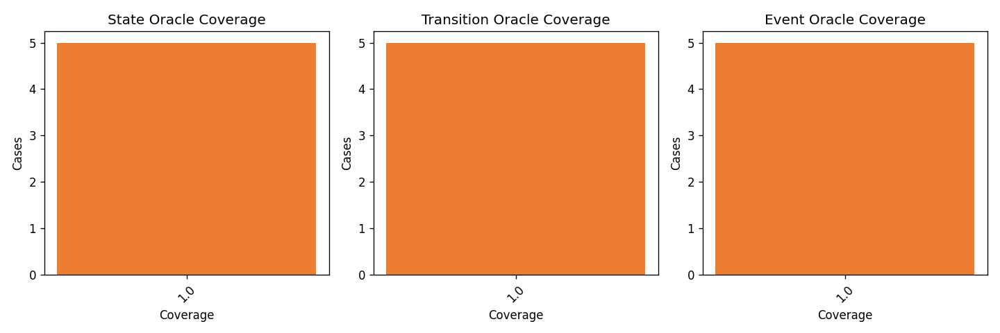
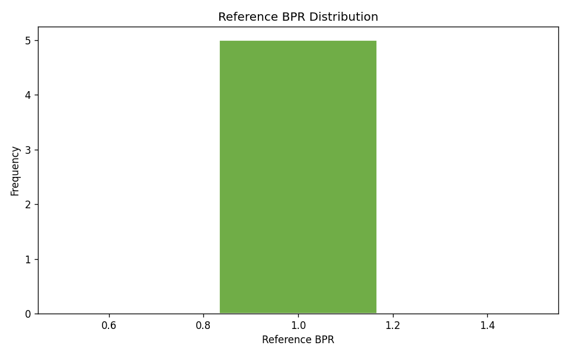
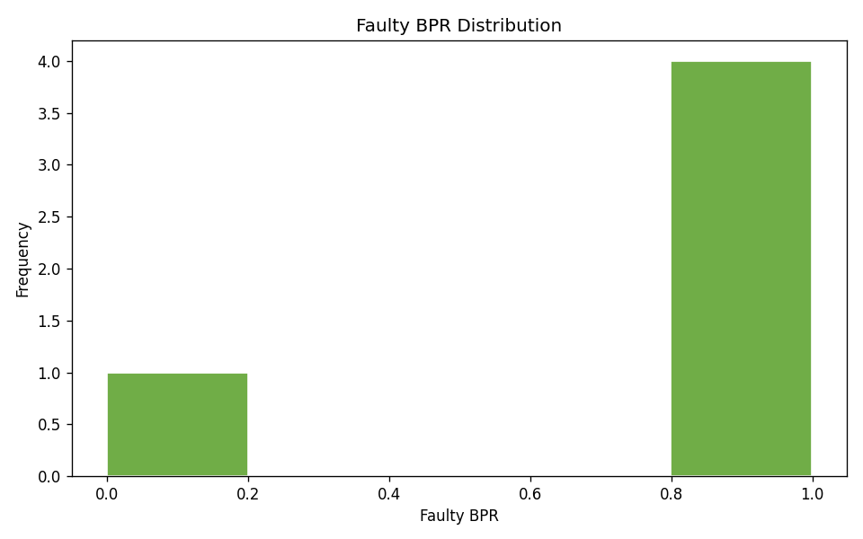
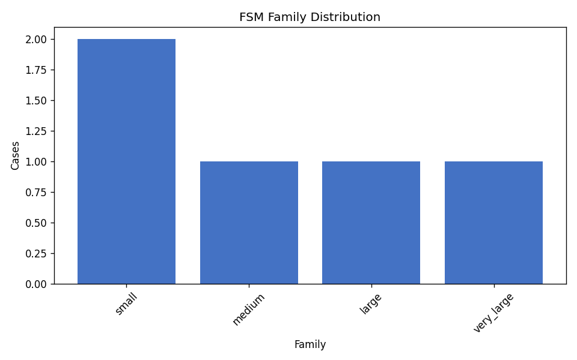

# FSMRepairBench Dataset Analysis Report

**Dataset:** `/home/cesar/papers/fsmrepairbench/fsmrepairbench/results/_smoke_analyze_subset`  
**Generated:** 2026-06-09 02:48 UTC  
**Cases analyzed:** 5

## Abstract

This report summarizes structural diversity, oracle coverage, mutation operator usage, behavioural pass rate (BPR) distributions, and correlations between FSM features and repair-difficulty proxies for the benchmark dataset. All statistics are derived from existing packaged case outputs (`case_metadata.json` / index rows) without introducing new benchmark features.

## Summary

- Overall mutation detection rate: **100.00%**
- Mean difficulty score: **28.84**
- Mean faulty BPR: **0.7872**
- Mean BPR delta: **0.2128**

## Mutation Operator Frequencies

| Operator | Cases | Share | Detection Rate |
|---|---:|---:|---:|
| `missing_transition` | 1 | 20.00% | 100.00% |
| `wrong_event` | 1 | 20.00% | 100.00% |
| `wrong_initial_state` | 1 | 20.00% | 100.00% |
| `wrong_source` | 1 | 20.00% | 100.00% |
| `wrong_target` | 1 | 20.00% | 100.00% |

## Coverage and BPR Distributions

Oracle coverage and BPR bucket counts are exported in `/home/cesar/papers/fsmrepairbench/fsmrepairbench/results/_smoke_analyze_out/distributions.csv`. Key figures:

## FSM Family Distribution (complexity tier)

| Family | Cases | Share |
|---|---:|---:|
| `small` | 2 | 40.00% |
| `medium` | 1 | 20.00% |
| `large` | 1 | 20.00% |
| `very_large` | 1 | 20.00% |

## Correlations with Repair Difficulty

Pearson correlations relate structural/oracle features to `difficulty_score` and `bpr_delta`. Full results: `/home/cesar/papers/fsmrepairbench/fsmrepairbench/results/_smoke_analyze_out/correlations.csv`.

| Feature | Target | *r* |
|---|---|---:|
| `faulty_bpr` | `bpr_delta` | -1.000 |
| `state_count` | `difficulty_score` | +0.991 |
| `event_count` | `difficulty_score` | +0.990 |
| `transition_count` | `difficulty_score` | +0.985 |
| `event_count` | `bpr_delta` | -0.479 |
| `faulty_bpr` | `difficulty_score` | +0.437 |
| `state_count` | `bpr_delta` | -0.410 |
| `transition_count` | `bpr_delta` | -0.390 |

## Artifacts

- Summary metrics: `/home/cesar/papers/fsmrepairbench/fsmrepairbench/results/_smoke_analyze_out/summary.csv`
- Distributions: `/home/cesar/papers/fsmrepairbench/fsmrepairbench/results/_smoke_analyze_out/distributions.csv`
- Correlations: `/home/cesar/papers/fsmrepairbench/fsmrepairbench/results/_smoke_analyze_out/correlations.csv`
- Figures: `/home/cesar/papers/fsmrepairbench/fsmrepairbench/results/_smoke_analyze_out/figures/`

