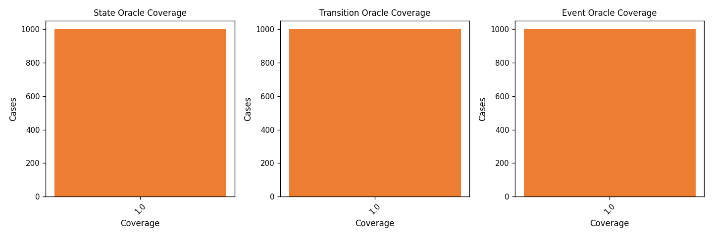
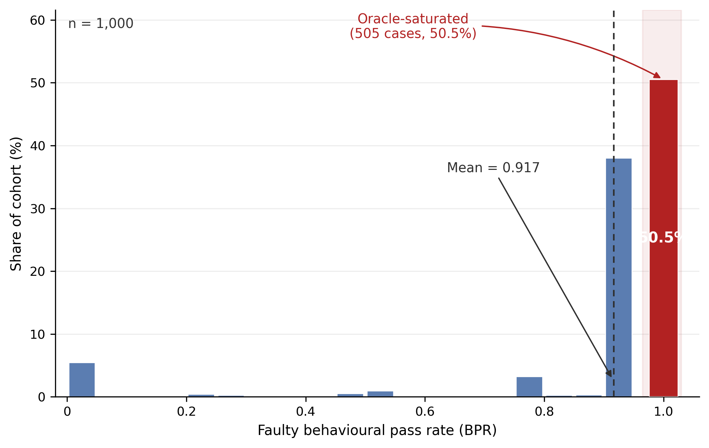
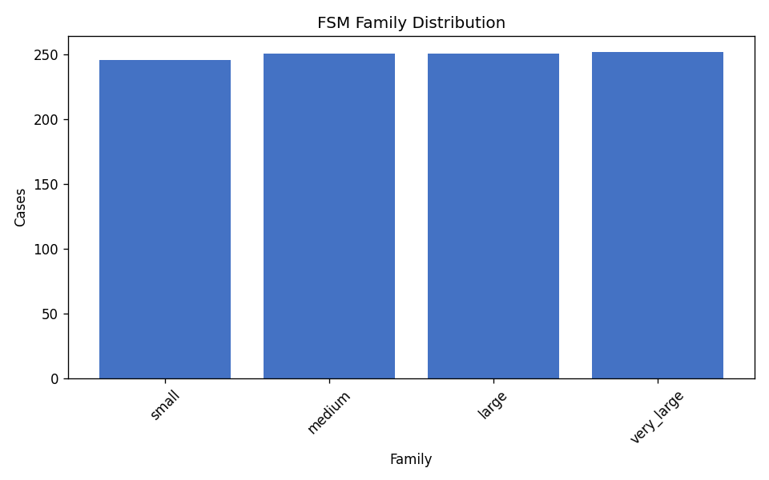

# FSMRepairBench Dataset Analysis Report

**Dataset:** `data/fsmrepairbench_1k`  
**Generated:** 2026-06-09 01:26 UTC  
**Cases analyzed:** 1000

## Abstract

This report summarizes structural diversity, oracle coverage, mutation operator usage, behavioural pass rate (BPR) distributions, and correlations between FSM features and repair-difficulty proxies for the benchmark dataset. All statistics are derived from existing packaged case outputs (`case_metadata.json` / index rows) without introducing new benchmark features.

## Summary

- Overall mutation detection rate: **49.50%**
- Mean difficulty score: **32.27**
- Mean faulty BPR: **0.9166**
- Mean BPR delta: **0.0834**

## Mutation Operator Frequencies

| Operator | Cases | Share | Detection Rate |
|---|---:|---:|---:|
| `action_corruption` | 59 | 5.90% | 0.00% |
| `action_full_mutation` | 59 | 5.90% | 0.00% |
| `dead_state_intro` | 59 | 5.90% | 0.00% |
| `delay_corruption` | 59 | 5.90% | 0.00% |
| `duplicate_transition` | 59 | 5.90% | 0.00% |
| `guard_flip` | 59 | 5.90% | 100.00% |
| `guard_inter_class` | 53 | 5.30% | 37.74% |
| `guard_strengthen` | 59 | 5.90% | 100.00% |
| `guard_weaken` | 59 | 5.90% | 100.00% |
| `missing_transition` | 60 | 6.00% | 100.00% |
| `nondeterminism_intro` | 59 | 5.90% | 0.00% |
| `timeout_corruption` | 59 | 5.90% | 0.00% |
| `unreachable_state_intro` | 59 | 5.90% | 0.00% |
| `wrong_event` | 59 | 5.90% | 100.00% |
| `wrong_initial_state` | 59 | 5.90% | 100.00% |
| `wrong_source` | 60 | 6.00% | 100.00% |
| `wrong_target` | 60 | 6.00% | 100.00% |

## Coverage and BPR Distributions

Oracle coverage and BPR bucket counts are exported in `results/analysis/distributions.csv`. Key figures:

## FSM Family Distribution (complexity tier)

| Family | Cases | Share |
|---|---:|---:|
| `small` | 246 | 24.60% |
| `medium` | 251 | 25.10% |
| `large` | 251 | 25.10% |
| `very_large` | 252 | 25.20% |

## Correlations with Repair Difficulty

Pearson correlations relate structural/oracle features to `difficulty_score` and `bpr_delta`. Full results: `results/analysis/correlations.csv`.

| Feature | Target | *r* |
|---|---|---:|
| `faulty_bpr` | `bpr_delta` | -1.000 |
| `state_count` | `difficulty_score` | +0.994 |
| `transition_count` | `difficulty_score` | +0.989 |
| `event_count` | `difficulty_score` | +0.980 |
| `event_count` | `bpr_delta` | -0.084 |
| `faulty_bpr` | `difficulty_score` | +0.079 |
| `state_count` | `bpr_delta` | -0.074 |
| `transition_count` | `bpr_delta` | -0.071 |

## Artifacts

- Summary metrics: `results/analysis/summary.csv`
- Distributions: `results/analysis/distributions.csv`
- Correlations: `results/analysis/correlations.csv`
- Figures: `results/analysis/figures/`

