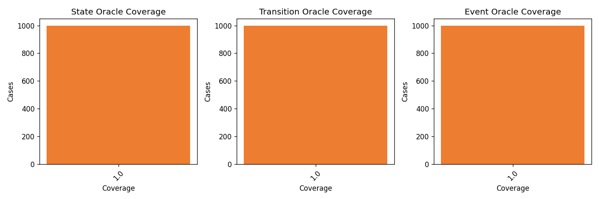
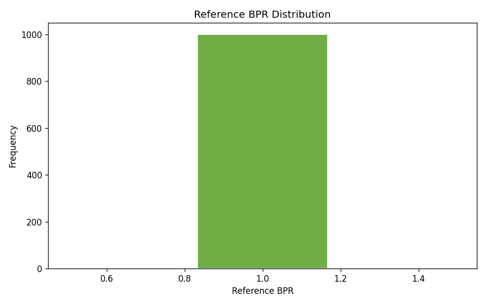
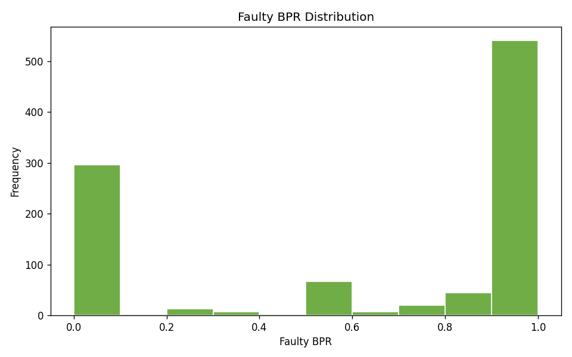
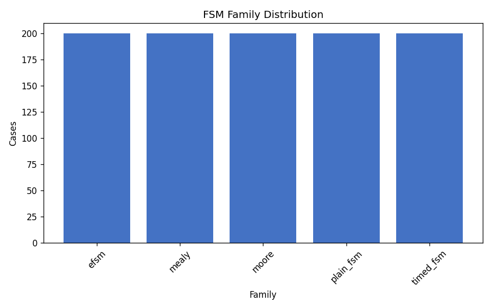

# FSMRepairBench Dataset Analysis Report

**Dataset:** `/home/cesar/papers/fsmrepairbench/fsmrepairbench/data/fsmrepairbench_1k_multifamily`  
**Generated:** 2026-06-09 18:27 UTC  
**Cases analyzed:** 1000

## Abstract

This report summarizes structural diversity, oracle coverage, mutation operator usage, behavioural pass rate (BPR) distributions, and correlations between FSM features and repair-difficulty proxies for the benchmark dataset. All statistics are derived from existing packaged case outputs (`case_metadata.json` / index rows) without introducing new benchmark features.

## Summary

- Overall mutation detection rate: **65.00%**
- Mean difficulty score: **9.91**
- Mean faulty BPR: **0.6278**
- Mean BPR delta: **0.3722**

## Mutation Operator Frequencies

| Operator | Cases | Share | Detection Rate |
|---|---:|---:|---:|
| `action_corruption` | 50 | 5.00% | 0.00% |
| `dead_state_intro` | 50 | 5.00% | 0.00% |
| `delay_corruption` | 50 | 5.00% | 0.00% |
| `duplicate_transition` | 50 | 5.00% | 0.00% |
| `guard_flip` | 100 | 10.00% | 100.00% |
| `guard_strengthen` | 50 | 5.00% | 100.00% |
| `guard_weaken` | 50 | 5.00% | 100.00% |
| `missing_transition` | 150 | 15.00% | 100.00% |
| `nondeterminism_intro` | 50 | 5.00% | 0.00% |
| `timeout_corruption` | 50 | 5.00% | 0.00% |
| `unreachable_state_intro` | 50 | 5.00% | 0.00% |
| `wrong_event` | 50 | 5.00% | 100.00% |
| `wrong_initial_state` | 50 | 5.00% | 100.00% |
| `wrong_source` | 50 | 5.00% | 100.00% |
| `wrong_target` | 150 | 15.00% | 100.00% |

## Coverage and BPR Distributions

Oracle coverage and BPR bucket counts are exported in `/home/cesar/papers/fsmrepairbench/fsmrepairbench/results/analysis_1k_multifamily/distributions.csv`. Key figures:

## FSM Family Distribution (machine type)

| Family | Cases | Share |
|---|---:|---:|
| `efsm` | 200 | 20.00% |
| `mealy` | 200 | 20.00% |
| `moore` | 200 | 20.00% |
| `plain_fsm` | 200 | 20.00% |
| `timed_fsm` | 200 | 20.00% |

## Correlations with Repair Difficulty

Pearson correlations relate structural/oracle features to `difficulty_score` and `bpr_delta`. Full results: `/home/cesar/papers/fsmrepairbench/fsmrepairbench/results/analysis_1k_multifamily/correlations.csv`.

| Feature | Target | *r* |
|---|---|---:|
| `faulty_bpr` | `bpr_delta` | -1.000 |
| `transition_count` | `difficulty_score` | +0.996 |
| `state_count` | `difficulty_score` | +0.641 |
| `state_count` | `bpr_delta` | -0.576 |
| `transition_count` | `bpr_delta` | -0.486 |
| `faulty_bpr` | `difficulty_score` | +0.481 |
| `event_count` | `difficulty_score` | +0.000 |
| `oracle_state_coverage` | `difficulty_score` | +0.000 |

## Artifacts

- Summary metrics: `/home/cesar/papers/fsmrepairbench/fsmrepairbench/results/analysis_1k_multifamily/summary.csv`
- Confidence intervals: `/home/cesar/papers/fsmrepairbench/fsmrepairbench/results/analysis_1k_multifamily/confidence_intervals.csv`
- Distributions: `/home/cesar/papers/fsmrepairbench/fsmrepairbench/results/analysis_1k_multifamily/distributions.csv`
- Correlations: `/home/cesar/papers/fsmrepairbench/fsmrepairbench/results/analysis_1k_multifamily/correlations.csv`
- Figures: `/home/cesar/papers/fsmrepairbench/fsmrepairbench/results/analysis_1k_multifamily/figures/`

## Bootstrap confidence intervals

Non-parametric percentile bootstrap over cases (10,000 resamples, 95% CI, seed 44).
Exports: `confidence_intervals.csv` and `confidence_intervals.json`.

- `overall_detection_rate (RQ2)`: 0.650000 [0.620000, 0.680000] (n=1000)
- `mean_faulty_bpr (RQ2)`: 0.627804 [0.600917, 0.654702] (n=1000)
- `mean_bpr_delta (RQ2)`: 0.372196 [0.345298, 0.399083] (n=1000)
