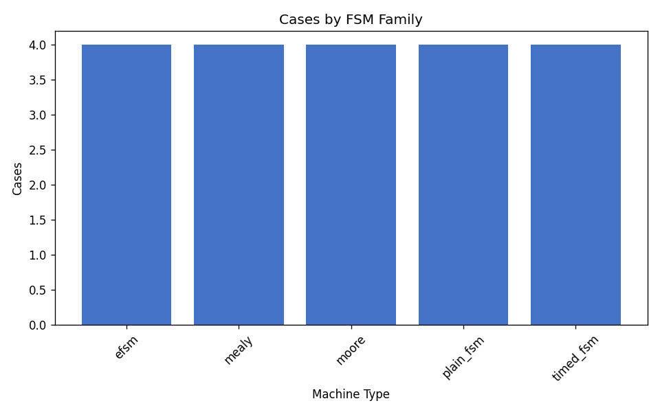
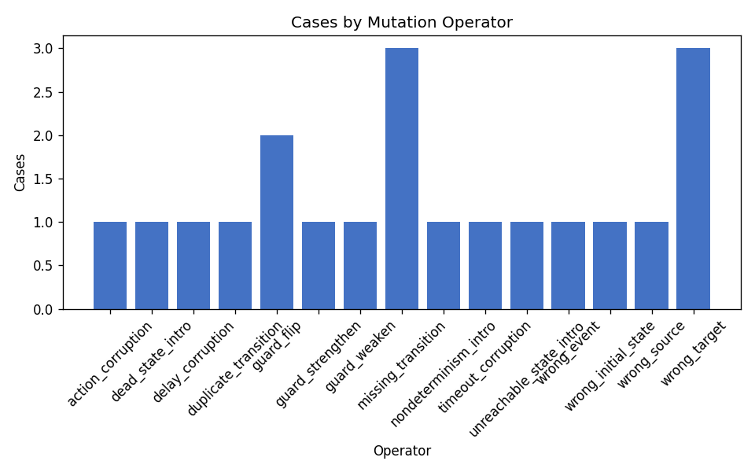
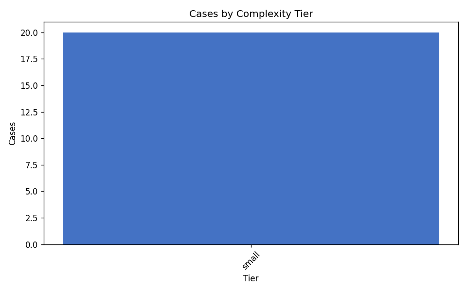
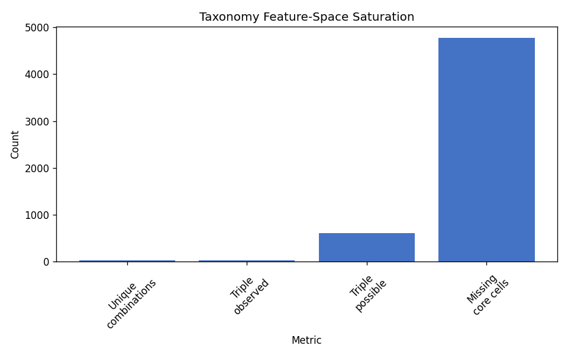
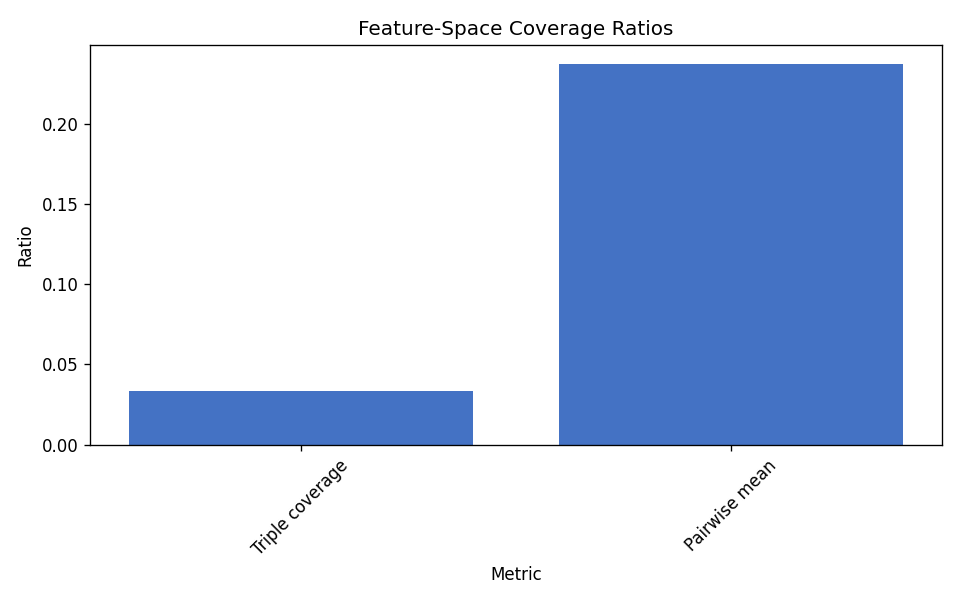

# Taxonomy Coverage Report

Empirical coverage audit of the FSMRepairBench taxonomy on an existing published dataset.

## Dataset

- **Dataset directory:** `/home/cesar/papers/fsmrepairbench/fsmrepairbench/data/fsmrepairbench_multifamily_pilot`
- **Cases analysed:** 20
- **Cohort manifest:** `/home/cesar/papers/fsmrepairbench/fsmrepairbench/data/fsmrepairbench_multifamily_pilot/analysis_cohort_multifamily.txt`

## Executive summary

Taxonomy claims are **only weakly supported** on this cohort; several declared dimensions or operator families are underrepresented. Mean dimension value coverage is 61.2%; mutation-operator coverage is 78.9%; machine-type/bug-type/size-class triple coverage is 3.3%.

## Coverage per taxonomy dimension

| Dimension | Observed values | Universe | Coverage | Entropy |
|-----------|----------------:|---------:|---------:|--------:|
| `machine_type` | 5 | 8 | 62.5% | 2.322 |
| `determinism` | 1 | 2 | 50.0% | 0.000 |
| `completeness` | 2 | 2 | 100.0% | 0.469 |
| `arity_class` | 3 | 4 | 75.0% | 1.353 |
| `size_class` | 1 | 5 | 20.0% | 0.000 |
| `guard_complexity` | 3 | 4 | 75.0% | 1.522 |
| `time_features` | 2 | 5 | 40.0% | 0.722 |
| `graph_structure` | 6 | 7 | 85.7% | 2.148 |
| `oracle_depth` | 1 | 4 | 25.0% | 0.000 |
| `bug_type` | 15 | 19 | 78.9% | 3.746 |

## Coverage per FSM family

| FSM family | Cases | Cohort share | Mutation operators |
|------------|------:|-------------:|-------------------:|
| `efsm` | 4 | 20.0% | 4 |
| `mealy` | 4 | 20.0% | 4 |
| `moore` | 4 | 20.0% | 4 |
| `plain_fsm` | 4 | 20.0% | 4 |
| `timed_fsm` | 4 | 20.0% | 4 |

## Coverage per mutation operator

| Operator | Cases | Cohort share | FSM families |
|----------|------:|-------------:|-------------:|
| `action_corruption` | 1 | 5.0% | 1 |
| `dead_state_intro` | 1 | 5.0% | 1 |
| `delay_corruption` | 1 | 5.0% | 1 |
| `duplicate_transition` | 1 | 5.0% | 1 |
| `guard_flip` | 2 | 10.0% | 2 |
| `guard_strengthen` | 1 | 5.0% | 1 |
| `guard_weaken` | 1 | 5.0% | 1 |
| `missing_transition` | 3 | 15.0% | 3 |
| `nondeterminism_intro` | 1 | 5.0% | 1 |
| `timeout_corruption` | 1 | 5.0% | 1 |
| `unreachable_state_intro` | 1 | 5.0% | 1 |
| `wrong_event` | 1 | 5.0% | 1 |
| `wrong_initial_state` | 1 | 5.0% | 1 |
| `wrong_source` | 1 | 5.0% | 1 |
| `wrong_target` | 3 | 15.0% | 3 |

## Coverage per complexity tier

| Tier | Cases | Cohort share | Mutation operators |
|------|------:|-------------:|-------------------:|
| `small` | 20 | 100.0% | 15 |

## Feature-space saturation

- Unique full-taxonomy combinations: **20**
- Duplicate-combination cases: **0**
- Missing core 5-feature combinations: **4780** (of 4800 possible)
- Triple (`machine_type`, `bug_type`, `size_class`) coverage: **3.3%**

## Artefacts

- Summary metrics: `/home/cesar/papers/fsmrepairbench/fsmrepairbench/results/multifamily_pilot/coverage/summary.csv`
- Unique combinations: `/home/cesar/papers/fsmrepairbench/fsmrepairbench/results/multifamily_pilot/coverage/unique_combinations_summary.csv`
- Top combinations: `/home/cesar/papers/fsmrepairbench/fsmrepairbench/results/multifamily_pilot/coverage/coverage_by_unique_combinations.csv`
- Dimension detail: `/home/cesar/papers/fsmrepairbench/fsmrepairbench/results/multifamily_pilot/coverage/coverage_by_dimension.csv`
- Feature-space report: `/home/cesar/papers/fsmrepairbench/fsmrepairbench/results/multifamily_pilot/coverage/feature_space_report.json`
- Frozen manifest: `/home/cesar/papers/fsmrepairbench/fsmrepairbench/results/multifamily_pilot/coverage/manifest.json`
- LaTeX tables: `/home/cesar/papers/fsmrepairbench/fsmrepairbench/results/multifamily_pilot/coverage/tables`

