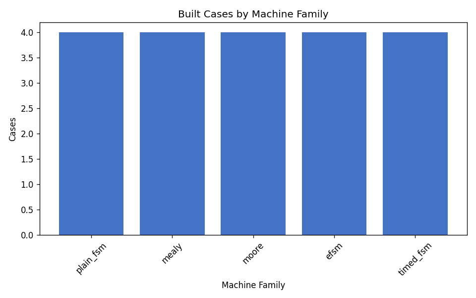
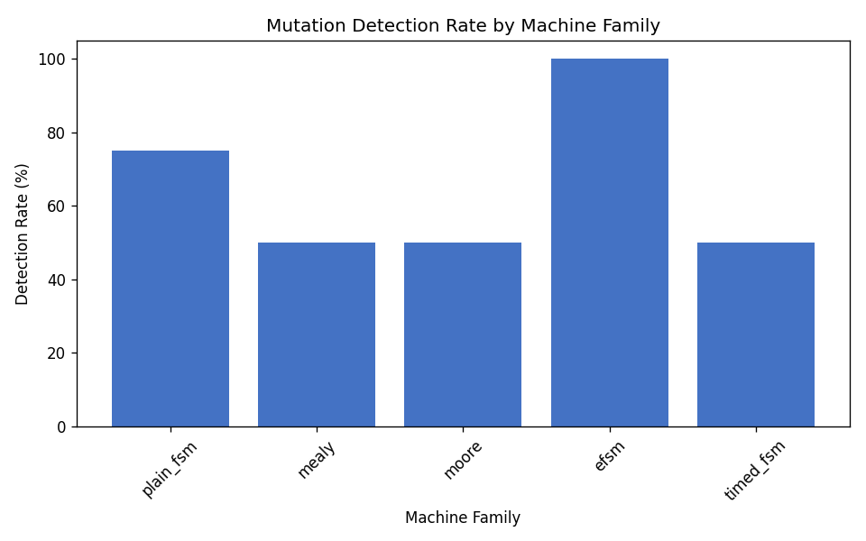
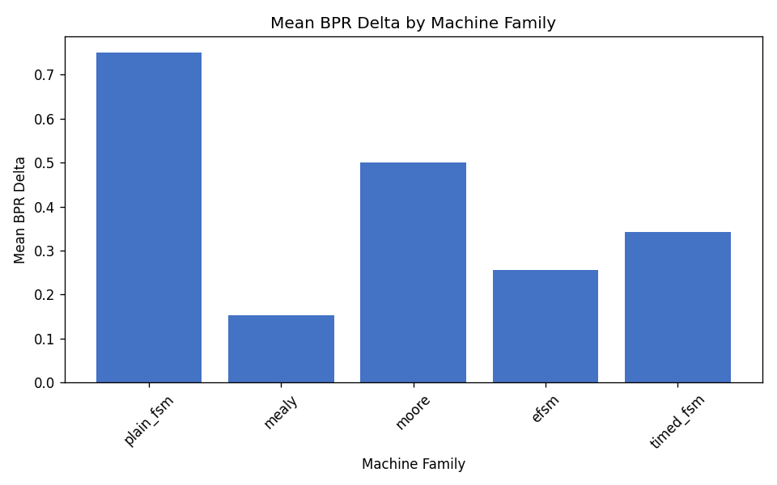
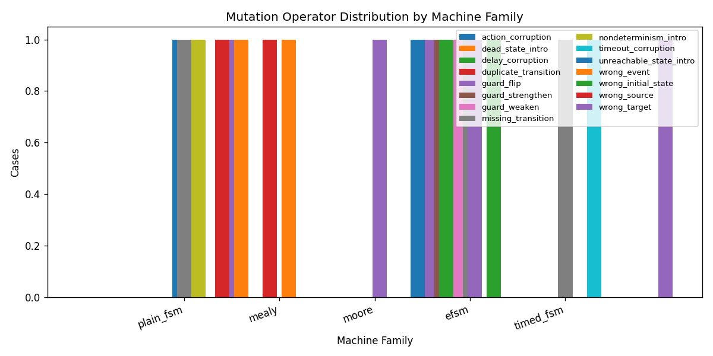

# Multi-Family External-Validity Pilot (v0.3.0-multifamily-pilot)

**Status:** pilot external-validity mini-cohort for manuscript sensitivity analysis.

This dataset is **not** part of the frozen Zenodo `v0.2.0-analysis` release and does **not** replace the published 1,000-case analysis cohort (which contains only `plain_fsm` cases). It is intended to inform future benchmark releases with balanced coverage across Mealy, Moore, EFSM, and timed FSM families.

## Dataset

- Plan: `/home/cesar/papers/fsmrepairbench/fsmrepairbench/plans/fsmrepairbench_multifamily_pilot_plan.yaml` (`fsmrepairbench_multifamily_pilot`, version 0.3.0-pilot, seed 46)
- Built dataset: `/home/cesar/papers/fsmrepairbench/fsmrepairbench/data/fsmrepairbench_multifamily_pilot`
- Built cases: 20
- Target families: plain_fsm, mealy, moore, efsm, timed_fsm
- Frozen v0.2.0 reference cohort: `data/fsmrepairbench_1k/analysis_cohort_1k.txt` (unchanged)

## Overall metrics

- Overall detection rate: **65.00%**
- Mean BPR delta: **0.4001**

## Family summary

| Family | Planned | Built | Failures | Detection | Mean faulty BPR | Mean BPR delta | Trans. cov. |
|---|---:|---:|---:|---:|---:|---:|---:|
| `plain_fsm` | 4 | 4 | 0 | 75.00% | 0.2500 | 0.7500 | 100.00% |
| `mealy` | 4 | 4 | 0 | 50.00% | 0.8472 | 0.1528 | 100.00% |
| `moore` | 4 | 4 | 0 | 50.00% | 0.5000 | 0.5000 | 100.00% |
| `efsm` | 4 | 4 | 0 | 100.00% | 0.7438 | 0.2562 | 100.00% |
| `timed_fsm` | 4 | 4 | 0 | 50.00% | 0.6583 | 0.3417 | 100.00% |

## Operator distribution by family

| Family | Operator | Cases | Share within family |
|---|---|---:|---:|
| `efsm` | `guard_flip` | 1 | 25.00% |
| `efsm` | `guard_strengthen` | 1 | 25.00% |
| `efsm` | `guard_weaken` | 1 | 25.00% |
| `efsm` | `missing_transition` | 1 | 25.00% |
| `mealy` | `action_corruption` | 1 | 25.00% |
| `mealy` | `duplicate_transition` | 1 | 25.00% |
| `mealy` | `guard_flip` | 1 | 25.00% |
| `mealy` | `wrong_target` | 1 | 25.00% |
| `moore` | `dead_state_intro` | 1 | 25.00% |
| `moore` | `unreachable_state_intro` | 1 | 25.00% |
| `moore` | `wrong_initial_state` | 1 | 25.00% |
| `moore` | `wrong_target` | 1 | 25.00% |
| `plain_fsm` | `missing_transition` | 1 | 25.00% |
| `plain_fsm` | `nondeterminism_intro` | 1 | 25.00% |
| `plain_fsm` | `wrong_event` | 1 | 25.00% |
| `plain_fsm` | `wrong_source` | 1 | 25.00% |
| `timed_fsm` | `delay_corruption` | 1 | 25.00% |
| `timed_fsm` | `missing_transition` | 1 | 25.00% |
| `timed_fsm` | `timeout_corruption` | 1 | 25.00% |
| `timed_fsm` | `wrong_target` | 1 | 25.00% |

## Figures

## Artifacts

- Summary: `/home/cesar/papers/fsmrepairbench/fsmrepairbench/results/multifamily_pilot/summary.csv`
- Family summary: `/home/cesar/papers/fsmrepairbench/fsmrepairbench/results/multifamily_pilot/family_summary.csv`
- Operator by family: `/home/cesar/papers/fsmrepairbench/fsmrepairbench/results/multifamily_pilot/operator_by_family.csv`
- Detection by family: `/home/cesar/papers/fsmrepairbench/fsmrepairbench/results/multifamily_pilot/detection_by_family.csv`
- LaTeX tables: `/home/cesar/papers/fsmrepairbench/fsmrepairbench/results/multifamily_pilot/tables/`

## Taxonomy coverage ratios

Coverage ratios are computed on the pilot cohort using the same taxonomy dimensions as the frozen `v0.2.0-analysis` release.

- Mean dimension coverage: **61.2%**
- Mutation-operator coverage: **78.9%**
- Complexity-tier coverage: **25.0%**
- Machine-type coverage: **0.0%**

### Coverage by taxonomy dimension

| Dimension | Observed | Universe | Coverage |
|-----------|---------:|---------:|---------:|
| `machine_type` | 5 | 8 | 62.5% |
| `determinism` | 1 | 2 | 50.0% |
| `completeness` | 2 | 2 | 100.0% |
| `arity_class` | 3 | 4 | 75.0% |
| `size_class` | 1 | 5 | 20.0% |
| `guard_complexity` | 3 | 4 | 75.0% |
| `time_features` | 2 | 5 | 40.0% |
| `graph_structure` | 6 | 7 | 85.7% |
| `oracle_depth` | 1 | 4 | 25.0% |
| `bug_type` | 15 | 19 | 78.9% |

### Coverage by mutation operator

| Operator | Cases | Cohort share | Subgroup coverage |
|----------|------:|-------------:|------------------:|
| `action_corruption` | 1 | 5.0% | 20.0% |
| `dead_state_intro` | 1 | 5.0% | 20.0% |
| `delay_corruption` | 1 | 5.0% | 20.0% |
| `duplicate_transition` | 1 | 5.0% | 20.0% |
| `guard_flip` | 2 | 10.0% | 40.0% |
| `guard_strengthen` | 1 | 5.0% | 20.0% |
| `guard_weaken` | 1 | 5.0% | 20.0% |
| `missing_transition` | 3 | 15.0% | 60.0% |
| `nondeterminism_intro` | 1 | 5.0% | 20.0% |
| `timeout_corruption` | 1 | 5.0% | 20.0% |
| `unreachable_state_intro` | 1 | 5.0% | 20.0% |
| `wrong_event` | 1 | 5.0% | 20.0% |
| `wrong_initial_state` | 1 | 5.0% | 20.0% |
| `wrong_source` | 1 | 5.0% | 20.0% |
| `wrong_target` | 3 | 15.0% | 60.0% |

### Coverage by complexity tier

| Tier | Cases | Cohort share | Subgroup coverage |
|------|------:|-------------:|------------------:|
| `small` | 20 | 100.0% | 100.0% |

### Coverage by machine type

| Machine type | Cases | Cohort share | Operator diversity |
|--------------|------:|-------------:|-------------------:|
| `efsm` | 4 | 20.0% | 4 |
| `mealy` | 4 | 20.0% | 4 |
| `moore` | 4 | 20.0% | 4 |
| `plain_fsm` | 4 | 20.0% | 4 |
| `timed_fsm` | 4 | 20.0% | 4 |

Full taxonomy coverage artefacts: `/home/cesar/papers/fsmrepairbench/fsmrepairbench/results/multifamily_pilot/coverage`

