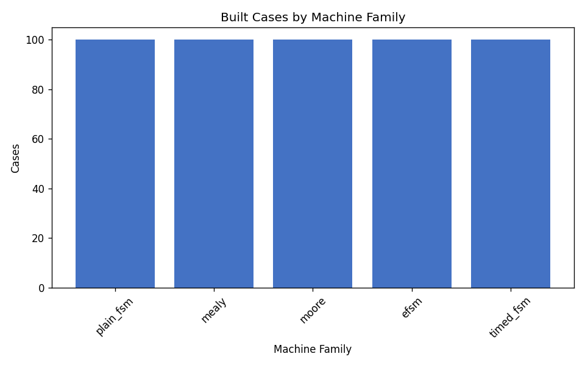
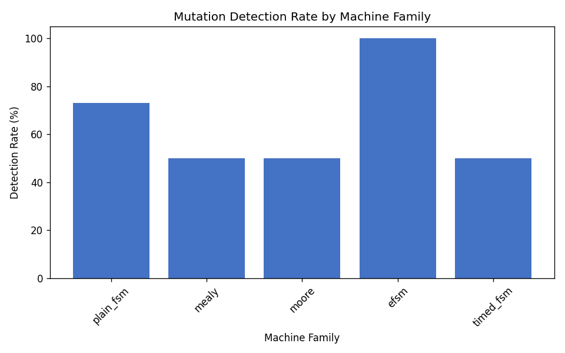
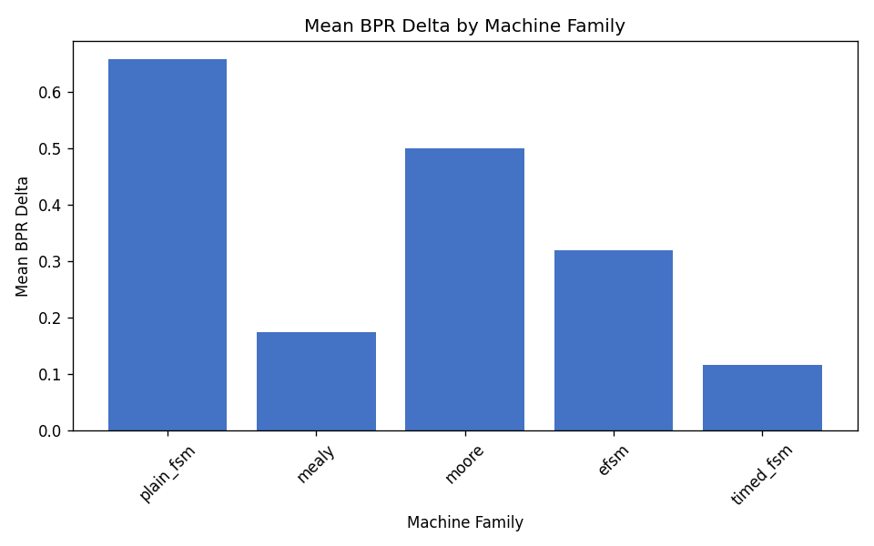
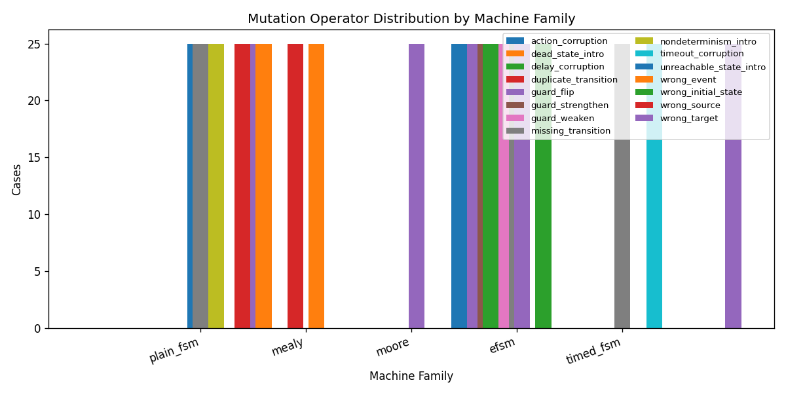

# Multi-Family External-Validity Pilot (v0.3.0)

**Status:** pilot external-validity mini-cohort for manuscript sensitivity analysis.

This dataset is **not** part of the frozen Zenodo `v0.2.0-analysis` release and does **not** replace the published 1,000-case analysis cohort (which contains only `plain_fsm` cases). It is intended to inform future benchmark releases with balanced coverage across Mealy, Moore, EFSM, and timed FSM families.

## Dataset

- Plan: `plans/fsmrepairbench_multifamily_v0_3_smoke_plan.yaml` (`fsmrepairbench_multifamily_v0_3_smoke`, version 0.3.0, seed 46)
- Built dataset: `data/fsmrepairbench_multifamily_v0_3_smoke`
- Built cases: 500
- Target families: plain_fsm, mealy, moore, efsm, timed_fsm

## Overall metrics

- Overall detection rate: **64.60%**
- Mean BPR delta: **0.3539**

## Family summary

| Family | Planned | Built | Failures | Detection | Mean faulty BPR | Mean BPR delta | Trans. cov. |
|---|---:|---:|---:|---:|---:|---:|---:|
| `plain_fsm` | 100 | 100 | 0 | 73.00% | 0.3417 | 0.6583 | 100.00% |
| `mealy` | 100 | 100 | 0 | 50.00% | 0.8250 | 0.1750 | 100.00% |
| `moore` | 100 | 100 | 0 | 50.00% | 0.5000 | 0.5000 | 100.00% |
| `efsm` | 100 | 100 | 0 | 100.00% | 0.6809 | 0.3191 | 100.00% |
| `timed_fsm` | 100 | 100 | 0 | 50.00% | 0.8830 | 0.1170 | 100.00% |

## Operator distribution by family

| Family | Operator | Cases | Share within family |
|---|---|---:|---:|
| `efsm` | `guard_flip` | 25 | 25.00% |
| `efsm` | `guard_strengthen` | 25 | 25.00% |
| `efsm` | `guard_weaken` | 25 | 25.00% |
| `efsm` | `missing_transition` | 25 | 25.00% |
| `mealy` | `action_corruption` | 25 | 25.00% |
| `mealy` | `duplicate_transition` | 25 | 25.00% |
| `mealy` | `guard_flip` | 25 | 25.00% |
| `mealy` | `wrong_target` | 25 | 25.00% |
| `moore` | `dead_state_intro` | 25 | 25.00% |
| `moore` | `unreachable_state_intro` | 25 | 25.00% |
| `moore` | `wrong_initial_state` | 25 | 25.00% |
| `moore` | `wrong_target` | 25 | 25.00% |
| `plain_fsm` | `missing_transition` | 25 | 25.00% |
| `plain_fsm` | `nondeterminism_intro` | 25 | 25.00% |
| `plain_fsm` | `wrong_event` | 25 | 25.00% |
| `plain_fsm` | `wrong_source` | 25 | 25.00% |
| `timed_fsm` | `delay_corruption` | 25 | 25.00% |
| `timed_fsm` | `missing_transition` | 25 | 25.00% |
| `timed_fsm` | `timeout_corruption` | 25 | 25.00% |
| `timed_fsm` | `wrong_target` | 25 | 25.00% |

## Figures

## Artifacts

- Summary: `results/multifamily_v0_3_smoke/summary.csv`
- Family summary: `results/multifamily_v0_3_smoke/family_summary.csv`
- Operator by family: `results/multifamily_v0_3_smoke/operator_by_family.csv`
- Detection by family: `results/multifamily_v0_3_smoke/detection_by_family.csv`
- LaTeX tables: `results/multifamily_v0_3_smoke/tables/`

