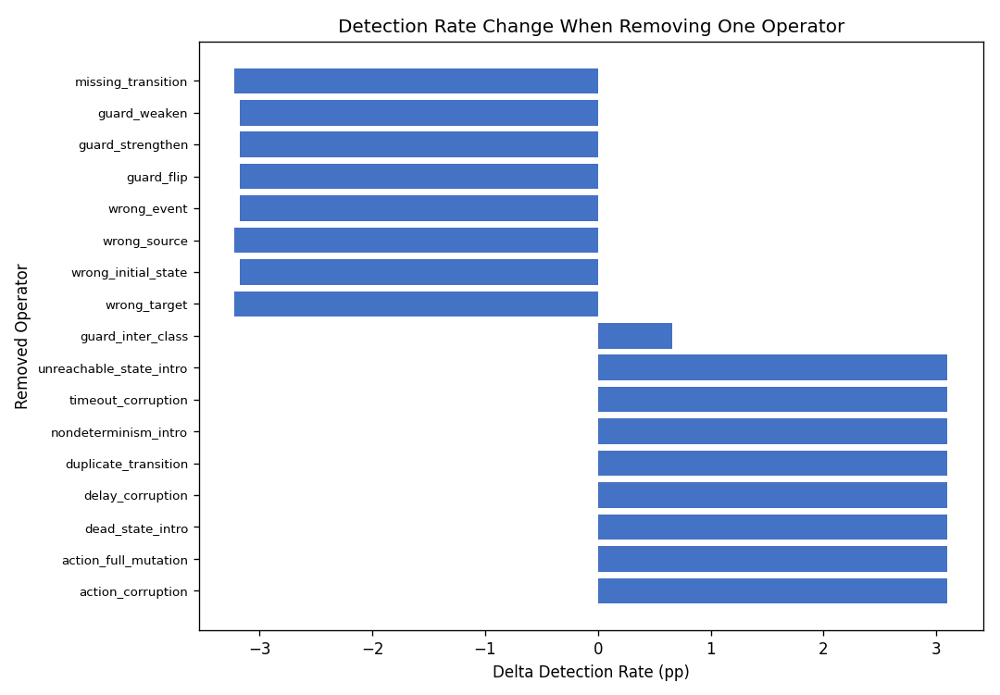
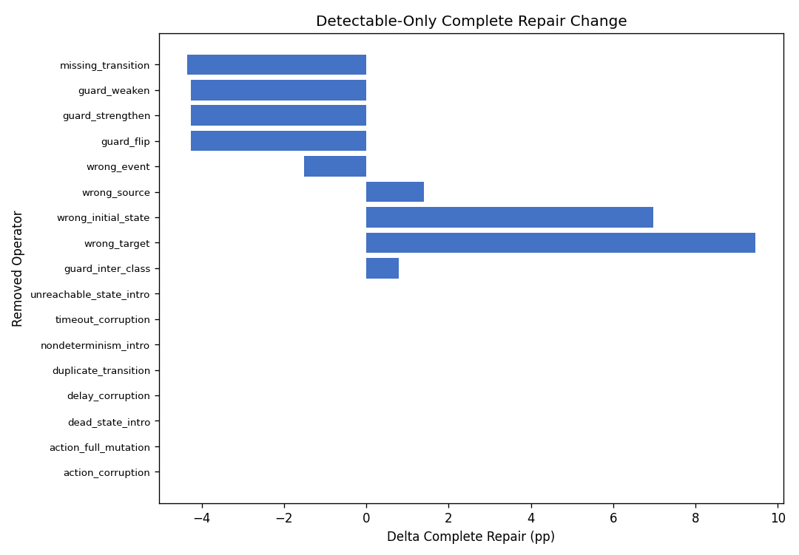
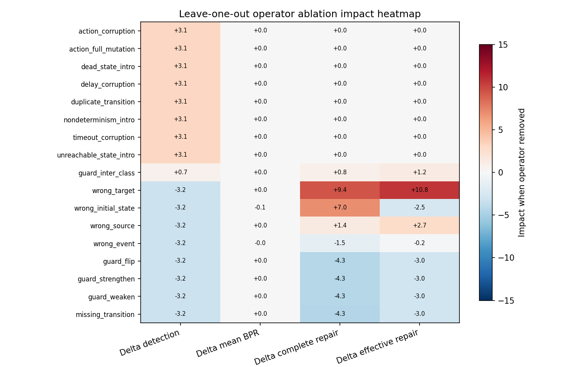
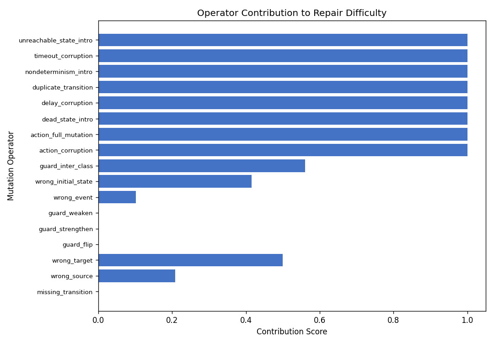

# Mutation Operator Ablation (Leave-One-Out)

Selective removal of individual mutation operators from the frozen 1k analysis cohort.

## Experimental design

- **Dataset:** `/home/cesar/papers/fsmrepairbench/fsmrepairbench/data/fsmrepairbench_1k`
- **Cohort:** `analysis_cohort_1k.txt` (1000 cases)
- **Repair engine:** `baseline_missing_transition`
- **Release:** `v0.2.0-analysis` (DOI [10.5281/zenodo.20602577](https://doi.org/10.5281/zenodo.20602577))

## Full-cohort baseline

- Detection rate: **49.5%**
- Mean faulty BPR: **0.9166**
- Mean BPR delta: **0.0834**
- Complete repair (detectable-only): **68.5%**
- Effective repair (detectable-only): **78.0%**

## Top removal impacts

| Removed operator | Delta detection (pp) | Delta complete repair (pp) | Contribution |
|---|---:|---:|---:|
| `action_corruption` | +3.1 | +0.0 | 1.00 |
| `action_full_mutation` | +3.1 | +0.0 | 1.00 |
| `dead_state_intro` | +3.1 | +0.0 | 1.00 |
| `delay_corruption` | +3.1 | +0.0 | 1.00 |
| `duplicate_transition` | +3.1 | +0.0 | 1.00 |

Oracle-invisible operator families (8): `action_corruption`, `action_full_mutation`, `dead_state_intro`, `delay_corruption`, `duplicate_transition`, `nondeterminism_intro`, `timeout_corruption`, `unreachable_state_intro`

## Figures

