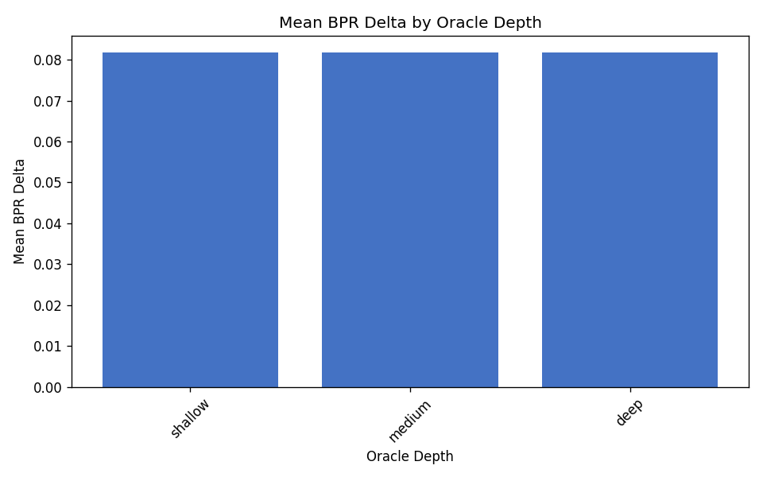
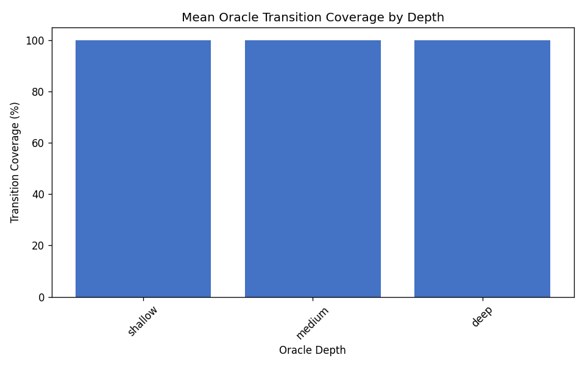

# Oracle Depth Ablation (C3)

Sensitivity analysis of mutation detection, BPR, and oracle coverage to behavioural oracle depth presets (`shallow`, `medium`, `deep`).

## Experimental design

- **Dataset:** `data/fsmrepairbench_1k`
- **Cohort:** 200 cases (`oracle_depth_ablation_200.txt`)
- **FSMs:** fixed reference/faulty machines from the published release
- **Oracles:** regenerated with existing `generate_oracle_suite` presets only
- **Depth presets:** shallow (max 5 steps), medium (12), deep (25)

## Research question

**How sensitive are benchmark conclusions to oracle depth?**

Benchmark detection conclusions are **largely insensitive** to oracle depth within the tested presets: overall detection moves from 48.5% (shallow) to 48.5% (medium) and 48.5% (deep). Paired on 200 cases: 0 faults newly detected at deep vs shallow, 0 faults detected only at shallow.

## Summary by oracle depth

| Depth | Cases | Detection rate | Detectable ratio | Mean faulty BPR | Mean BPR delta | Mean trans. cov. |
|---|---:|---:|---:|---:|---:|---:|
| `shallow` | 200 | 48.50% | 48.50% | 0.9182 | 0.0818 | 100.00% |
| `medium` | 200 | 48.50% | 48.50% | 0.9182 | 0.0818 | 100.00% |
| `deep` | 200 | 48.50% | 48.50% | 0.9182 | 0.0818 | 100.00% |

## Mutation operator detection by depth

| Operator | Shallow | Medium | Deep |
|---|---:|---:|---:|
| `action_corruption` | 0.00% | 0.00% | 0.00% |
| `action_full_mutation` | 0.00% | 0.00% | 0.00% |
| `dead_state_intro` | 0.00% | 0.00% | 0.00% |
| `delay_corruption` | 0.00% | 0.00% | 0.00% |
| `duplicate_transition` | 0.00% | 0.00% | 0.00% |
| `guard_flip` | 100.00% | 100.00% | 100.00% |
| `guard_inter_class` | 41.67% | 41.67% | 41.67% |
| `guard_strengthen` | 100.00% | 100.00% | 100.00% |
| `guard_weaken` | 100.00% | 100.00% | 100.00% |
| `missing_transition` | 100.00% | 100.00% | 100.00% |
| `nondeterminism_intro` | 0.00% | 0.00% | 0.00% |
| `timeout_corruption` | 0.00% | 0.00% | 0.00% |
| `unreachable_state_intro` | 0.00% | 0.00% | 0.00% |
| `wrong_event` | 100.00% | 100.00% | 100.00% |
| `wrong_initial_state` | 100.00% | 100.00% | 100.00% |
| `wrong_source` | 100.00% | 100.00% | 100.00% |
| `wrong_target` | 100.00% | 100.00% | 100.00% |

## Figures

## Artifacts

- Depth summary: `results/oracle_depth_ablation/depth_summary.csv`
- Combined summary: `results/oracle_depth_ablation/summary.csv`
- Distributions: `results/oracle_depth_ablation/distributions.csv`
- Per-case results: `results/oracle_depth_ablation/per_case_results.csv`
- LaTeX tables: `results/oracle_depth_ablation/tables/`

## Bootstrap confidence intervals

Non-parametric percentile bootstrap over cases (10,000 resamples, 95% CI, seed 44).
Exports: `confidence_intervals.csv` and `confidence_intervals.json`.

- `detection_rate (shallow)`: 0.485000 [0.415000, 0.555000] (n=200)
- `mean_faulty_bpr (shallow)`: 0.918245 [0.882656, 0.950025] (n=200)
- `mean_bpr_delta (shallow)`: 0.081755 [0.049975, 0.117344] (n=200)
- `detection_rate (medium)`: 0.485000 [0.415000, 0.555000] (n=200)
- `mean_faulty_bpr (medium)`: 0.918245 [0.882656, 0.950025] (n=200)
- `mean_bpr_delta (medium)`: 0.081755 [0.049975, 0.117344] (n=200)
- `detection_rate (deep)`: 0.485000 [0.415000, 0.555000] (n=200)
- `mean_faulty_bpr (deep)`: 0.918245 [0.882656, 0.950025] (n=200)
- `mean_bpr_delta (deep)`: 0.081755 [0.049975, 0.117344] (n=200)
