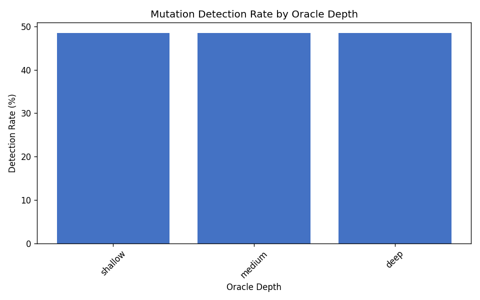
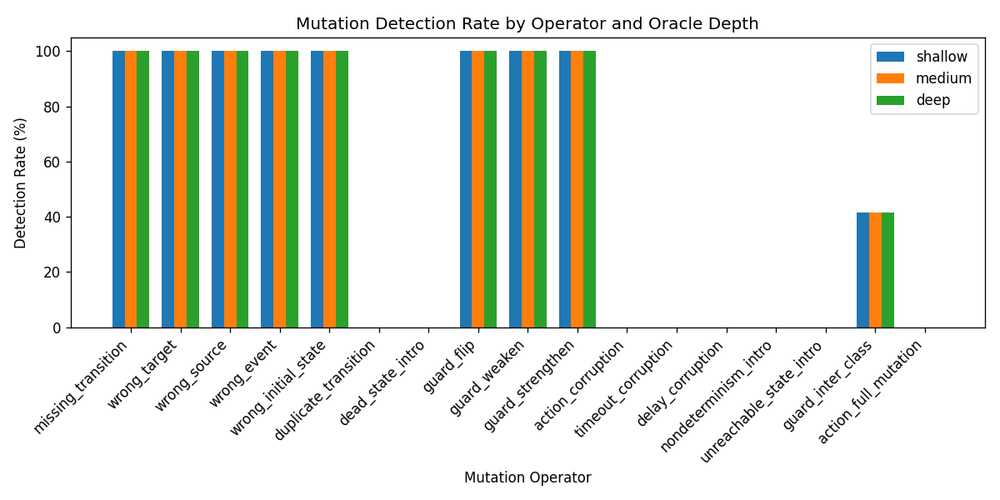
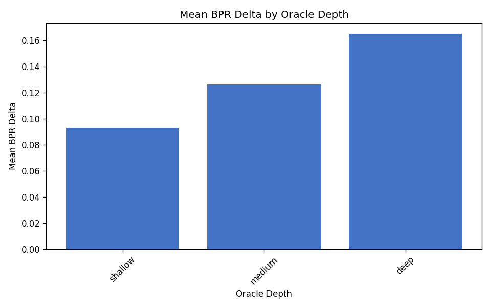
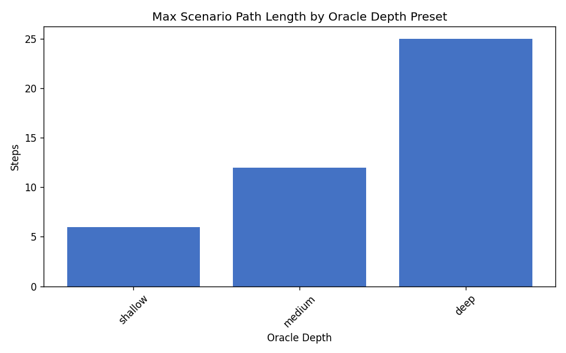

# Oracle Depth Ablation (C3)

Sensitivity analysis of mutation detection, BPR, and oracle coverage to behavioural oracle depth presets (`shallow`, `medium`, `deep`).

## Experimental design

- **Dataset:** `data/fsmrepairbench_1k`
- **Cohort:** 200 cases (`oracle_depth_ablation_200.txt`)
- **FSMs:** fixed reference/faulty machines from the published release
- **Scenario policy:** depth-forced (longer random walks + extra scenarios when needed)
- **Depth presets:** shallow (max 5 steps), medium (12), deep (25)

## Research question

**How sensitive are benchmark conclusions to oracle depth?**

Benchmark detection conclusions are **largely insensitive** to oracle depth within the tested presets: overall detection moves from 48.5% (shallow) to 48.5% (medium) and 48.5% (deep). Paired on 200 cases: 0 faults newly detected at deep vs shallow, 0 faults detected only at shallow.

## Summary by oracle depth

| Depth | Max steps | Cases | Detection rate | Detectable ratio | Mean faulty BPR | Mean BPR delta | Max path length | Mean trans. cov. |
|---|---:|---:|---:|---:|---:|---:|---:|---:|
| `shallow` | 5 | 200 | 48.50% | 48.50% | 0.9072 | 0.0928 | 6 | 100.00% |
| `medium` | 12 | 200 | 48.50% | 48.50% | 0.8740 | 0.1260 | 12 | 100.00% |
| `deep` | 25 | 200 | 48.50% | 48.50% | 0.8349 | 0.1651 | 25 | 100.00% |

## Mutation operator detection by depth

| Operator | Shallow | Medium | Deep |
|---|---:|---:|---:|
| `action_corruption` | 0.00% | 0.00% | 0.00% |
| `action_full_mutation` | 0.00% | 0.00% | 0.00% |
| `dead_state_intro` | 0.00% | 0.00% | 0.00% |
| `delay_corruption` | 0.00% | 0.00% | 0.00% |
| `duplicate_transition` | 0.00% | 0.00% | 0.00% |
| `guard_flip` | 100.00% | 100.00% | 100.00% |
| `guard_inter_class` | 41.67% | 41.67% | 41.67% |
| `guard_strengthen` | 100.00% | 100.00% | 100.00% |
| `guard_weaken` | 100.00% | 100.00% | 100.00% |
| `missing_transition` | 100.00% | 100.00% | 100.00% |
| `nondeterminism_intro` | 0.00% | 0.00% | 0.00% |
| `timeout_corruption` | 0.00% | 0.00% | 0.00% |
| `unreachable_state_intro` | 0.00% | 0.00% | 0.00% |
| `wrong_event` | 100.00% | 100.00% | 100.00% |
| `wrong_initial_state` | 100.00% | 100.00% | 100.00% |
| `wrong_source` | 100.00% | 100.00% | 100.00% |
| `wrong_target` | 100.00% | 100.00% | 100.00% |

## Paired detection changes vs shallow (McNemar-style)

| Depth | Both | Shallow only | Higher only | Neither | Gains | Losses | χ² |
|---|---:|---:|---:|---:|---:|---:|---:|
| `medium` | 97 | 0 | 0 | 103 | 0 | 0 | 0.0 |
| `deep` | 97 | 0 | 0 | 103 | 0 | 0 | 0.0 |

## Figures

## Artifacts

- Depth summary: `results/oracle_depth_ablation_v2/depth_summary.csv`
- Combined summary: `results/oracle_depth_ablation_v2/summary.csv`
- Distributions: `results/oracle_depth_ablation_v2/distributions.csv`
- Per-case results: `results/oracle_depth_ablation_v2/per_case_results.csv`
- Confidence intervals: `results/oracle_depth_ablation_v2/confidence_intervals.csv`
- Paired detection changes: `results/oracle_depth_ablation_v2/paired_detection_changes.csv`
- Coverage by depth: `results/oracle_depth_ablation_v2/coverage_by_depth.csv`
- LaTeX tables: `results/oracle_depth_ablation_v2/tables/`

## Bootstrap confidence intervals

Non-parametric percentile bootstrap over cases (10,000 resamples, 95% CI, seed 44).
Exports: `confidence_intervals.csv` and `confidence_intervals.json`.

- `detection_rate (C3, shallow)`: 0.485000 [0.415000, 0.555000] (n=200)
- `mean_faulty_bpr (C3, shallow)`: 0.907236 [0.871062, 0.939146] (n=200)
- `mean_bpr_delta (C3, shallow)`: 0.092764 [0.060854, 0.128938] (n=200)
- `detection_rate (C3, medium)`: 0.485000 [0.415000, 0.555000] (n=200)
- `mean_faulty_bpr (C3, medium)`: 0.874019 [0.837049, 0.908059] (n=200)
- `mean_bpr_delta (C3, medium)`: 0.125981 [0.091941, 0.162951] (n=200)
- `detection_rate (C3, deep)`: 0.485000 [0.415000, 0.555000] (n=200)
- `mean_faulty_bpr (C3, deep)`: 0.834855 [0.793700, 0.873025] (n=200)
- `mean_bpr_delta (C3, deep)`: 0.165145 [0.126975, 0.206300] (n=200)
