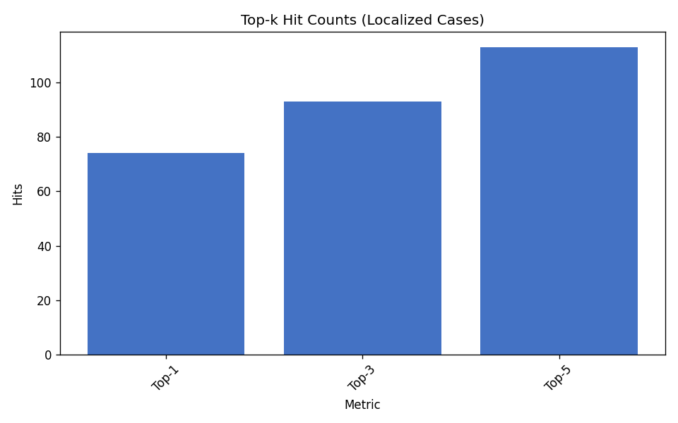
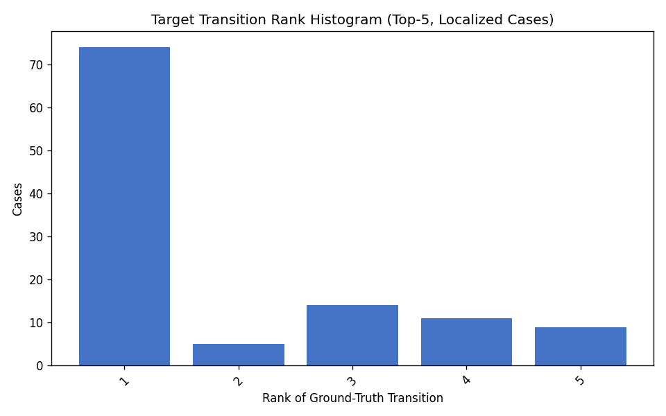
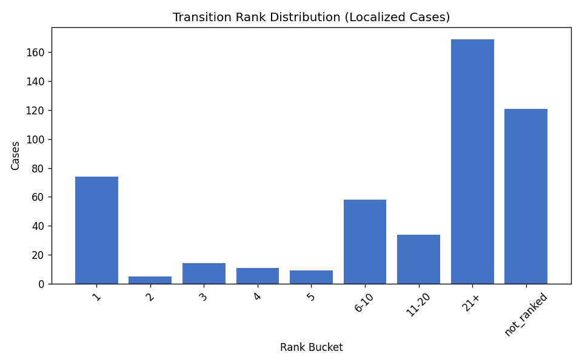
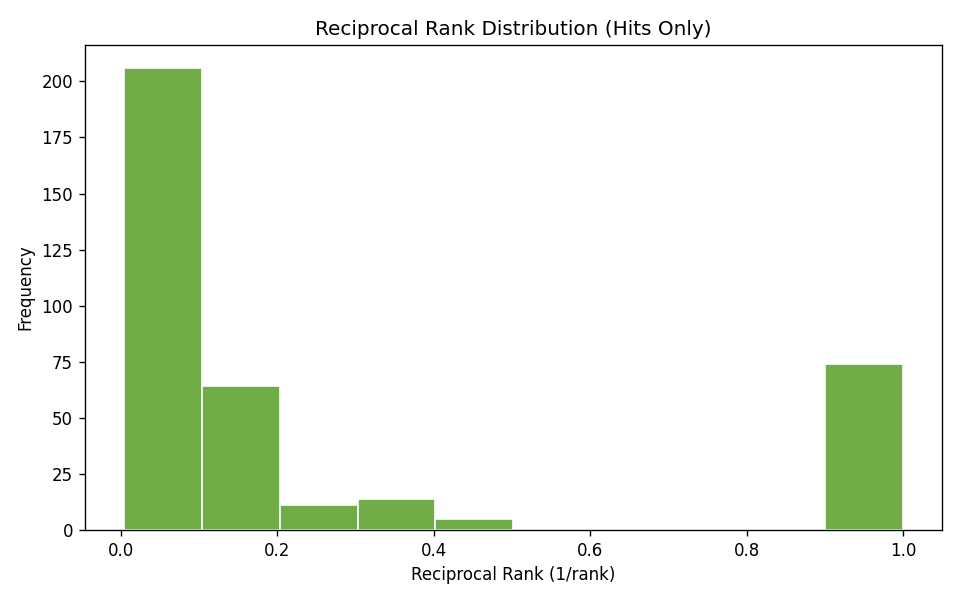
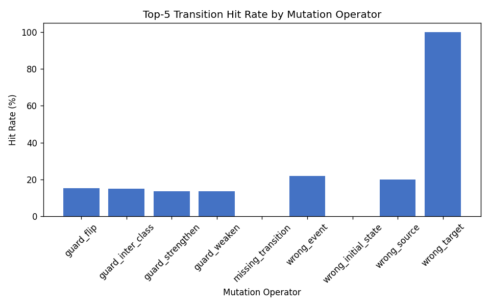

# RQ3 Fault Localization (Ochiai, Transition-Level)

Spectrum-based fault localization ranks transitions by Ochiai suspiciousness using oracle pass/fail spectra. Ground truth is `changed_transition_id` from `bug_metadata.json`.

## Experimental design

- **Dataset:** `data/fsmrepairbench_1k`
- **Cohort:** 1000 cases (`localization_cohort_1k.txt`)
- **Method:** ochiai on transition elements only
- **Top-k metrics:** top-1, top-3, top-5

## Aggregate metrics

Top-k hit rates and MRR are computed over **detectable (localized) cases only** (`detectable_denominator = 495`). Skipped cases (505) are excluded from ranking metrics.

| Metric | Value |
|---|---:|
| Cohort size | 1000 |
| Detectable (localized) cases | 495 |
| Skipped cases | 505 |
| Top-1 hit rate | 14.95% |
| Top-3 hit rate | 18.79% |
| Top-5 hit rate | 22.83% |
| MRR | 0.2010 |

## Rank distribution

| Rank bucket | Cases | Fraction |
|---|---:|---:|
| 1 | 74 | 14.95% |
| 2 | 5 | 1.01% |
| 3 | 14 | 2.83% |
| 4 | 11 | 2.22% |
| 5 | 9 | 1.82% |
| 6-10 | 58 | 11.72% |
| 11-20 | 34 | 6.87% |
| 21+ | 169 | 34.14% |
| not_ranked | 121 | 24.44% |

## Figures

## Artifacts

- Leaderboard: `results/rq3_localization_1k/leaderboard.csv`
- Summary: `results/rq3_localization_1k/summary.csv`
- Localization metrics: `results/rq3_localization_1k/localization_metrics.csv`
- Per-case results: `results/rq3_localization_1k/per_case_results.csv`
- Confidence intervals: `results/rq3_localization_1k/confidence_intervals.csv`
- Frozen manifest: `results/rq3_localization_1k/manifest.json`
- LaTeX tables: `results/rq3_localization_1k/tables/`

## Bootstrap confidence intervals

Non-parametric percentile bootstrap over cases (10,000 resamples, 95% CI, seed 44).
Exports: `confidence_intervals.csv` and `confidence_intervals.json`.

- `top_1_hit_rate`: 0.149495 [0.119192, 0.181818] (n=495)
- `top_3_hit_rate`: 0.187879 [0.153535, 0.222222] (n=495)
- `top_5_hit_rate`: 0.228283 [0.191919, 0.264646] (n=495)
- `mrr`: 0.201018 [0.170688, 0.231904] (n=495)
