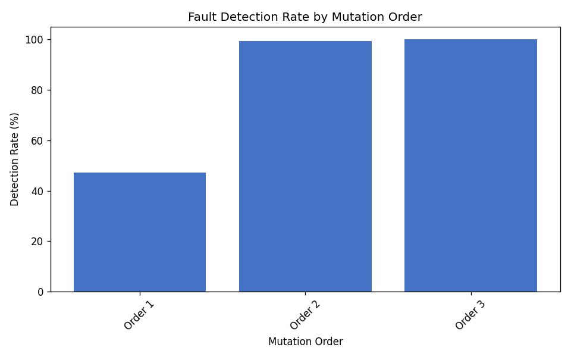
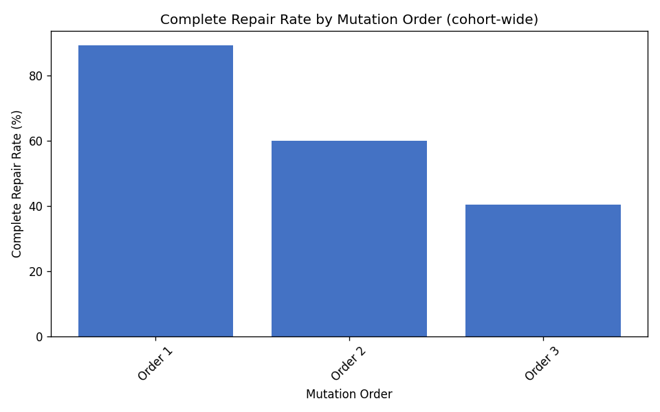
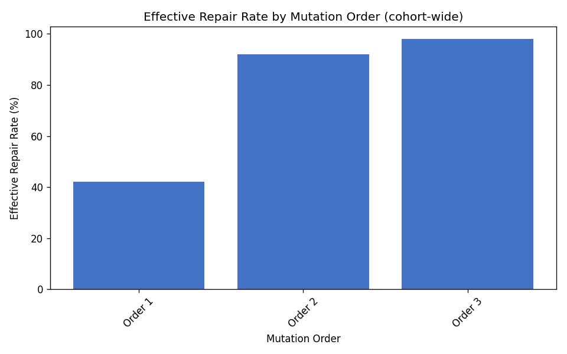
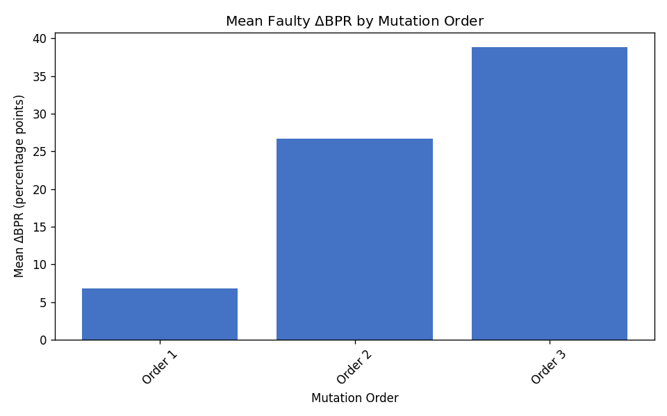
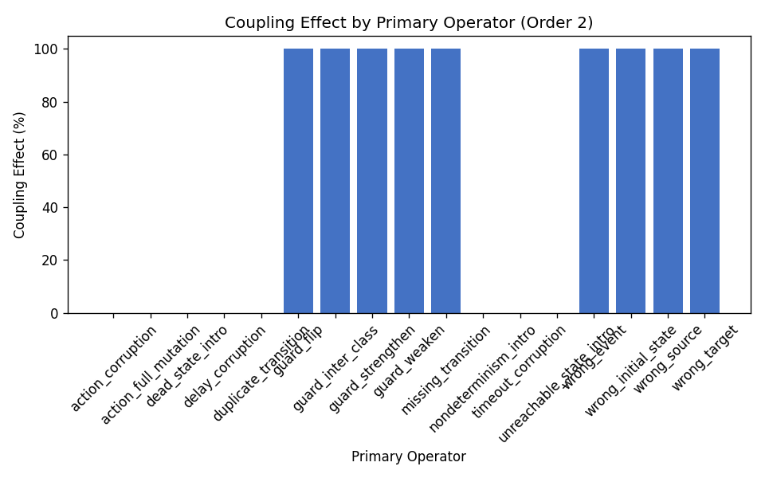
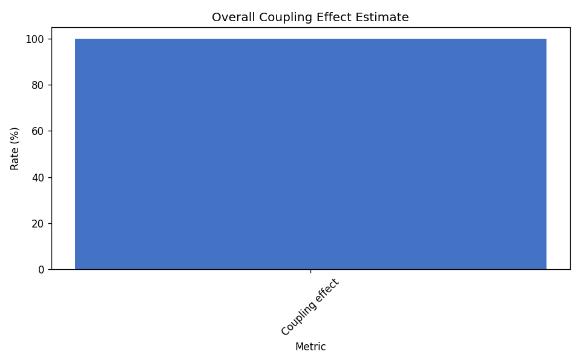

# RQ4 Higher-Order Coupling Campaign

Higher-order mutants (orders 2 and 3) were generated on the pinned 250-case cohort
by chaining the source first-order operator with deterministic secondary operators
(campaign seed 44).

## Experimental design

- **Source dataset:** `data/fsmrepairbench_1k`
- **Cohort:** `coupling_campaign_250.txt` (250 cases)
- **Enriched subset:** `results/rq4_coupling_subset`
- **Repair baseline:** `missing-transition` (seed 44)

## Aggregate metrics

| Metric | Value |
|---|---:|
| Total analyzed cases | 750 |
| First-order cases | 250 |
| Higher-order cases | 500 |
| First-order detection rate | 47.20% |
| Higher-order detection rate | 99.60% |
| Coupling effect estimate | 100.00% |
| Skipped HO generations | 0 |

## Detection and repair by mutation order

| Order | Cases | Detection | Complete repair | Effective repair | Mean faulty BPR | Mean $\Delta$BPR |
|---|---:|---:|---:|---:|---:|---:|
| 1 | 250 | 47.20% | 89.20% | 42.00% | 0.932 | 0.068 |
| 2 | 250 | 99.20% | 60.00% | 92.00% | 0.733 | 0.267 |
| 3 | 250 | 100.00% | 40.40% | 98.00% | 0.612 | 0.388 |

## Figures

## Artifacts

- Summary: `results/rq4_coupling_250/summary.csv`
- Coupling metrics: `results/rq4_coupling_250/coupling_metrics.csv`
- Per-case results: `results/rq4_coupling_250/per_case_results.csv`
- Confidence intervals: `results/rq4_coupling_250/confidence_intervals.csv`
- Coupling report JSON: `results/rq4_coupling_250/coupling_report.json`
- Frozen manifest: `results/rq4_coupling_250/manifest.json`
- LaTeX tables: `results/rq4_coupling_250/tables/`

## Bootstrap confidence intervals

Non-parametric percentile bootstrap over cases (10,000 resamples, 95% CI, seed 44).
Exports: `confidence_intervals.csv` and `confidence_intervals.json`.

- `detection_rate (RQ4, order_1)`: 0.472000 [0.412000, 0.536000] (n=250)
- `complete_repair_rate (RQ4, order_1)`: 0.892000 [0.852000, 0.928000] (n=250)
- `effective_repair_rate (RQ4, order_1)`: 0.420000 [0.360000, 0.484000] (n=250)
- `mean_bpr_delta (RQ4, order_1)`: 0.067700 [0.041874, 0.096662] (n=250)
- `complete_repair_rate (RQ4, order_1)`: 0.771186 [0.694915, 0.847458] (n=118)
- `effective_repair_rate (RQ4, order_1)`: 0.889831 [0.830508, 0.940678] (n=118)
- `mean_bpr_delta (RQ4, order_1)`: 0.143432 [0.091786, 0.200682] (n=118)
- `detection_rate (RQ4, order_2)`: 0.992000 [0.980000, 1.000000] (n=250)
- `complete_repair_rate (RQ4, order_2)`: 0.600000 [0.540000, 0.660000] (n=250)
- `effective_repair_rate (RQ4, order_2)`: 0.920000 [0.884000, 0.952000] (n=250)
- `mean_bpr_delta (RQ4, order_2)`: 0.267039 [0.220809, 0.315454] (n=250)
- `complete_repair_rate (RQ4, order_2)`: 0.596774 [0.536290, 0.657258] (n=248)
- `effective_repair_rate (RQ4, order_2)`: 0.927419 [0.895161, 0.959677] (n=248)
- `mean_bpr_delta (RQ4, order_2)`: 0.269193 [0.223169, 0.317398] (n=248)
- `detection_rate (RQ4, order_3)`: 1.000000 [1.000000, 1.000000] (n=250)
- `complete_repair_rate (RQ4, order_3)`: 0.404000 [0.344000, 0.464000] (n=250)
- `effective_repair_rate (RQ4, order_3)`: 0.980000 [0.960000, 0.996000] (n=250)
- `mean_bpr_delta (RQ4, order_3)`: 0.388064 [0.335051, 0.441553] (n=250)
- `complete_repair_rate (RQ4, order_3)`: 0.404000 [0.344000, 0.464000] (n=250)
- `effective_repair_rate (RQ4, order_3)`: 0.980000 [0.960000, 0.996000] (n=250)
- `mean_bpr_delta (RQ4, order_3)`: 0.388064 [0.335051, 0.441553] (n=250)
- `detection_rate (RQ4, fo_subset)`: 0.472000 [0.412000, 0.536000] (n=250)
- `detection_rate (RQ4, ho_orders_2_3)`: 0.996000 [0.990000, 1.000000] (n=500)
