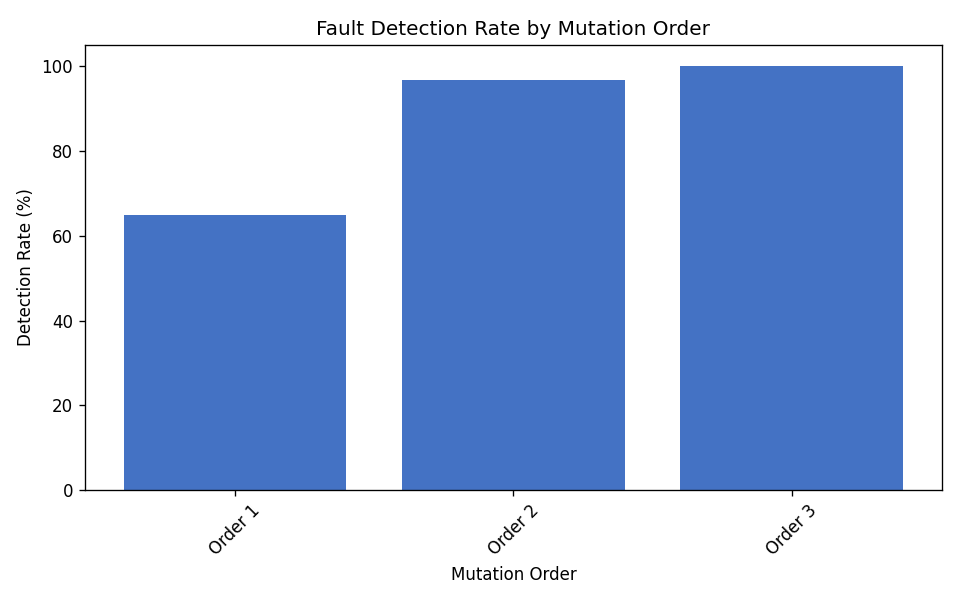
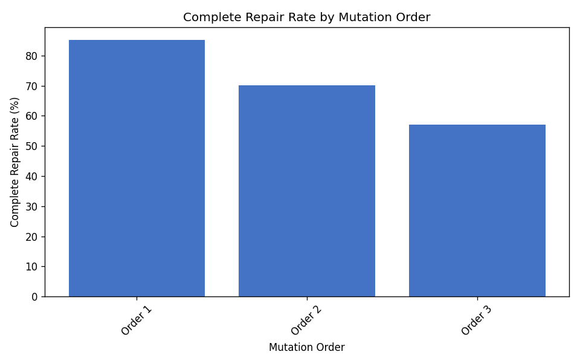
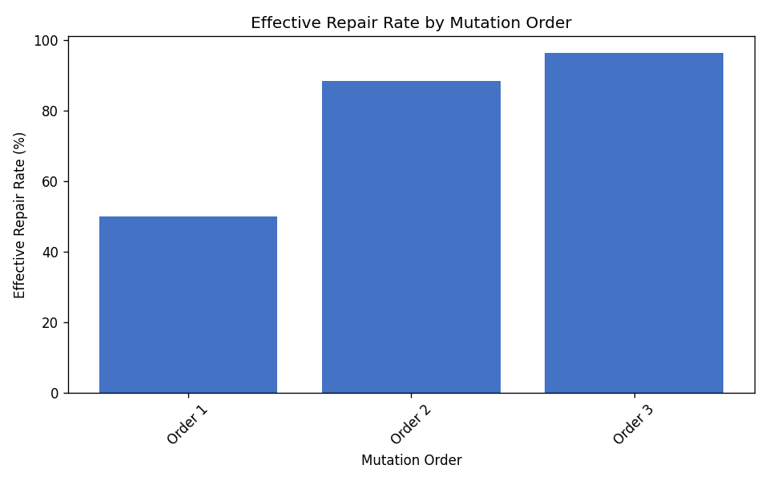
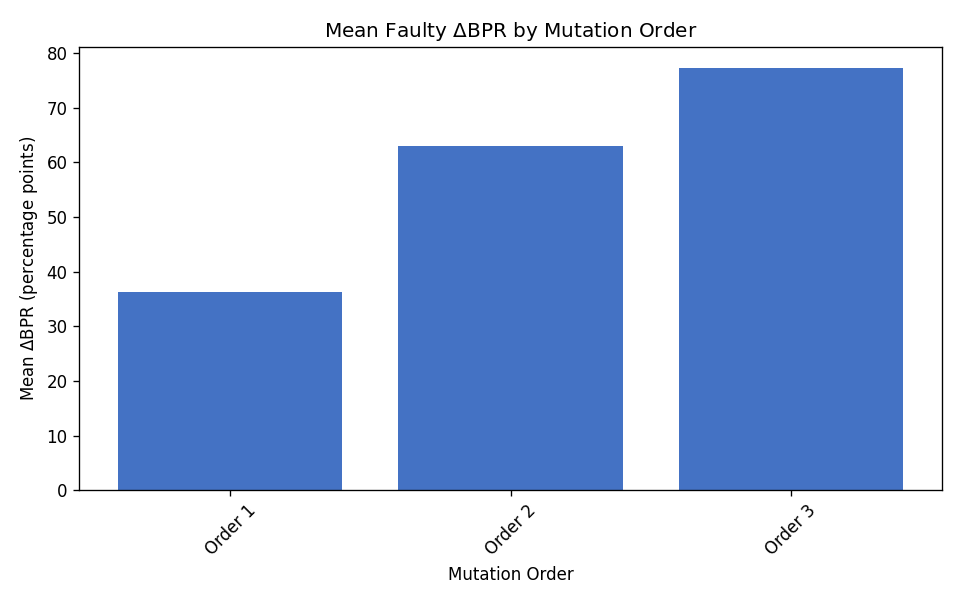
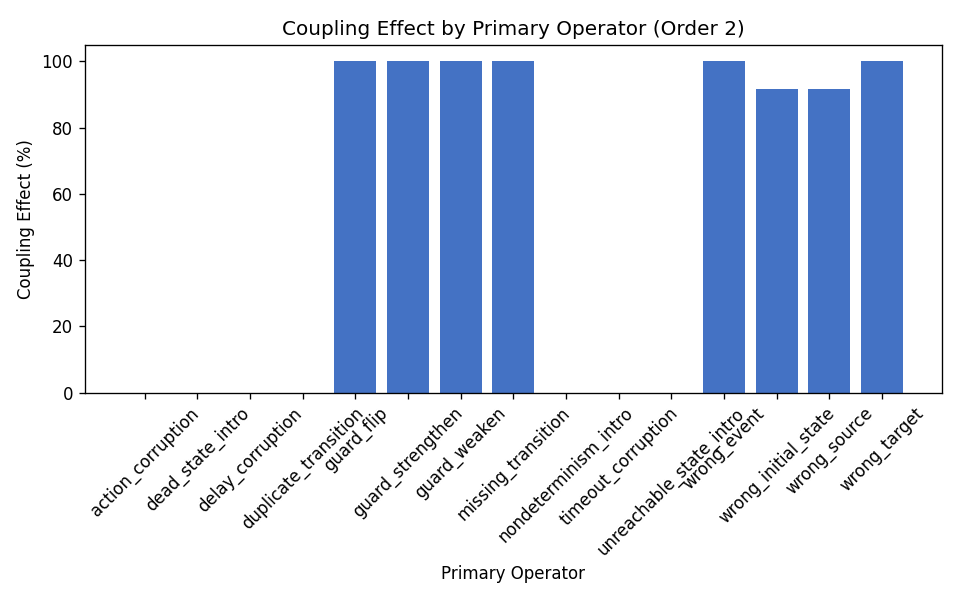
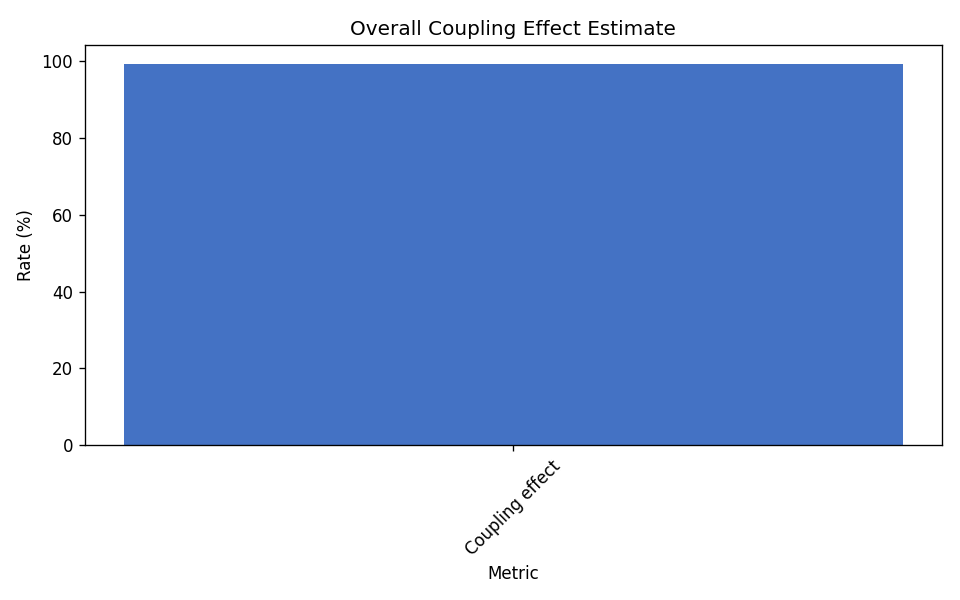

# RQ4 Higher-Order Coupling Campaign

Higher-order mutants (orders 2 and 3) were generated on the pinned 250-case cohort
by chaining the source first-order operator with deterministic secondary operators
(campaign seed 44).

## Experimental design

- **Source dataset:** `/home/cesar/papers/fsmrepairbench/fsmrepairbench/data/fsmrepairbench_multifamily_v0_3`
- **Cohort:** `coupling_campaign_multifamily.txt` (250 cases)
- **Enriched subset:** `/home/cesar/papers/fsmrepairbench/fsmrepairbench/results/rq4_coupling_subset_multifamily`
- **Repair baseline:** `missing-transition` (seed 44)

## Aggregate metrics

| Metric | Value |
|---|---:|
| Total analyzed cases | 715 |
| First-order cases | 250 |
| Higher-order cases | 465 |
| First-order detection rate | 64.80% |
| Higher-order detection rate | 98.28% |
| Coupling effect estimate | 99.31% |
| Skipped HO generations | 35 |

## Detection and repair by mutation order

| Order | Cases | Detection | Complete repair | Effective repair | Mean faulty BPR | Mean $\Delta$BPR |
|---|---:|---:|---:|---:|---:|---:|
| 1 | 250 | 64.80% | 85.20% | 50.00% | 0.637 | 0.363 |
| 2 | 241 | 96.68% | 70.12% | 88.38% | 0.370 | 0.630 |
| 3 | 224 | 100.00% | 57.14% | 96.43% | 0.228 | 0.772 |

## Figures

## Artifacts

- Summary: `/home/cesar/papers/fsmrepairbench/fsmrepairbench/results/rq4_coupling_multifamily/summary.csv`
- Coupling metrics: `/home/cesar/papers/fsmrepairbench/fsmrepairbench/results/rq4_coupling_multifamily/coupling_metrics.csv`
- Per-case results: `/home/cesar/papers/fsmrepairbench/fsmrepairbench/results/rq4_coupling_multifamily/per_case_results.csv`
- Confidence intervals: `/home/cesar/papers/fsmrepairbench/fsmrepairbench/results/rq4_coupling_multifamily/confidence_intervals.csv`
- Coupling report JSON: `/home/cesar/papers/fsmrepairbench/fsmrepairbench/results/rq4_coupling_multifamily/coupling_report.json`
- Frozen manifest: `/home/cesar/papers/fsmrepairbench/fsmrepairbench/results/rq4_coupling_multifamily/manifest.json`
- LaTeX tables: `/home/cesar/papers/fsmrepairbench/fsmrepairbench/results/rq4_coupling_multifamily/tables/`

## Bootstrap confidence intervals

Non-parametric percentile bootstrap over cases (10,000 resamples, 95% CI, seed 44).
Exports: `confidence_intervals.csv` and `confidence_intervals.json`.

- `detection_rate (RQ4, order_1)`: 0.648000 [0.588000, 0.708000] (n=250)
- `complete_repair_rate (RQ4, order_1)`: 0.852000 [0.808000, 0.896000] (n=250)
- `effective_repair_rate (RQ4, order_1)`: 0.500000 [0.436000, 0.560000] (n=250)
- `mean_bpr_delta (RQ4, order_1)`: 0.363110 [0.309742, 0.416564] (n=250)
- `complete_repair_rate (RQ4, order_1)`: 0.771605 [0.703704, 0.833333] (n=162)
- `effective_repair_rate (RQ4, order_1)`: 0.771605 [0.703704, 0.833333] (n=162)
- `mean_bpr_delta (RQ4, order_1)`: 0.560356 [0.497020, 0.624417] (n=162)
- `detection_rate (RQ4, order_2)`: 0.966805 [0.941909, 0.987552] (n=241)
- `complete_repair_rate (RQ4, order_2)`: 0.701245 [0.643154, 0.759336] (n=241)
- `effective_repair_rate (RQ4, order_2)`: 0.883817 [0.842324, 0.921162] (n=241)
- `mean_bpr_delta (RQ4, order_2)`: 0.630463 [0.581687, 0.678863] (n=241)
- `complete_repair_rate (RQ4, order_2)`: 0.690987 [0.630901, 0.746781] (n=233)
- `effective_repair_rate (RQ4, order_2)`: 0.914163 [0.875536, 0.948498] (n=233)
- `mean_bpr_delta (RQ4, order_2)`: 0.652110 [0.604097, 0.700184] (n=233)
- `detection_rate (RQ4, order_3)`: 1.000000 [1.000000, 1.000000] (n=224)
- `complete_repair_rate (RQ4, order_3)`: 0.571429 [0.508929, 0.638393] (n=224)
- `effective_repair_rate (RQ4, order_3)`: 0.964286 [0.937500, 0.986607] (n=224)
- `mean_bpr_delta (RQ4, order_3)`: 0.772278 [0.729776, 0.813837] (n=224)
- `complete_repair_rate (RQ4, order_3)`: 0.571429 [0.508929, 0.638393] (n=224)
- `effective_repair_rate (RQ4, order_3)`: 0.964286 [0.937500, 0.986607] (n=224)
- `mean_bpr_delta (RQ4, order_3)`: 0.772278 [0.729776, 0.813837] (n=224)
- `detection_rate (RQ4, fo_subset)`: 0.648000 [0.588000, 0.708000] (n=250)
- `detection_rate (RQ4, ho_orders_2_3)`: 0.982796 [0.969892, 0.993548] (n=465)
