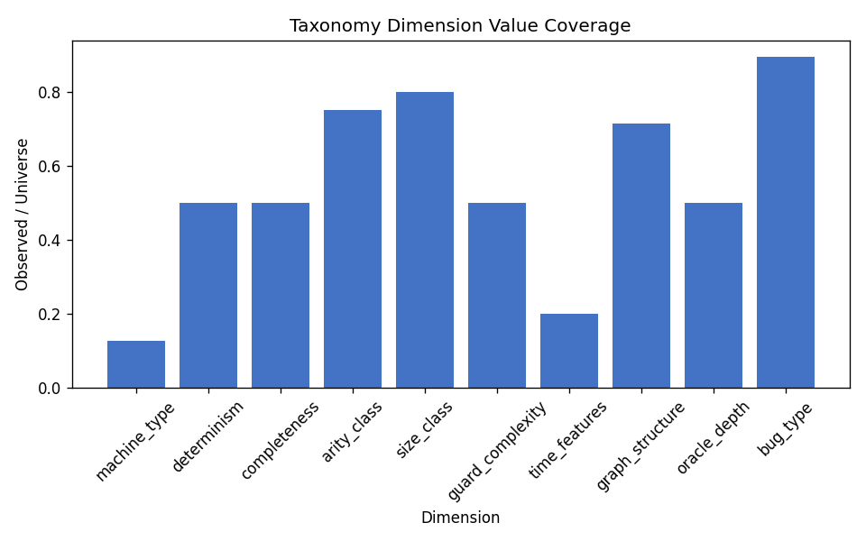
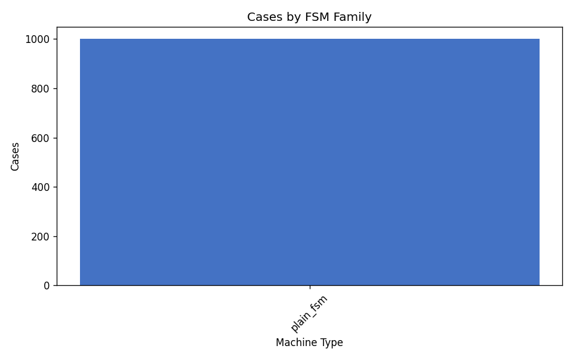
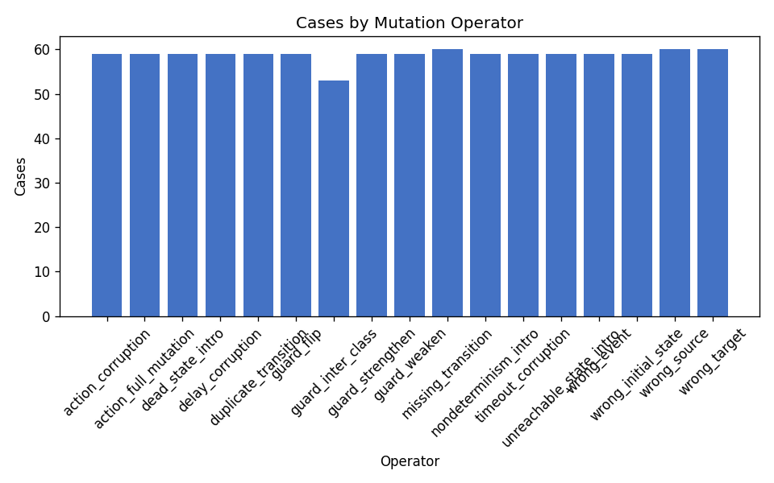
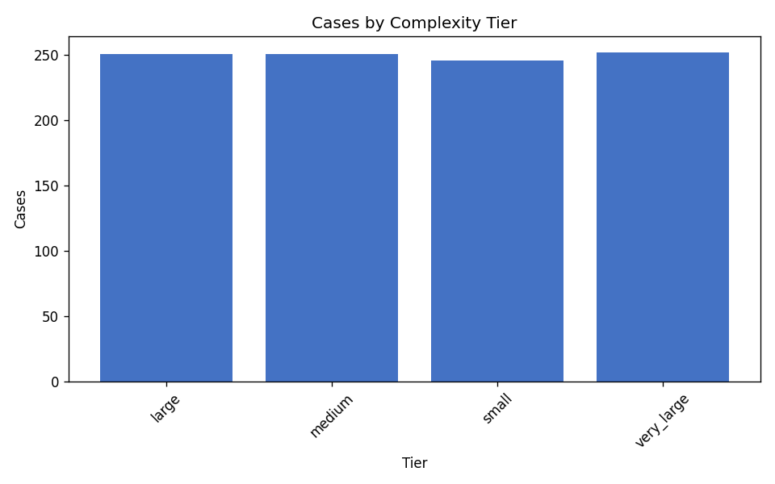
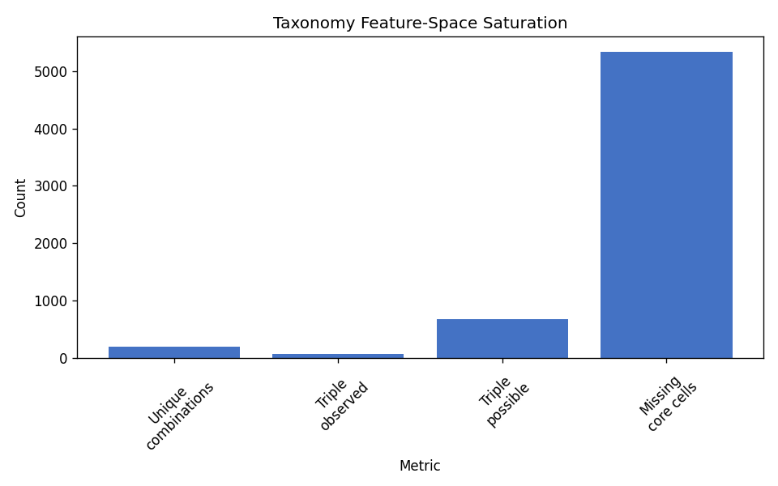
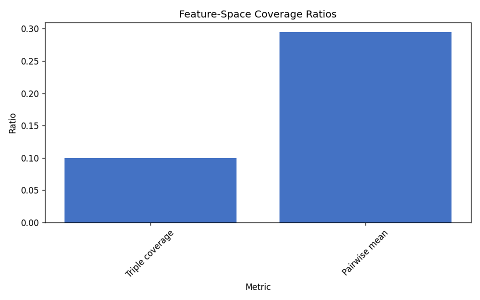

# Taxonomy Coverage Report

Empirical coverage audit of the FSMRepairBench taxonomy on an existing published dataset.

## Dataset

- **Dataset directory:** `/home/cesar/papers/fsmrepairbench/fsmrepairbench/data/fsmrepairbench_1k`
- **Cases analysed:** 1000
- **Cohort manifest:** `/home/cesar/papers/fsmrepairbench/fsmrepairbench/data/fsmrepairbench_1k/analysis_cohort_1k.txt`

## Executive summary

Taxonomy claims are **partially supported**: core dimensions are populated, but some declared operator or feature-space cells remain absent. Mean dimension value coverage is 54.8%; mutation-operator coverage is 89.5%; machine-type/bug-type/size-class triple coverage is 10.0%.

## Coverage per taxonomy dimension

| Dimension | Observed values | Universe | Coverage | Entropy |
|-----------|----------------:|---------:|---------:|--------:|
| `machine_type` | 1 | 8 | 12.5% | 0.000 |
| `determinism` | 1 | 2 | 50.0% | 0.000 |
| `completeness` | 1 | 2 | 50.0% | 0.000 |
| `arity_class` | 3 | 4 | 75.0% | 1.440 |
| `size_class` | 4 | 5 | 80.0% | 2.000 |
| `guard_complexity` | 2 | 4 | 50.0% | 0.141 |
| `time_features` | 1 | 5 | 20.0% | 0.000 |
| `graph_structure` | 5 | 7 | 71.4% | 1.748 |
| `oracle_depth` | 2 | 4 | 50.0% | 0.805 |
| `bug_type` | 17 | 19 | 89.5% | 4.087 |

## Coverage per FSM family

| FSM family | Cases | Cohort share | Mutation operators |
|------------|------:|-------------:|-------------------:|
| `plain_fsm` | 1000 | 100.0% | 17 |

## Coverage per mutation operator

| Operator | Cases | Cohort share | FSM families |
|----------|------:|-------------:|-------------:|
| `action_corruption` | 59 | 5.9% | 1 |
| `action_full_mutation` | 59 | 5.9% | 1 |
| `dead_state_intro` | 59 | 5.9% | 1 |
| `delay_corruption` | 59 | 5.9% | 1 |
| `duplicate_transition` | 59 | 5.9% | 1 |
| `guard_flip` | 59 | 5.9% | 1 |
| `guard_inter_class` | 53 | 5.3% | 1 |
| `guard_strengthen` | 59 | 5.9% | 1 |
| `guard_weaken` | 59 | 5.9% | 1 |
| `missing_transition` | 60 | 6.0% | 1 |
| `nondeterminism_intro` | 59 | 5.9% | 1 |
| `timeout_corruption` | 59 | 5.9% | 1 |
| `unreachable_state_intro` | 59 | 5.9% | 1 |
| `wrong_event` | 59 | 5.9% | 1 |
| `wrong_initial_state` | 59 | 5.9% | 1 |
| `wrong_source` | 60 | 6.0% | 1 |
| `wrong_target` | 60 | 6.0% | 1 |

## Coverage per complexity tier

| Tier | Cases | Cohort share | Mutation operators |
|------|------:|-------------:|-------------------:|
| `large` | 251 | 25.1% | 17 |
| `medium` | 251 | 25.1% | 17 |
| `small` | 246 | 24.6% | 17 |
| `very_large` | 252 | 25.2% | 17 |

## Feature-space saturation

- Unique full-taxonomy combinations: **200**
- Duplicate-combination cases: **800**
- Missing core 5-feature combinations: **5338** (of 5440 possible)
- Triple (`machine_type`, `bug_type`, `size_class`) coverage: **10.0%**

## Artefacts

- Summary metrics: `/home/cesar/papers/fsmrepairbench/fsmrepairbench/results/taxonomy_coverage/summary.csv`
- Unique combinations: `/home/cesar/papers/fsmrepairbench/fsmrepairbench/results/taxonomy_coverage/unique_combinations_summary.csv`
- Top combinations: `/home/cesar/papers/fsmrepairbench/fsmrepairbench/results/taxonomy_coverage/coverage_by_unique_combinations.csv`
- Dimension detail: `/home/cesar/papers/fsmrepairbench/fsmrepairbench/results/taxonomy_coverage/coverage_by_dimension.csv`
- Feature-space report: `/home/cesar/papers/fsmrepairbench/fsmrepairbench/results/taxonomy_coverage/feature_space_report.json`
- Frozen manifest: `/home/cesar/papers/fsmrepairbench/fsmrepairbench/results/taxonomy_coverage/manifest.json`
- LaTeX tables: `/home/cesar/papers/fsmrepairbench/fsmrepairbench/results/taxonomy_coverage/tables`

